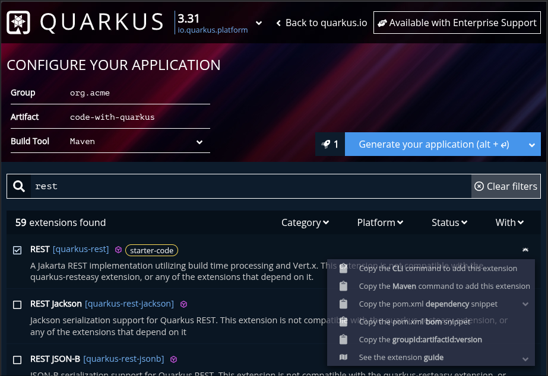
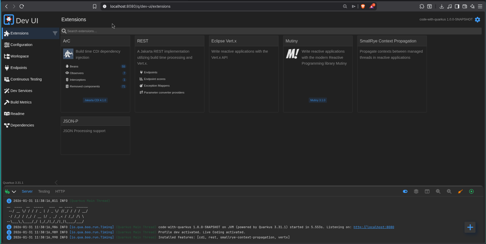

*This article is part of a series based on the book Quarkus for Spring Developers.*

## The Starting Point: Where it all begins

Every journey starts at the beginning. In the Spring ecosystem that starting point is the **Spring Initializr**; in Quarkus it's **code.quarkus.io**. Both aim to help you pick the components for your project, but while they look similar, the concepts of **Starter** and **Extension** reflect a fundamental architectural difference.

## A Different Mindset: Starter vs Extension

A **Spring Boot Starter** mainly aggregates dependencies. When the application starts, Spring scans the classpath, reads annotations and builds the dependency-injection context — all at runtime (**Runtime**).

A **Quarkus Extension**, however, is split into two parts: a runtime module and an **Augmentation (Deployment)** module. The real magic happens at build time: the extension scans your code, processes annotations, reads descriptors and leaves everything "pre-chewed" and baked into the bytecode.

As the book emphasizes, the work done at build time is what makes Quarkus extremely fast and memory-efficient, because it removes the need for heavy reflection and runtime scanning during startup.

### Equivalence Table

| Quarkus Extension | Spring Boot Starter |
| --- | --- |
| `quarkus-resteasy-jackson` | `spring-boot-starter-web` / `spring-boot-starter-webflux` |
| `quarkus-resteasy-reactive-jackson` | `spring-boot-starter-web` / `spring-boot-starter-webflux` |
| `quarkus-hibernate-orm-panache` | `spring-boot-starter-data-jpa` |
| `quarkus-hibernate-orm-rest-data-panache` | `spring-boot-starter-data-rest` |
| `quarkus-hibernate-reactive-panache` | `spring-boot-starter-data-r2dbc` |
| `quarkus-mongodb-panache` | `spring-boot-starter-data-mongodb` / `...-reactive` |
| `quarkus-hibernate-validator` | `spring-boot-starter-validation` |
| `quarkus-qpid-jms` | `spring-boot-starter-activemq` |
| `quarkus-artemis-jms` | `spring-boot-starter-artemis` |
| `quarkus-cache` | `spring-boot-starter-cache` |
| `quarkus-redis-client` | `spring-boot-starter-data-redis` / `...-reactive` |
| `quarkus-mailer` | `spring-boot-starter-mail` |
| `quarkus-quartz` | `spring-boot-starter-quartz` |
| `quarkus-oidc` | `spring-boot-starter-oauth2-resource-server` |
| `quarkus-oidc-client` | `spring-boot-starter-oauth2-client` |
| `quarkus-smallrye-jwt` | `spring-boot-starter-security` |

## Creating an API: code.quarkus.io vs Spring Initializr

If you visit the [Quarkus project generator](https://code.quarkus.io/), you'll notice an option the [Spring Initializr](https://start.spring.io/) doesn't provide yet: **Starter Code**. When you pick an extension such as Quarkus REST, Quarkus will generate a working example (`GreetingResource.java`) so you don't start from an empty page.
For our example we'll use that extension — it's the equivalent of **Spring Web**.



Unlike Spring, code.quarkus.io lets you preview the dependency, see CLI commands for Maven/Quarkus, or even publish the project directly to your GitHub.

This will be your initial Quarkus code:

```java
package org.acme;

import jakarta.ws.rs.GET;
import jakarta.ws.rs.Path;
import jakarta.ws.rs.Produces;
import jakarta.ws.rs.core.MediaType;

@Path("/hello")
public class GreetingResource {

    @GET
    @Produces(MediaType.TEXT_PLAIN)
    public String hello() {
        return "Hello from Quarkus REST";
    }
}
```

### And how does it look on Spring Initializr?

On the Spring side, using the [Spring Initializr](https://start.spring.io/) is what we're used to: you pick **Spring Web**, generate the project and download a `.zip` containing the folder structure and an empty main class.


There is no Starter Code concept in Spring Initializr — you create your `Controller` by hand to get something working. A Spring controller would look like this:

```java
package com.example.demo;

import org.springframework.web.bind.annotation.GetMapping;
import org.springframework.web.bind.annotation.RestController;

@RestController
public class HelloController {

    @GetMapping("/hello")
    public String hello() {
        return "Hello from Spring Web";
    }
}
```

### The reality check: JAX-RS vs Spring Web

Side-by-side the two snippets do the same thing, but the annotations are different. Quarkus uses the **Jakarta REST (JAX-RS)** standard while Spring uses its own Web annotations.

This is the first notable "accent" change Eric Deandrea highlights in the book: Quarkus moves you closer to Jakarta EE standards while keeping the modern ergonomics Spring developers appreciate.

## Anatomy of a Quarkus project: what changes in `pom.xml`

### Version Control: the Quarkus BOM

If you've worked with Spring before Spring Boot, you may remember the pain of aligning compatible versions across libraries. Spring Boot solved this with a Parent POM.

Quarkus offers the same convenience using a **BOM (Bill of Materials)**. Instead of inheriting from a parent, you import the `quarkus-bom` under `<dependencyManagement>`.

```xml
<dependencyManagement>
    <dependencies>
        <dependency>
            <groupId>${quarkus.platform.group-id}</groupId>
            <artifactId>${quarkus.platform.artifact-id}</artifactId>
            <version>${quarkus.platform.version}</version>
            <type>pom</type>
            <scope>import</scope>
        </dependency>
    </dependencies>
</dependencyManagement>
```

Why is this useful?
When you declare an extension (for example REST) in your `<dependencies>` you **don't need to specify a version**. The BOM ensures the versions used are compatible for that Quarkus release. To upgrade the whole project you change the `${quarkus.platform.version}` property at the top of the POM.

### Folder structure: practical differences

The folder layout of a Quarkus application is almost identical to Spring Boot, easing the migration path. One notable absence is a Java class with a `main` method. Spring Boot relies on a class annotated with `@SpringBootApplication` to bootstrap the container; Quarkus manages startup internally and more efficiently.

| File / Directory | Quarkus description | Spring equivalent or difference |
| --- | --- | --- |
| **`src/main/docker`** | Includes ready-made Dockerfiles for JVM and Native builds. | Usually created by the developer from scratch. |
| **`application.properties`** | Centralizes configuration in a single file, profiles included. | Often multiple files are used (e.g. `application-dev.yml`). |
| **`META-INF/resources`** | Place for static files (frontend/index). | `static` or `public` under `resources`. |
| **`pom.xml`** | Manages extensions and build-time processing. | Manages starters and Spring runtime. |
| **`README.md`** | Auto-populated with build and native-image instructions. | Usually contains just the project description. |

---

## Dev Mode: the end of "Wait for Restart"

If there is one feature that captures the joy of developing with Quarkus, it's **Dev Mode**. In Spring, even with DevTools it's common to face slow restarts as a project grows, with the framework banner and logs reappearing each time.

With Quarkus simply run:

```bash
./mvnw quarkus:dev
```

### Try live reload now

With Dev Mode running, open `localhost:8080/hello`.

In your IDE, change the method return to `"Hello Quarkus!"` and save.

Press F5 in the browser. The change is instant!

### The secret to the speed: Restart vs Live Reload

Many Spring developers might think: "Doesn't Spring DevTools already reload?" The difference is subtle in name but enormous in execution:

* **Spring DevTools (Restart):** It uses two *ClassLoaders*. When a file changes Spring discards the app's class loader and creates a new one. The framework must **rebuild the entire context**: re-scan annotations, rewire the DI graph and restart the server. It's an optimized reboot, but still a reboot.
* **Quarkus (Live Reload):** Thanks to the **Build-time** architecture we discussed, Quarkus already knows your application's structure. When you change a class it performs hot-replacement of only the modified bytecode. **The JVM process never dies.** Quarkus doesn't need to re-discover endpoints; it surgically updates their behavior.

## Dev Services: on-demand infrastructure

If Live Reload handles code changes, **Dev Services** handles your infrastructure. In Spring you typically need a `docker-compose.yaml` or a locally installed service for databases (PostgreSQL) or brokers (Kafka).

In Quarkus, if you have Docker (or Podman) available the flow is magical:

1. Add the **PostgreSQL** extension.
2. Do **not** configure a URL in `application.properties`.
3. When running in Dev Mode Quarkus detects the missing configuration and automatically starts a container via **Testcontainers** for you.

It sets ports and credentials for you. When you stop Dev Mode it cleans up the environment — zero-config developer experience.

## Dev UI: your application's control panel

While Spring Boot gives us Actuator (production-oriented JSON endpoints), Quarkus provides the **Dev UI**: a developer-friendly interface at `http://localhost:8080/q/dev` during Dev Mode.



There you can:

* View and exercise all installed extensions.
* Edit `application.properties` visually.
* **Continuous Testing:** see unit test status in real time. Pressing `r` in the terminal makes Quarkus run affected tests on each save, giving instant feedback if your last change broke anything.

## Conclusion

On this first contact we saw that Quarkus does not aim to be "just another framework." It attacks the root of lost productivity: waiting time. The switch from Spring Web annotations to Jakarta REST is minor compared to the real win — no more waiting for a restart to see your changes.

In the next article we'll dive into a topic Spring developers love: **Dependency Injection (CDI vs Spring DI)**. We'll see how `@Autowired` behaves in the Quarkus world.