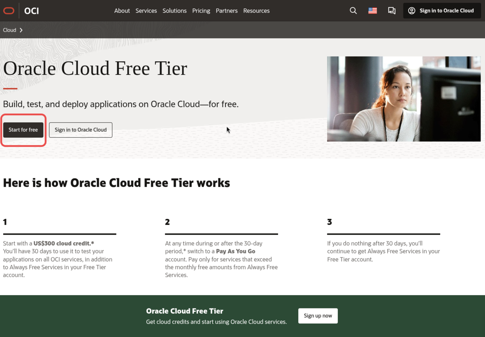
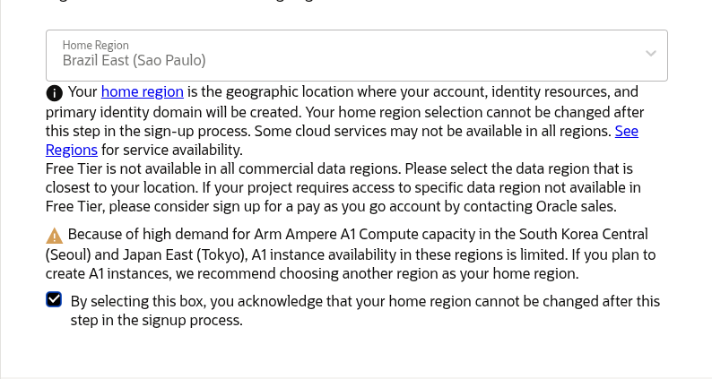

Welcome to the **Oracle FreeStack Journey**! In this article series, we will explore the full power of the **Oracle Free Tier** to build a robust Quarkus backend. As "Phase 0" and an essential starting point, this detailed guide focuses on creating your Oracle Cloud Free Tier account. Before we write any Java code, we need our cloud "data center". Unlike other providers with expiring credits, **Oracle Cloud Infrastructure (OCI)** offers one of the most generous programs on the market: **Always Free**. This program is not a limited trial period; it offers computing and database resources that remain free as long as your account is active. We will ensure you create your account correctly to make the most of this journey.

## Market Comparison: OCI vs AWS (Free Tier)

For Java developers, the resource difference between the major cloud providers is significant. Below is a comparison between Oracle's permanent (Always Free) resources and the AWS free tier:

| Resource           | Oracle Cloud (Always Free)    | AWS (Free Tier - 12 months)      |
| :----------------- | :---------------------------- | :------------------------------- |
| **Database**       | 2 x Autonomous DB (20GB each) | 1 x RDS (20GB - 12 months only)  |
| **RAM Memory**     | Up to 24 GB (ARM Ampere)      | 750 MB (t2.micro/t3.micro)       |
| **Processing**     | 4 OCPUs (ARM) + 2 cores (AMD) | 1 vCPU (12 months only)          |
| **Storage**        | 200 GB (NVMe SSD)             | 30 GB                            |
| **Monthly Bandwidth**| 10 TB                       | 100 GB                           |

OCI's superiority in terms of memory and managed database (Autonomous) makes this the ideal platform for running modern Java workloads with Quarkus.

---

## Registration Checklist

To ensure your account is approved without issues, have the following ready:

1. **Valid Email**: Use an email you access frequently. Avoid temporary emails, as they are automatically blocked.
2. **International Credit Card**: An "authorization hold" will be made (usually US$ 1.00 or R$ 1.00).
    - **Important:** This amount is **not charged**; it is just a validity check that your bank will reverse in a few days.
    - **Attention:** Oracle does not accept prepaid cards or debit cards that require a PIN. Use a traditional credit card or a debit card that works in the credit function.
3. **Residential Address**: Must be identical to the card's billing address. Inconsistencies here are the biggest cause of rejection.
4. **Respect the Rule**: Only **one account per person** is allowed. Attempting to create multiple accounts can lead to all of them being banned.

---

## Step-by-Step Account Creation

### 1. Start Registration
Go to [oracle.com/cloud/free](https://www.oracle.com/cloud/free/) and select the **Start for Free** option.

### 2. Identity and Region Information
Enter your country and full name. Use real and up-to-date information.

### 3. The Crucial Choice: Home Region
The *Home Region* is where your main data center and Always Free resources will reside.

> [!IMPORTANT]
> The region choice is permanent. If you choose a region without "Always Free" resource availability, you may encounter the **"out of host capacity"** error.

- **Tip:** If you encounter a capacity error when creating your instance later, wait a few days or try creating it in a different *Availability Domain* within the same region.
- **Suggestion:** Brazil East (São Paulo) is excellent, but US East (Ashburn) usually has a higher volume of available hardware.

### 4. Credit Verification and Security
After entering your card details, you will set up **MFA (Multi-Factor Authentication)**. Do not skip this step; it is essential for protecting your infrastructure.

---

## Technical Tips to Avoid Rejection

Oracle's provisioning system is strict to prevent abuse. Follow these guidelines:

- **Network**: Do not use **VPN** or Proxy. The IP must be residential or from a mobile network in your region.
- **Browser**: Disable blockers like **Brave**'s or extensions that mask your identity.
- **Card**: Use physical cards. One-time use virtual cards are frequently rejected.
- **Support**: Remember that Always Free accounts have **Community Support** (forums). Official technical support via tickets (My Oracle Support) is reserved for paid accounts or during the Free Trial.

## Complete List of Always Free Services

To give you a clear view of how robust this offer is, here are the main services you can use at no cost for an unlimited time:

### Database and Data
- **Autonomous Database**: 2 instances (Transaction Processing, Data Warehouse, or JSON Database).
- **NoSQL Database**: Available in selected regions.
- **HeatWave**: Accelerated processing for MySQL.
- **APEX**: Integrated Low-Code application development in the database.

### Computing and Storage
- **Arm-based Ampere A1**: Up to 4 instances with 24GB of distributed RAM.
- **AMD-based Compute**: 2 Micro instances (1GB RAM each).
- **Block Volume**: 200 GB of disk storage.
- **Object Storage**: 10 GB of object storage.
- **Archive Storage**: 10 GB for cold backup.

### Network and Security
- **Flexible Load Balancer**: 1 instance (10 Mbps).
- **VPN Connect & Site-to-Site VPN**: For secure connections.
- **VCN (Virtual Cloud Network)**: Entire private virtual network.
- **Vault**: Key and secret management (ESSENTIAL for Step 3).
- **Bastions**: Secure access to your instances without a public IP.
- **Security Advisor**: Integrated security recommendations.

### Observability and Management
- **Monitoring & Notifications**: Metrics and alerts.
- **Logging**: Infrastructure log collection.
- **Application Performance Monitoring (APM)**: Detailed performance tracking.
- **Resource Manager**: Automation with Terraform.
- **Service Connector Hub**: Data integration between services.

### Other Services
- **Email Delivery**: Up to 3,000 emails per month.
- **Content Management Starter Edition**: Digital asset management.

### Technical Resource Details

- **Autonomous Database (ATP)**: You receive two full instances. This allows you to have a Development and a Production environment at no cost. The database comes with self-configuration, self-security, and self-scaling.
- **Arm Ampere A1 Instances**: These are state-of-the-art processors. With 24GB of RAM, you can run multiple Docker containers or Quarkus instances with high performance.

---

### Bonus: The 30-Day Free Trial

In addition to the **Always Free** services (which are forever), when you sign up, you automatically receive **US$ 300.00 in credits** to use on any Oracle Cloud service for 30 days. This is excellent for testing "heavy-duty" features not in the free tier, such as GPU instances or Exadata databases.

---

## Conclusion

With your account active, you have one of the most modern cloud infrastructures in the world at your fingertips. This was your initial step in the **Oracle FreeStack Journey**.

The next step will be to connect your application to the database and start building. In our next article, we will explore how to build a Quarkus Backend with Oracle Autonomous Database.

---

## Resources
- [Oracle Cloud Free Tier FAQ](https://www.oracle.com/cloud/free/faq.html)
- [Official OCI Documentation](https://docs.oracle.com/en-us/iaas/Content/home.htm)
- [Project Repository](https://github.com/omatheusmesmo/Quarkus-OCI-FreeStack)
