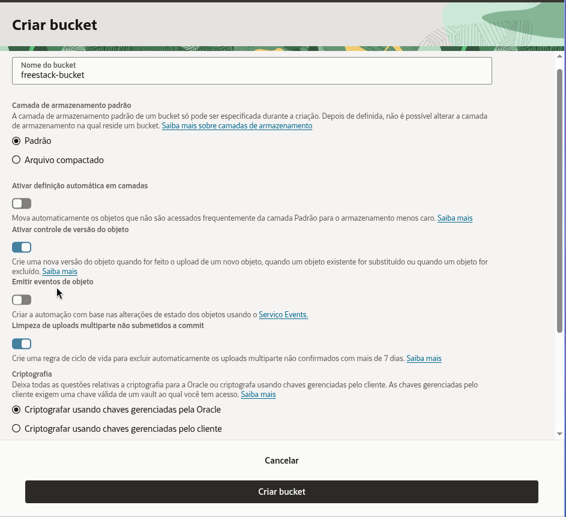
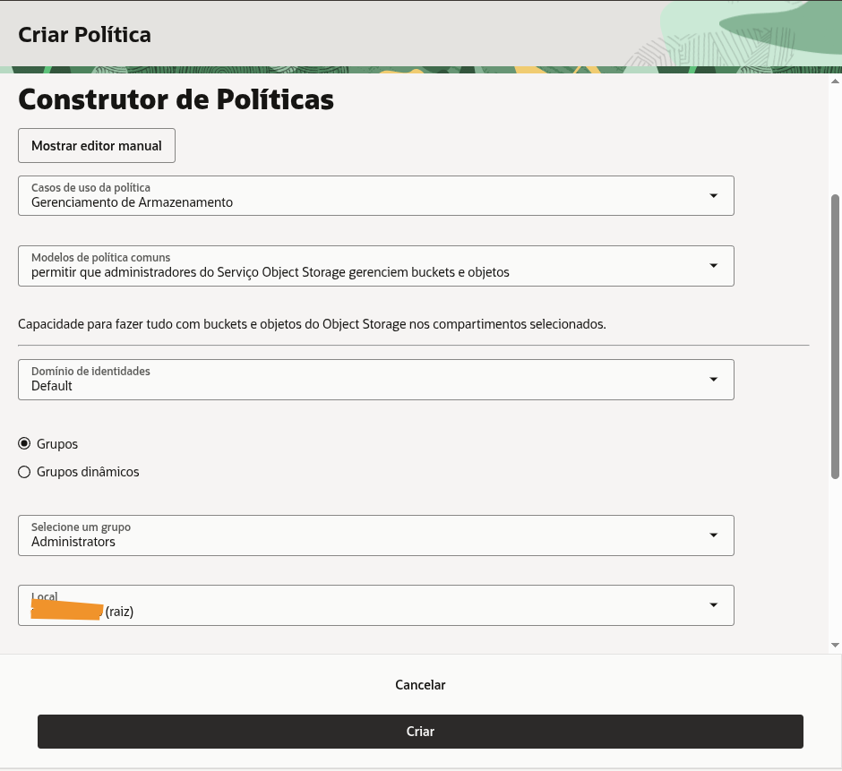

*This article is part of the ["Oracle FreeStack Journey"](https://blog.omatheusmesmo.dev/en/tags/oracle-freestack-journey/) series. In the [previous article](), we shielded our application with OCI Vault. Today, we will solve the file storage problem without overloading our Java server.*

When building APIs, it's common to create an endpoint that receives a file, reads the bytes, and saves it to disk or a database.

**The Problem:** This consumes precious RAM (especially on Always Free ARM instances), takes up network bandwidth, and creates a bottleneck. If 50 users simultaneously upload 5MB images, your server could suffer an "Out of Memory" error or become slow to respond to other requests.

## The Solution: PAR (Pre-Authenticated Requests)

The modern strategy is to delegate. The backend doesn't touch the image bytes. Instead:
1. The frontend asks Java for permission to perform an upload.
2. Java generates a **secure temporary URL (PAR)** from Oracle Cloud.
3. The frontend `PUT`s the image **directly to Oracle Object Storage**.

This means infinite scalability with zero resource consumption on your micro-backend.

---

## Step 1: Oracle Cloud (OCI) Configuration

Unlike a folder on a server, **Object Storage** is a highly available and scalable object storage service.

### 1.1. Create the Bucket
1. In the OCI sidebar, go to **Storage > Buckets**.
2. Click **Create Bucket**.
3. **Bucket Name:** `freestack-bucket`.
4. **Default Storage Tier:** Select **Standard**. This ensures images are served instantly.
5. **Enable Object Versioning:** Check as **Enabled**. This allows recovering previous versions of an image.
6. **Encryption:** Select **Encrypt using Oracle-managed keys**.
7. Click **Create Bucket**.



### Is it Free? (Always Free Limits)
Oracle Object Storage is one of the most generous on the market for developers:
- **Storage:** 20 GB free forever (Object and Archive Storage combined).
- **Requests:** Up to 50,000 API calls per month. 
- **Transfer:** 10 TB of data egress per month.

**Financial Security Tip:** Unlike **AWS**, where overusage is automatically charged to your card (which can lead to unexpected bills), on an **Oracle Always Free** account, the service simply stops responding if the limit is reached. You have a native "safety latch": it's either free or it doesn't work. There are no surprise charges without you manually upgrading your account.

---

## Bonus: Making Images Visible in the Browser

By default, Oracle creates private buckets. For your blog to be able to display images via direct URL, we need to adjust visibility:

1. In the OCI Console, enter your bucket and go to **Actions > Edit Visibility**.
2. Choose the **Public** option.
3. **Maximum Security:** Ensure the **"Allow users to list objects in this bucket"** option is **UNCHECKED**.

This allows anyone with the direct link to see the image, but no one can "spy" on the file list inside.

---

### 1.2. Data Collection for .env
Inside your newly created Bucket's details page, locate and note:
- **Namespace:** Click on **Bucket Details**. The Namespace is a unique string for your account (e.g., `axf123abc`). It appears at the beginning of the information page.
- **Region:** Your region code (e.g., `sa-saopaulo-1`).

### 1.3. Identity Policies (The "Key" to the Vault)
For your application to have permission to create upload links (PARs), you need an IAM policy in Oracle. Use the **Policy Builder** to make it easier:

1. In the OCI sidebar, go to **Identity & Security > Policies**.
2. Click **Create Policy**.
3. Under **Policy Use Cases**, select **Storage Management**.
4. Under **Common Policy Templates**, select: **"allow Object Storage Service administrators to manage buckets and objects"**.
5. Select your **Group** and **Compartment**.
6. Click **Create**.



---

## 🔒 Security and Best Practices: The Public Bucket Risk

Even though we disabled object listing, a public bucket still poses risks if filenames are predictable.

### The Sequential ID Problem
If we use `article-1.png`, `article-2.png`, an attacker can easily create a script to download all images from your server (Scraping). Even worse: if you accidentally upload a sensitive file to the same bucket, it will be exposed.

### The Solution: UUIDs and Random Names
In production systems, best practice is to **never use sequential IDs in the URL**. In our project, we implement a prefix, but the ideal would be:
- **Use UUIDs:** e.g., `covers/7b2e-4f1a-9c3d.png`.
- **Dedicated Bucket:** Use an exclusive bucket for public media and another (private) one for sensitive documents.

---

## Step 2: Implementation in Quarkus

### 2.1. Dependencies (pom.xml)
We use the Oracle SDK BOM to ensure compatibility between modules and add the Object Storage dependency:

```xml
<dependencyManagement>
    <dependencies>
        <dependency>
            <groupId>com.oracle.oci.sdk</groupId>
            <artifactId>oci-java-sdk-bom</artifactId>
            <version>3.80.2</version>
            <type>pom</type>
            <scope>import</scope>
        </dependency>
    </dependencies>
</dependencyManagement>

<dependencies>
    <dependency>
        <groupId>com.oracle.oci.sdk</groupId>
        <artifactId>oci-java-sdk-objectstorage</artifactId>
    </dependency>
</dependencies>
```

### 2.2. Configuration (application.properties and .env)
We map the identifiers in `application.properties`:

```properties
# OCI Object Storage Configuration
oci.objectstorage.bucket=${OCI_OBJECTSTORAGE_BUCKET}
oci.objectstorage.namespace=${OCI_OBJECTSTORAGE_NAMESPACE}
oci.objectstorage.region=${OCI_OBJECTSTORAGE_REGION}
```

#### Identifiers vs. Secrets: What goes in the .env?
Following the **Zero Trust** pattern we established in the Vault article, our `.env` file will contain only **identifiers**.
- **What stays in .env:** Bucket name, namespace, and region. These are just "addresses." Knowing your bucket name doesn't grant access to files.
- **What stays OUT of .env:** Private keys or passwords. Access to the bucket is guaranteed by the application's identity.

Fill your `.env` file with the data collected in Step 1:
```env
OCI_OBJECTSTORAGE_BUCKET=freestack-bucket
OCI_OBJECTSTORAGE_NAMESPACE=your_namespace
OCI_OBJECTSTORAGE_REGION=your_region_code
```

---

## Step 3: Infrastructure Code

### 3.1. OciObjectStorageService.java
This service orchestrates interaction with the Oracle SDK. Note the use of meaningful variable names and the `Preauthenticated` (lowercase) spelling:

```java
@ApplicationScoped
public class OciObjectStorageService {
    private static final Logger LOG = Logger.getLogger(OciObjectStorageService.class);

    @ConfigProperty(name = "oci.objectstorage.bucket")
    String bucketName;

    @ConfigProperty(name = "oci.objectstorage.namespace")
    Optional<String> namespaceName;

    @ConfigProperty(name = "oci.objectstorage.region")
    String region;

    public String createUploadPar(String objectName) {
        LOG.info("Creating upload PAR for object: " + objectName + " in bucket: " + bucketName);

        try (ObjectStorage objectStorageClient = createObjectStorageClient()) {
            String namespace = namespaceName.orElseGet(() -> getNamespace(objectStorageClient));

            CreatePreauthenticatedRequestDetails parDetails = CreatePreauthenticatedRequestDetails.builder()
                    .name("Upload-" + objectName + "-" + System.currentTimeMillis())
                    .accessType(CreatePreauthenticatedRequestDetails.AccessType.ObjectWrite)
                    .objectName(objectName)
                    .timeExpires(Date.from(Instant.now().plus(1, ChronoUnit.HOURS)))
                    .build();

            CreatePreauthenticatedRequestRequest parRequest = CreatePreauthenticatedRequestRequest.builder()
                    .namespaceName(namespace)
                    .bucketName(bucketName)
                    .createPreauthenticatedRequestDetails(parDetails)
                    .build();

            CreatePreauthenticatedRequestResponse parResponse = objectStorageClient.createPreauthenticatedRequest(parRequest);
            String accessUri = parResponse.getPreauthenticatedRequest().getAccessUri();
            
            String fullPreauthenticatedRequestUrl = String.format("https://objectstorage.%s.oraclecloud.com%s", region, accessUri);
            LOG.debug("PAR successfully created: " + fullPreauthenticatedRequestUrl);
            return fullPreauthenticatedRequestUrl;
        } catch (Exception e) {
            LOG.error("CRITICAL ERROR: Could not create Pre-authenticated Request in OCI Object Storage", e);
            throw new RuntimeException("Error creating PAR for upload. Check OCI permissions and configuration.");
        }
    }

    public String getObjectUrl(String objectName) {
        String namespace = namespaceName.orElse("your_namespace");
        return String.format("https://objectstorage.%s.oraclecloud.com/n/%s/b/%s/o/%s", 
                region, namespace, bucketName, objectName);
    }
}
```

### 3.2. Response DTO (ParResponse.java)
To return URLs in a structured way to the frontend, we use a Java Record:

```java
public record ParResponse(String parUrl, String objectUrl) {}
```

---

## Step 4: Business Integration (Articles)

In our `ArticleService`, when generating the upload link, we already update the article's JSON document with the final URL. Note the separation of concerns and the use of helper methods.

### 4.1. Refactoring ArticleService.java

```java
@ApplicationScoped
public class ArticleService {
    @Inject ArticleRepository repository;
    @Inject OciObjectStorageService objectStorageService;
    @Inject ObjectMapper objectMapper;

    @Transactional
    public ParResponse generateCoverPar(Long articleId, String fileName) {
        Article article = repository.findById(articleId);
        if (article == null) {
            throw new NotFoundException("Article not found with id: " + articleId);
        }

        String fileExtension = getFileExtension(fileName);
        String storageObjectName = "covers/article-" + articleId + fileExtension;

        // Request the PAR and public URL
        String parUrl = objectStorageService.createUploadPar(storageObjectName);
        String objectPublicUrl = objectStorageService.getObjectUrl(storageObjectName);

        // Update article JSON
        updateArticleContentWithCoverUrl(article, objectPublicUrl);

        return new ParResponse(parUrl, objectPublicUrl);
    }

    private String getFileExtension(String fileName) {
        if (fileName != null && fileName.contains(".")) {
            return fileName.substring(fileName.lastIndexOf("."));
        }
        return ".png";
    }

    private void updateArticleContentWithCoverUrl(Article article, String coverUrl) {
        if (article.content != null && article.content.isObject()) {
            ((ObjectNode) article.content).put("coverUrl", coverUrl);
        } else {
            ObjectNode newContent = objectMapper.createObjectNode();
            newContent.put("coverUrl", coverUrl);
            article.content = newContent;
        }
    }
}
```

### 4.2. REST Endpoint (ArticleResource.java)
We expose the route for the frontend to request the upload link:

```java
@POST
@Path("/{id}/cover-upload-url")
public ParResponse getUploadUrl(@PathParam("id") Long id, @QueryParam("fileName") String fileName) {
    return service.generateCoverPar(id, fileName != null ? fileName : "cover.png");
}
```

---

## Step 5: Testing the Full Flow

Let's simulate uploading a real image named `linux-open-source.png`.

### 1. Create the Article
```bash
curl -X POST http://localhost:8080/articles 
  -H "Content-Type: application/json" 
  -d '{
    "title": "Open Source Attack: The Power of Linux",
    "author": "Matheus Oliveira",
    "content": {
      "body": "Exploring converged architecture...",
      "tags": ["linux", "open-source", "oci"]
    }
  }'
```
*Suppose the returned ID was **1053**.*

### 2. Request Upload Authorization (PAR)
```bash
curl -X POST "http://localhost:8080/articles/1053/cover-upload-url?fileName=linux-open-source.png"
```
**Server Response:**
```json
{
  "parUrl": "https://objectstorage.sa-saopaulo-1.oraclecloud.com/p/ABC123XYZ.../covers/article-1053.png",
  "objectUrl": "https://objectstorage.sa-saopaulo-1.oraclecloud.com/n/your_namespace/b/freestack-bucket/o/covers/article-1053.png"
}
```

### 3. Execute Direct Upload to Oracle
The computer (or frontend) sends the image directly to Oracle's cloud using the `parUrl`:
```bash
curl -X PUT -H "Content-Type: image/png" 
     --data-binary "@./images/linux-open-source.png" 
     "YOUR_PAR_URL_HERE"
```

### 4. View Image in Browser
Access the `objectUrl` returned in step 2 directly in your browser:
`https://objectstorage.sa-saopaulo-1.oraclecloud.com/n/your_namespace/b/freestack-bucket/o/covers/article-1053.png`

---

## Conclusion: Elite Architecture

By delegating storage to Object Storage, you ensure your application supports thousands of simultaneous uploads without ever degrading API performance. Your images now reside on global infrastructure, ready to be served ultra-fast and securely.

In the next article, we will dive into **OCI Streaming (Kafka)** to process events asynchronously.

---
## Resources
- [OCI Object Storage PAR Documentation](https://docs.oracle.com/en-us/iaas/Content/Object/Tasks/usingpreauthenticatedrequests.htm)
- [Quarkus OCI SDK Integration](https://github.com/omatheusmesmo/quarkus-oci-freestack)
