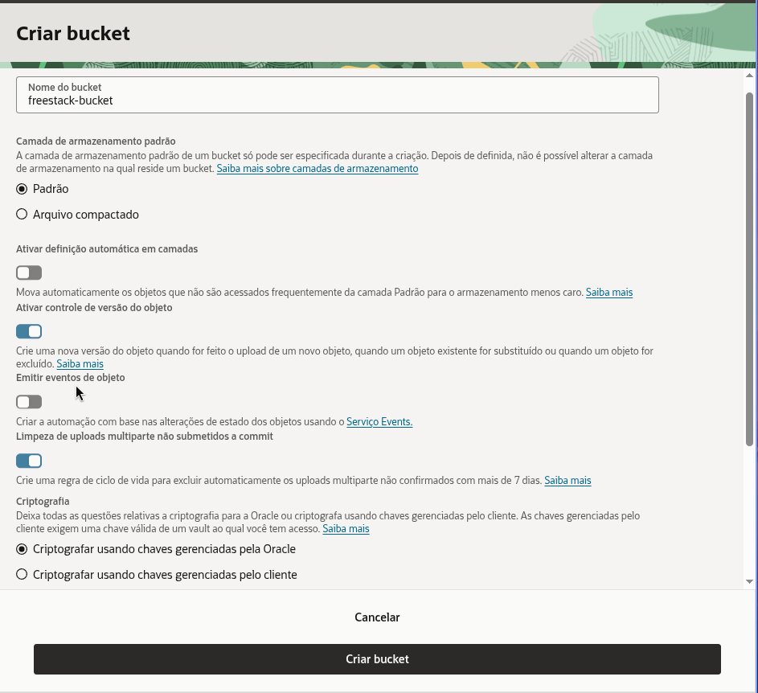
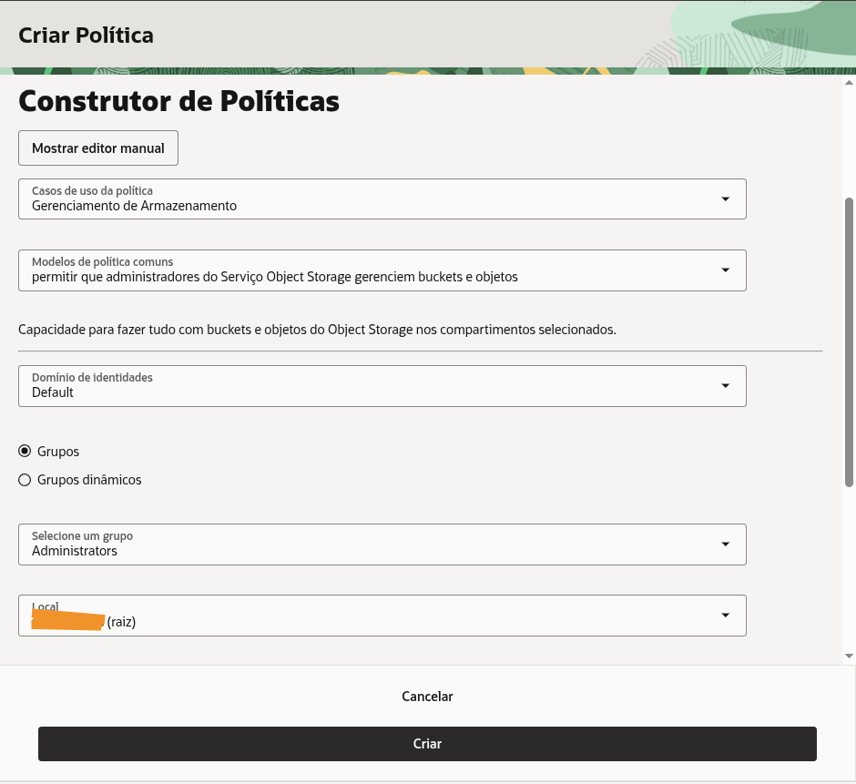

*Este artigo faz parte da série ["Jornada Oracle FreeStack"](https://blog.omatheusmesmo.dev/tags/jornada-oracle-freestack/). No [artigo anterior](), blindamos nossa aplicação com OCI Vault. Hoje, vamos resolver o problema de armazenamento de arquivos sem sobrecarregar nosso servidor Java.*

Quando construímos APIs, é comum criar um endpoint que recebe um arquivo, lê os bytes e salva em disco ou banco.

**O Problema:** Isso consome memória RAM preciosa (especialmente nas instâncias ARM Always Free), ocupa banda de rede e cria um gargalo. Se 50 usuários fizerem upload simultâneo de imagens de 5MB, seu servidor pode sofrer um "Out of Memory" ou ficar lento para responder outras requisições.

## A Solução: PAR (Pre-Authenticated Requests)

A estratégia moderna é delegar. O backend não toca nos bytes da imagem. Em vez disso:
1. O frontend pede permissão ao Java para fazer um upload.
2. O Java gera uma **URL temporária e segura (PAR)** da Oracle Cloud.
3. O frontend faz o `PUT` da imagem **diretamente para o Object Storage da Oracle**.

Isso significa escalabilidade infinita com consumo zero de recursos no seu micro-backend.

---

## Passo 1: Configuração na Oracle Cloud (OCI)

Diferente de uma pasta no servidor, o **Object Storage** é um serviço de armazenamento de objetos altamente disponível e escalável.

### 1.1. Criar o Bucket
1. No menu lateral da OCI, vá em **Armazenamento (Storage) > Buckets**.
2. Clique em **Criar bucket**.
3. **Nome do bucket:** `freestack-bucket`.
4. **Camada de armazenamento padrão:** Selecione **Padrão** (Standard). Isso garante que as imagens sejam servidas instantaneamente.
5. **Ativar controle de versão do objeto:** Marque como **Ativado**. Isso permite recuperar versões anteriores de uma imagem.
6. **Criptografia:** Selecione **Criptografar usando chaves gerenciadas pela Oracle**.
7. Clique em **Criar bucket**.



### É Grátis? (Limites do Always Free)
O Object Storage da Oracle é um dos mais generosos do mercado para desenvolvedores:
- **Espaço:** 20 GB gratuitos para sempre (Object e Archive Storage combinados).
- **Requisições:** Até 50.000 chamadas de API por mês.
- **Transferência:** 10 TB de saída de dados (Egress) por mês.

**Dica de Segurança Financeira:** Diferente da **AWS**, onde o excesso de uso é cobrado automaticamente no seu cartão (o que pode gerar faturas inesperadas), na conta **Always Free da Oracle** o serviço simplesmente para de responder se o limite for atingido. Você tem uma "trava de segurança" nativa: ou é grátis, ou não funciona. Não há cobranças surpresa sem que você faça o upgrade manual da conta.

---

## Bônus: Tornando as Imagens Visíveis no Navegador

Por padrão, a Oracle cria buckets privados. Para que seu blog consiga exibir a imagem via URL direta, precisamos ajustar a visibilidade:

1. No Console OCI, entre no seu bucket e vá em **Ações > Editar visibilidade**.
2. Escolha a opção **Público**.
3. **Segurança Máxima:** Certifique-se de que a opção **"Permitir que os usuários listem objetos deste bucket"** esteja **DESMARCADA**.

Isso permite que qualquer pessoa com o link direto veja a imagem, mas ninguém consiga "espiar" a lista de arquivos que você tem lá dentro.

---

### 1.2. Coleta de Dados para o .env
Dentro da página de detalhes do seu Bucket recém-criado, localize e anote:
- **Namespace:** Clique em **Detalhes do Bucket**. O Namespace é uma string única da sua conta (ex: `axf123abc`). Ele aparece logo no início da página de informações.
- **Region:** O código da sua região (ex: `sa-saopaulo-1`).

### 1.3. Políticas de Identidade (A "Chave" do Cofre)
Para que sua aplicação tenha permissão de criar links de upload (PAR), você precisa de uma política no IAM da Oracle. Use o **Construtor de Políticas** para facilitar:

1. No menu lateral da OCI, vá em **Identidade e Segurança > Políticas**.
2. Clique em **Criar política**.
3. Em **Casos de uso da política**, selecione **Gerenciamento de Armazenamento**.
4. Em **Modelos de política comuns**, selecione: **"permitir que administradores do Serviço Object Storage gerenciem buckets e objetos"**.
5. Selecione o seu **Grupo** e o seu **Compartimento**.
6. Clique em **Criar**.



---

## 🔒 Segurança e Boas Práticas: O Risco do Bucket Público

Embora tenhamos desativado a listagem de objetos, um bucket público ainda oferece riscos se os nomes dos arquivos forem previsíveis.

### O Problema dos IDs Sequenciais
Se usarmos `article-1.png`, `article-2.png`, um atacante pode facilmente criar um script para baixar todas as imagens do seu servidor (Scraping). Pior ainda: se você subir um arquivo sensível por engano no mesmo bucket, ele estará exposto.

### A Solução: UUIDs e Nomes Aleatórios
Em sistemas de produção, a boa prática é **nunca usar IDs sequenciais na URL**. No nosso projeto, implementamos um prefixo, mas o ideal seria:
- **Usar UUIDs:** Ex: `covers/7b2e-4f1a-9c3d.png`.
- **Bucket Dedicado:** Use um bucket exclusivo para mídia pública e outro (privado) para documentos sensíveis.

---

## Passo 2: Implementação no Quarkus

### 2.1. Dependências (pom.xml)
Utilizamos o BOM do SDK da Oracle para garantir compatibilidade entre os módulos e adicionamos a dependência de Object Storage:

```xml
<dependencyManagement>
    <dependencies>
        <dependency>
            <groupId>com.oracle.oci.sdk</groupId>
            <artifactId>oci-java-sdk-bom</artifactId>
            <version>3.80.2</version>
            <type>pom</type>
            <scope>import</scope>
        </dependency>
    </dependencies>
</dependencyManagement>

<dependencies>
    <dependency>
        <groupId>com.oracle.oci.sdk</groupId>
        <artifactId>oci-java-sdk-objectstorage</artifactId>
    </dependency>
</dependencies>
```

### 2.2. Configuração (application.properties e .env)
Mapeamos os identificadores no `application.properties`:

```properties
# OCI Object Storage Configuration
oci.objectstorage.bucket=${OCI_OBJECTSTORAGE_BUCKET}
oci.objectstorage.namespace=${OCI_OBJECTSTORAGE_NAMESPACE}
oci.objectstorage.region=${OCI_OBJECTSTORAGE_REGION}
```

#### Identificadores vs. Segredos: O que vai para o .env?
Seguindo o padrão **Zero Trust** que estabelecemos no artigo sobre Vault, nosso arquivo `.env` conterá apenas **identificadores**.
- **O que fica no .env:** Nome do bucket, namespace e região. Esses são apenas "endereços". Saber o nome do seu bucket não dá acesso aos arquivos.
- **O que NÃO fica no .env:** Chaves privadas ou senhas. O acesso ao bucket é garantido pela identidade da aplicação.

Alimente seu arquivo `.env` com os dados coletados no Passo 1:
```env
OCI_OBJECTSTORAGE_BUCKET=freestack-bucket
OCI_OBJECTSTORAGE_NAMESPACE=seu_namespace
OCI_OBJECTSTORAGE_REGION=seu_codigo_regiao
```

---

## Passo 3: O Código da Infraestrutura

### 3.1. OciObjectStorageService.java
Este serviço orquestra a interação com o SDK da Oracle. Note o uso de nomes de variáveis significativos e a grafia `Preauthenticated` (minúsculo):

```java
@ApplicationScoped
public class OciObjectStorageService {
    private static final Logger LOG = Logger.getLogger(OciObjectStorageService.class);

    @ConfigProperty(name = "oci.objectstorage.bucket")
    String bucketName;

    @ConfigProperty(name = "oci.objectstorage.namespace")
    Optional<String> namespaceName;

    @ConfigProperty(name = "oci.objectstorage.region")
    String region;

    public String createUploadPar(String objectName) {
        LOG.info("Creating upload PAR for object: " + objectName + " in bucket: " + bucketName);

        try (ObjectStorage objectStorageClient = createObjectStorageClient()) {
            String namespace = namespaceName.orElseGet(() -> getNamespace(objectStorageClient));

            CreatePreauthenticatedRequestDetails parDetails = CreatePreauthenticatedRequestDetails.builder()
                    .name("Upload-" + objectName + "-" + System.currentTimeMillis())
                    .accessType(CreatePreauthenticatedRequestDetails.AccessType.ObjectWrite)
                    .objectName(objectName)
                    .timeExpires(Date.from(Instant.now().plus(1, ChronoUnit.HOURS)))
                    .build();

            CreatePreauthenticatedRequestRequest parRequest = CreatePreauthenticatedRequestRequest.builder()
                    .namespaceName(namespace)
                    .bucketName(bucketName)
                    .createPreauthenticatedRequestDetails(parDetails)
                    .build();

            CreatePreauthenticatedRequestResponse parResponse = objectStorageClient.createPreauthenticatedRequest(parRequest);
            String accessUri = parResponse.getPreauthenticatedRequest().getAccessUri();

            String fullPreauthenticatedRequestUrl = String.format("https://objectstorage.%s.oraclecloud.com%s", region, accessUri);
            LOG.debug("PAR successfully created: " + fullPreauthenticatedRequestUrl);
            return fullPreauthenticatedRequestUrl;
        } catch (Exception e) {
            LOG.error("CRITICAL ERROR: Could not create Pre-authenticated Request in OCI Object Storage", e);
            throw new RuntimeException("Error creating PAR for upload. Check OCI permissions and configuration.");
        }
    }

    public String getObjectUrl(String objectName) {
        String namespace = namespaceName.orElse("seu_namespace");
        return String.format("https://objectstorage.%s.oraclecloud.com/n/%s/b/%s/o/%s",
                region, namespace, bucketName, objectName);
    }
}
```

### 3.2. O DTO de Resposta (ParResponse.java)
Para devolver as URLs de forma estruturada ao frontend, usamos um Java Record:

```java
public record ParResponse(String parUrl, String objectUrl) {}
```

---

## Passo 4: Integrando ao Negócio (Articles)

No nosso `ArticleService`, ao gerar o link de upload, já atualizamos o documento JSON do artigo com a URL final. Note a separação de responsabilidades e o uso de métodos auxiliares.

### 4.1. Refatorando o ArticleService.java

```java
@ApplicationScoped
public class ArticleService {
    @Inject ArticleRepository repository;
    @Inject OciObjectStorageService objectStorageService;
    @Inject ObjectMapper objectMapper;

    @Transactional
    public ParResponse generateCoverPar(Long articleId, String fileName) {
        Article article = repository.findById(articleId);
        if (article == null) {
            throw new NotFoundException("Article not found with id: " + articleId);
        }

        String fileExtension = getFileExtension(fileName);
        String storageObjectName = "covers/article-" + articleId + fileExtension;

        // Solicita a PAR e a URL pública
        String parUrl = objectStorageService.createUploadPar(storageObjectName);
        String objectPublicUrl = objectStorageService.getObjectUrl(storageObjectName);

        // Atualiza o JSON do artigo
        updateArticleContentWithCoverUrl(article, objectPublicUrl);

        return new ParResponse(parUrl, objectPublicUrl);
    }

    private String getFileExtension(String fileName) {
        if (fileName != null && fileName.contains(".")) {
            return fileName.substring(fileName.lastIndexOf("."));
        }
        return ".png";
    }

    private void updateArticleContentWithCoverUrl(Article article, String coverUrl) {
        if (article.content != null && article.content.isObject()) {
            ((ObjectNode) article.content).put("coverUrl", coverUrl);
        } else {
            ObjectNode newContent = objectMapper.createObjectNode();
            newContent.put("coverUrl", coverUrl);
            article.content = newContent;
        }
    }
}
```

### 4.2. O Endpoint REST (ArticleResource.java)
Expomos a rota para o frontend solicitar o link de upload:

```java
@POST
@Path("/{id}/cover-upload-url")
public ParResponse getUploadUrl(@PathParam("id") Long id, @QueryParam("fileName") String fileName) {
    return service.generateCoverPar(id, fileName != null ? fileName : "cover.png");
}
```

---

## Passo 5: Testando o Fluxo Completo

Vamos simular o upload de uma imagem real chamada `linux-open-source.png`.

### 1. Criar o Artigo
```bash
curl -X POST http://localhost:8080/articles
  -H "Content-Type: application/json"
  -d '{
    "title": "Ataque Open Source: O Poder do Linux",
    "author": "Matheus Oliveira",
    "content": {
      "body": "Explorando a arquitetura convergente...",
      "tags": ["linux", "open-source", "oci"]
    }
  }'
```
*Suponha que o ID retornado foi **1053**.*

### 2. Solicitar Autorização de Upload (PAR)
```bash
curl -X POST "http://localhost:8080/articles/1053/cover-upload-url?fileName=linux-open-source.png"
```
**Resposta do Servidor:**
```json
{
  "parUrl": "https://objectstorage.sa-saopaulo-1.oraclecloud.com/p/ABC123XYZ.../covers/article-1053.png",
  "objectUrl": "https://objectstorage.sa-saopaulo-1.oraclecloud.com/n/seu_namespace/b/freestack-bucket/o/covers/article-1053.png"
}
```

### 3. Executar o Upload Direto para a Oracle
O computador (ou frontend) envia a imagem diretamente para a nuvem da Oracle, usando a `parUrl`:
```bash
curl -X PUT -H "Content-Type: image/png"
     --data-binary "@./images/linux-open-source.png"
     "URL_DA_PAR_AQUI"
```

### 4. Visualizar a Imagem no Navegador
Acesse a `objectUrl` retornada no passo 2 diretamente no seu navegador:
`https://objectstorage.sa-saopaulo-1.oraclecloud.com/n/seu_namespace/b/freestack-bucket/o/covers/article-1053.png`

---

## Conclusão: Arquitetura de Elite

Ao delegar o armazenamento para o Object Storage, você garante que sua aplicação suporte milhares de uploads simultâneos sem nunca degradar a performance da API. Suas imagens agora residem em uma infraestrutura global, prontas para serem servidas de forma ultra-rápida e segura.

No próximo artigo, entraremos no mundo do **OCI Notifications (ONS)** para processar eventos de forma assíncrona no Always Free.

---
## Recursos
- [Documentação OCI Object Storage PAR](https://docs.oracle.com/en-us/iaas/Content/Object/Tasks/usingpreauthenticatedrequests.htm)
- [Quarkus OCI SDK Integration](https://github.com/omatheusmesmo/quarkus-oci-freestack)
