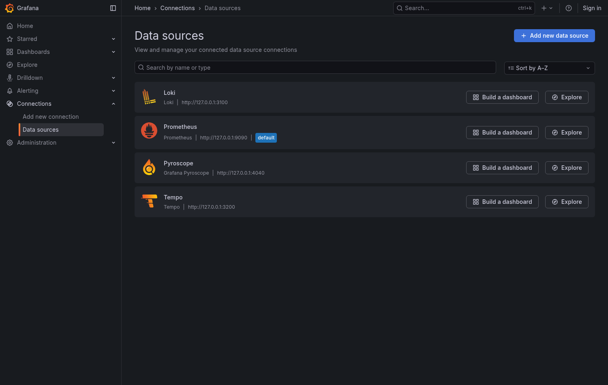
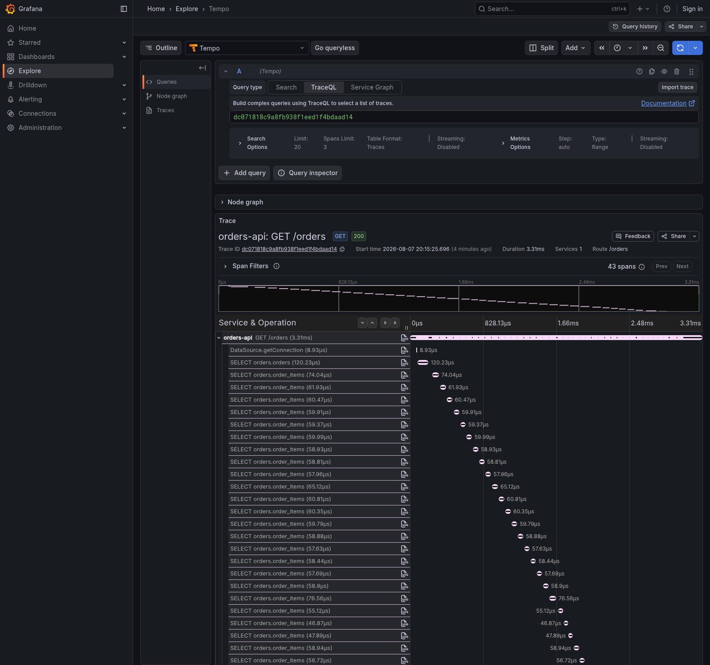
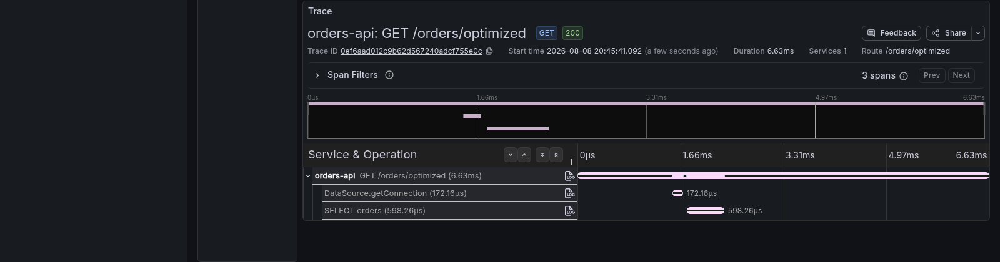

> **Parte 1 de 2.** Aqui o objetivo é te convencer a instrumentar e mostrar o caminho
> mais curto para isso, com um serviço só. A
> [parte 2](/posts/observabilidade-distribuida-producao/) pega o mesmo sistema e o
> distribui em cinco serviços e quatro linguagens, e depois discute o que muda em
> produção.
>
> Todos os números vieram de medições no repo
> [observability-arena](https://github.com/omatheusmesmo/observability-arena).

## O pedido que ninguém sabe responder

São 14h32 de uma terça-feira. Um cliente abre um chamado: "o checkout travou".

Você tem dashboards. O de infraestrutura está verde. O de aplicação mostra latência
dentro do normal. O time de frontend jura que o problema é da API. O time de backend
mostra um gráfico onde nada saiu do lugar. O time de pagamentos abre o painel deles e
diz, com razão, que a taxa de erro está em zero.

Três times, três dashboards, três conclusões, todas apontando para o outro. E o
cliente continua esperando.

Esse artigo é sobre a diferença entre ter dados e conseguir responder perguntas.

---

## Por que isso virou padrão de mercado

Em 21 de maio de 2026 o OpenTelemetry graduou na CNCF. Isso encerrou uma discussão
que consumiu anos de reuniões de arquitetura: qual padrão de telemetria adotar.

A resposta agora é chata, e ser chata é exatamente o ponto. O OpenTelemetry é o
padrão. O pacote JavaScript passou de 1,36 bilhão de downloads em doze meses, o
Python passou de 1,3 bilhão. Não existe mais decisão a tomar aqui, existe implementação.

Três coisas mudaram junto com a graduação, e elas explicam por que 2026 é diferente
de 2023:

**Profiles viraram o quarto sinal.** Métricas, logs e traces deixaram de ser "os três
pilares". Perfis de execução entraram na conversa, e as ferramentas modernas
correlacionam os quatro.

**eBPF tornou a instrumentação opcional para o básico.** Dá para instrumentar HTTP,
banco e rede sem tocar no código. A prática de mercado hoje é híbrida: zero-code no
perímetro, instrumentação manual para o contexto de negócio que só você conhece.

**Custo virou problema de engenharia.** Telemetria cresce mais rápido que o sistema
que ela observa. Deixar isso sem controle é uma das maiores linhas da fatura de
nuvem, e a resposta não é "amostrar menos", como veremos.

### O que o ambiente empresarial faz de errado

O erro mais comum em empresa não é técnico, é organizacional: cada aplicação exporta
telemetria direto para o backend de observabilidade.

Isso funciona em tutorial. Em uma empresa com quarenta serviços, significa que:

- mudar a política de amostragem é um ticket para quarenta times
- trocar de fornecedor é um projeto de migração
- um dado sensível que vaza para o trace precisa ser corrigido em quarenta repositórios
- ninguém consegue tomar uma decisão que dependa do trace inteiro

O padrão que o mercado consolidou é outro, e é o que vamos montar aqui:

```
aplicações ──► agent ──► gateway ──► backend
               (enriquece)  (amostra, redige)
```

As aplicações nunca falam com o backend. Elas falam com um coletor local. A política
vive em um lugar só. Isso não é preciosismo de arquitetura: é a diferença entre
"vamos mudar a amostragem" ser quatro linhas de YAML ou ser um trimestre.

---

## O vocabulário mínimo

Quatro termos e um mecanismo. Se você já vive nesse mundo, pule.

### Os quatro sinais

A pergunta útil não é "o que é cada um", é **qual pergunta cada um responde**:

| Sinal | Responde | Cardinalidade |
|---|---|---|
| **Métrica** | quantos, quão rápido, está piorando? | precisa ser baixa |
| **Log** | o que aconteceu nesta linha de código? | livre |
| **Trace** | por onde passou esta requisição e onde gastou tempo? | livre |
| **Profile** | quais linhas de código consumiram CPU? | n/a |

**Métrica te diz que existe um problema, trace te diz onde, log te diz o quê, profile
te diz por quê.** Quem só tem métricas para no primeiro degrau, e é onde a maioria das
empresas está.

### Trace, span e propagação

Um **span** é uma unidade de trabalho com começo, fim e nome. Um **trace** é a árvore
de spans de uma requisição inteira, e a relação pai-filho é o que desenha a cascata que
você vê nos prints deste artigo. Todo span carrega **atributos**: `order.id=1019`,
`db.system=postgresql`. Aqui alta cardinalidade é bem-vinda, porque cada span é um
evento individual.

O mecanismo que amarra tudo é mais simples do que parece. Quando um serviço chama
outro, manda junto um header padronizado pelo W3C:

```
traceparent: 00-4bf92f3577b34da6a3ce929d0e0e4736-00f067aa0ba902b7-01
             ^     ^                                ^                ^
          versão  trace id (32 hex)            span id (16 hex)    flags
```

O serviço que recebe lê e cria os spans dele **como filhos** daquele span, dentro
daquele trace. Só isso. Sem coordenação, banco compartilhado ou registro central: uma
string de 55 caracteres viajando junto da requisição.

É por isso que funciona igual entre Java, Go, .NET e Node. E é por isso que falha em
silêncio: sem o header, o próximo serviço abre um trace novo, e nada dá erro.

### MDC, o contexto do lado dos logs

**MDC** (*Mapped Diagnostic Context*) é um mapa chave-valor preso à thread atual. Tudo
que for logado dali em diante carrega esses campos automaticamente.

Sem MDC, você repete o identificador em cada log e esquece justamente no que
importava. Com ele, você declara uma vez:

```java
MDC.put("order.id", String.valueOf(order.id));
```

E toda linha seguinte carrega o campo, **inclusive as escritas por código que não faz
ideia do que é um pedido**.

| | Span attribute | MDC |
|---|---|---|
| Gruda em | **um** span | **toda** linha de log seguinte |
| Consulta com | TraceQL | LogQL |

O detalhe que amarra tudo: **`trace_id` e `span_id` já estão no MDC**, colocados lá
pela extensão de OpenTelemetry. É esse o mecanismo por trás de toda correlação entre
log e trace neste artigo.

Uma regra que custa caro aprender: remova o campo em um `finally`. Threads são
reaproveitadas, e um MDC esquecido cola o pedido de um cliente na requisição do
próximo.

### Cardinalidade e amostragem

**Cardinalidade** é quantos valores distintos um campo pode assumir. `order.status` tem
três, `order.id` tem infinitos. Irrelevante para traces e logs, decisivo para métricas:
cada combinação de labels vira uma série temporal que ocupa memória e disco por toda a
retenção. A [parte 2](/posts/observabilidade-distribuida-producao/) mede o estrago.

**Amostragem** tem duas formas. *Head sampling* decide no início, antes de saber o que
vai acontecer, e joga fora erros na mesma proporção que requisições normais. *Tail
sampling* espera o trace terminar e pode considerar duração e status, permitindo
"guarde 100% dos erros e 10% do resto". A segunda só funciona num ponto que enxergue o
trace completo, o que muda o desenho da tubulação.

### Por que "CNCF" muda alguma coisa

Graduação na CNCF não é selo de marketing: os critérios são públicos e verificáveis,
incluindo adotantes em produção documentados, governança independente de qualquer
empresa e auditoria de segurança.

O que isso compra na prática, e é o argumento que convence quem decide:

**Sua instrumentação deixa de ser um contrato com fornecedor.** O código que gera spans
não menciona backend nenhum. Trocar de fornecedor vira mudar um endereço de
exportação, não reinstrumentar quarenta serviços. Quem já migrou de APM proprietário
sabe quanto isso vale.

Vale saber onde a stack deste artigo **não** é CNCF: Grafana, Loki e Tempo são projetos
da Grafana Labs sob AGPL. Excelentes, e não neutros da mesma forma. A parte 2 fecha essa
lacuna com o Perses.


---

## O que o Quarkus entrega, e por que ele sai na frente

### Um comando, e a stack inteira sobe

```bash
cd services/orders-api
quarkus dev
```

É só isso. Os Dev Services levantam Postgres, Kafka e a stack Grafana completa
(Grafana, Loki, Prometheus, Tempo, Pyroscope e um coletor OpenTelemetry) via
Testcontainers. Você não escreve `docker-compose.yml` nenhum, nem configura nada.

Uma pegadinha que custa tempo: a extensão `quarkus-observability-devservices` sozinha
não sobe nada. O Dev Service só ativa quando existe pelo menos um *dev resource* no
classpath:

```xml
<dependency>
    <groupId>io.quarkus</groupId>
    <artifactId>quarkus-observability-devservices-lgtm</artifactId>
    <scope>provided</scope>
</dependency>
```

A porta do Grafana é efêmera e aparece no log:

```
Dev Service Lgtm started, config: {grafana.endpoint=http://localhost:PORTA, ...}
```



Os quatro datasources já configurados, sem você abrir uma tela de configuração. Repare
no Pyroscope ali: o quarto sinal veio junto e a maioria das pessoas nem descobre que
ele está disponível.

### Os três sinais com uma extensão

```xml
<dependency>
    <groupId>io.quarkus</groupId>
    <artifactId>quarkus-micrometer-opentelemetry</artifactId>
</dependency>
```

A documentação é direta: *"All signals are enabled by default"*. Traces, métricas e
logs saem juntos.

Detalhe que vale saber: no `quarkus-opentelemetry` puro, métricas e logs são tech
preview e vêm desligados. A ponte do Micrometer liga os três sem você pedir.

E um contraste com o mundo Spring que vale destacar: **o agente Java do OpenTelemetry
não é necessário nem recomendado no Quarkus**. As extensões instrumentam em build
time. Sem `-javaagent`, sem cold start extra, sem surpresa em native image.

### A linha mais importante do arquivo

```properties
quarkus.datasource.jdbc.telemetry=true
```

Sem ela, as queries não viram spans. O trace mostra `GET /orders` com a duração total,
que é exatamente o que a métrica de latência já dizia. Com ela, você vê o que o
Hibernate realmente fez.

### Demonstração: o N+1 que ninguém vê no código

O `orders-api` tem dois endpoints que devolvem **exatamente o mesmo JSON**:

```java
@GET
@Transactional
public List<OrderSummary> listNaive() {
    return Order.<Order>listAll(Sort.by("id")).stream()
            .map(OrderResource::summarize)
            .toList();
}

@GET
@Path("/optimized")
@Transactional
public List<OrderSummary> listOptimized() {
    return Order.find("select distinct o from Order o left join fetch o.items order by o.id")
            .list().stream()
            .map(OrderResource::summarize)
            .toList();
}
```

Medindo com k6:

```
naive        p95    12.78ms   avg     7.41ms
optimized    p95     3.27ms   avg     1.93ms
naive is 4.2x slower for an identical payload
```

A métrica para aqui. Ela diz que um endpoint é mais lento e nada sobre o porquê.

#### Como você resolveria isso sem OpenTelemetry

Vale fazer o percurso, porque é ele que mostra o tamanho do que se ganha.

Você ligaria o log de SQL e reproduziria:

```properties
quarkus.hibernate-orm.log.sql=true
```

Repare no que essa frase já custou. **Mudar configuração e reiniciar**, o que em produção
significa um deploy, ou reproduzir em homologação torcendo para o volume de dados ser
parecido. O problema que aparece com quarenta pedidos some com três.

Aí você olha o console e encontra o que espera: uma parede de `select` repetidos. Só que
agora vem a parte difícil.

**O log não sabe de qual requisição cada linha veio.** Com dez usuários simultâneos, as
queries das dez chegam intercaladas no mesmo console, sem nada que as separe. Você não
consegue contar quantas foram de uma requisição, que é exatamente o número que importa.
Sobra medir com uma requisição por vez, num ambiente controlado, o que já não é mais
depurar produção.

E ainda faltaria a pergunta que fecha o caso: **quanto do tempo total foi banco?** O log
de SQL não cronometra nada. Para isso você partiria para um profiler, ou para o
`p6spy`, ou para cronometragem na mão em volta do repositório.

Junte tudo: mudança de configuração, restart, ambiente reproduzível, tráfego isolado e
uma segunda ferramenta para ter tempos. Comparado a **abrir o trace de uma requisição
que já aconteceu, em produção, com todo mundo usando**.



Repare no canto direito: **43 spans**. E na escada de `SELECT orders.order_items`
descendo pela tela, cada um com seus 60 microssegundos. Nenhum deles é lento. Juntos,
são o problema. Nenhuma métrica de latência conseguiria desenhar isso.

E o mesmo JSON, pelo endpoint que usa `join fetch`:



**3 spans contra 43.** Um `SELECT orders` de 598 microssegundos, uma aquisição de conexão,
e acabou. Os dois endpoints devolvem bytes idênticos e têm código de tamanho parecido.

A diferença entre as duas imagens é o argumento inteiro deste artigo. Não é que uma seja
mais rápida, isso a métrica já dizia. É que **a estrutura do trabalho fica visível**, e
com ela a causa.

Antes de você concluir a coisa errada sobre o Quarkus, um aviso: **aqueles 43 spans não
são o comportamento padrão.** A demo desliga uma proteção de propósito, com
`quarkus.hibernate-orm.fetch.batch-size=1`, para o cenário aparecer inteiro.

Com o default, o mesmo `listAll` sobre 40 pedidos não dispara 41 queries, dispara **4**:
o Quarkus liga **batch fetching com tamanho 16**, e os 40 lazy loads viram 3 queries com
`IN (...)` mais a query dos pedidos.

E é justamente aí que mora a lição: **uma proteção padrão que você não sabe que existe é
uma que você não percebe quando perde.** Alguém baixa o `batch-size` num tuning, nenhum
teste falha, nenhum log reclama, e a latência sobe em silêncio. Você só descobre abrindo
um trace, que é o argumento inteiro deste artigo.

### Instrumentação manual: anotações antes de API

Quando a auto-instrumentação não cobre, a documentação do Quarkus é direta sobre a
ordem de preferência, e ela vale repetir: *"use instrumentação manual se não houver
alternativa, porque exige mais trabalho de manutenção"*.

Antes de escrever código com a API, existem duas anotações:

```java
@WithSpan("reservar estoque")           // cria um span novo
public Reservation reserve(@SpanAttribute("sku") String sku) { ... }

@AddingSpanAttributes                   // NÃO cria span, só adiciona atributos
public void enrich(@SpanAttribute("tenant") String tenant) { ... }
```

A diferença entre as duas é onde a maioria erra. `@WithSpan` **sempre** cria um span
novo, e a doc avisa explicitamente: **não use em endpoints REST**, porque eles já são
instrumentados e você vai acabar com um span duplicado dentro do outro.
`@AddingSpanAttributes` é a escolha certa quando você só quer enriquecer o span que já
existe, que é o caso mais comum.

Se precisar mesmo da API, o Quarkus injeta o que a especificação MicroProfile define:
`OpenTelemetry`, `Tracer`, `Span` e `Baggage`.

### Pare de tracear o que não interessa

Essa é pequena e economiza mais do que parece:

```properties
quarkus.otel.traces.suppress-application-uris=q/health.*
```

Um orquestrador chama o health check a cada dez segundos, para sempre. Sem essa linha,
cada chamada vira um trace: enterra os traces que importam sob ruído, gasta decisões de
amostragem com nada e paga armazenamento por dados que ninguém vai abrir.

Medido na demo, com 25 requisições em cada endpoint:

```
GET /orders            ->  25 traces
GET /q/health/ready    ->   0 traces   (suprimidos)
```

Repare no formato: sem barra inicial, e o `.*` para subcaminhos. Se você usa
`quarkus.http.root-path`, ele precisa entrar aqui também.

### O que já vem instrumentado (ou: pare de anotar tudo)

Antes de sair espalhando anotação pelo código, vale saber o que já está coberto. E é
mais do que a maioria imagina.

**Para traces**, a instrumentação é ligada por configuração, não por anotação:

```properties
quarkus.datasource.jdbc.telemetry            # JDBC
quarkus.otel.instrument.vertx-sql-client     # cliente SQL reativo
quarkus.otel.instrument.rest                 # endpoints REST
quarkus.otel.instrument.resteasy-client      # REST Client
quarkus.otel.instrument.messaging            # Kafka e afins
quarkus.otel.instrument.grpc                 # gRPC
quarkus.otel.instrument.vertx-http           # HTTP
quarkus.otel.instrument.vertx-event-bus      # Event Bus
quarkus.otel.instrument.vertx-redis-client   # Redis
```

Todas com default `true`. Cada camada de acesso a dados, cada chamada de saída, cada
mensagem consumida vira span sem você escrever nada. Elas estão aí para **desligar**
quando alguma gerar ruído, não para ligar.

**Para métricas, a mesma lógica**, com um interruptor só:

```properties
quarkus.micrometer.binder-enabled-default=true
```

Isso liga de uma vez JVM, HTTP server e client, Vert.x, Netty, Kafka, o pool de
conexões Agroal e o Hibernate ORM, tudo vindo de extensões que já estão no classpath.

Aqui mora uma pegadinha que custa tempo: **a ponte inverte esse default**. Com
`quarkus-micrometer` puro os binders vêm ligados; com `quarkus-micrometer-opentelemetry`
vêm desligados. Mesma família de propriedades, comportamento oposto, e o sintoma é um
dashboard simplesmente vazio.

Os binders de banco precisam de mais um passo, porque o interruptor acima só decide se
**publica** o que existe, e coletar estatística não é de graça:

```properties
quarkus.datasource.metrics.enabled=true
quarkus.hibernate-orm.metrics.enabled=true
```

Medido na demo, isso trouxe **45 métricas novas sem uma linha de código**: 17 do pool
de conexões e 28 do Hibernate.

```
agroal_active_count                      agroal_awaiting_count
agroal_blocking_time_average_milliseconds
hibernate_collections_fetches_total      hibernate_cache_query_requests_total
```

Olhe `agroal_awaiting_count` e `agroal_blocking_time_average` com atenção: são as
métricas que denunciam pool esgotado **antes** de alguém abrir um trace, e é com elas
que a parte 2 pega uma falha em cascata pelo lado das métricas.

E a documentação do Micrometer é direta sobre anotações:

> *"Muitos métodos, como métodos de endpoint REST ou rotas Vert.x, são contados e
> cronometrados pela extensão do Micrometer por padrão."*

Ou seja: **`@Timed` e `@Counted` em endpoint são redundantes**. A extensão já mede
todos eles, com tags de classe, método e exceção. As anotações existem para os métodos
que *não* são endpoints, tipicamente uma regra de negócio ou uma integração interna que
você quer cronometrar em separado.

Se for usar `@Timed` com parâmetros, existe `@MeterTag` para extrair um valor do
argumento como tag. E aí vale o aviso que a própria doc coloca em maiúsculas:

> *"Os valores de tag fornecidos DEVEM SER de BAIXA CARDINALIDADE. Valores de alta
> cardinalidade podem causar problemas de performance e armazenamento no seu backend de
> métricas. Valores de tag não devem usar dados de usuário final."*

É o cenário da explosão de cardinalidade, escrito na documentação da ferramenta, o que
não impede ninguém de cair nele.

Dois interruptores merecem atenção porque envolvem dados sensíveis:

```properties
quarkus.otel.traces.eusp.enabled=true        # atributos do usuário final
quarkus.otel.security-events.enabled=true    # eventos de segurança nos spans
```

O primeiro exporta identificação de usuário para dentro dos spans. A própria doc marca
isso como **informação pessoalmente identificável**, e telemetria costuma ter retenção
longa, acesso amplo e nenhum fluxo de exclusão. Ligue sabendo o que está fazendo.

### Métricas que seguem o padrão (e o limite honesto disso)

A ponte do Micrometer exporta com a nomenclatura histórica dele (`http.server.requests`),
não com a do OpenTelemetry (`http.server.request.duration`). A documentação do Quarkus
diz isso explicitamente.

Mas isso é um **default**, não uma limitação. O Quarkus detecta beans `MeterFilter` e
os aplica na inicialização dos registries:

```java
@Produces
@Singleton
public MeterFilter semanticConventions() {
    return new MeterFilter() {
        @Override
        public Meter.Id map(Meter.Id id) {
            String name = METER_NAMES.getOrDefault(id.getName(), id.getName());
            // ... renomeia também as tags
            return id.withName(name).replaceTags(tags);
        }
    };
}
```

**O que esse filtro deliberadamente NÃO renomeia são os timers**, e essa omissão é a
parte interessante. A convenção do OTel define `http.server.request.duration` em
**segundos**. O Micrometer grava **milissegundos**. Um `MeterFilter` reescreve nomes,
não converte valores.

Renomear mesmo assim produziria uma métrica com nome padrão e unidade fora do padrão,
que é estritamente pior que um nome obviamente não-padrão: um dashboard genérico de
OTel leria como segundos e mostraria números mil vezes maiores, sem nada indicando
erro.

Seguir uma convenção pela metade não é estar metade seguro.

### Profiles: o quarto sinal, com trace id dentro

O profiling tradicional você liga **depois** que o problema apareceu, e aí ele não
reproduz. Contínuo inverte isso: **os dados do incidente já existem**, e você abre a
janela das 14h32 de ontem.

O custo é menor do que a intuição sugere, porque o mecanismo é amostragem e não
instrumentação: tipicamente cem stack traces por segundo, número que não cresce com o
volume de chamadas. Fica entre 1% e 3% de CPU num SDK de linguagem, e abaixo de 1% com
eBPF. Ficar ligado o tempo todo em produção é prática padrão, não ousadia.

Vale separar duas coisas que costumam ser confundidas: **JFR é da JVM, não do Quarkus.**
Ele funciona sem extensão nenhuma, e é ele que grava alocação, GC, contenção de lock e
amostras de CPU.

A extensão `quarkus-jfr` acrescenta pouco, e é honesto dizer quanto. Num dump de 178
segundos sob carga vieram 390 eventos `quarkus.Rest` e 23 de metadados de boot. Só o
primeiro importa, e o motivo é este:

```
quarkus.Rest {
  duration = 452 ms
  traceId = "26c97e4c601a425ed113bdab712dbc62"
  uri = "/orders"
  resourceMethod = "listNaive"
  eventThread = "executor-thread-1"
}
```

Precisão importa aqui: **os eventos de profiling da JVM não carregam trace id.** Um
`jdk.ExecutionSample` tem pilha e nome de thread, mais nada. O que o `quarkus.Rest` te
dá é a tupla `(traceId, thread, instante, duração)`, e com ela você filtra as amostras
daquela thread naquela janela. Sem a extensão você teria as amostras e nenhum caminho
partindo de um trace id. É uma ponte, não uma ferramenta, e é o único motivo real para
instalá-la.

#### Ler a gravação sem virar arqueólogo

A impressão que a maioria tem do JFR é de arquivo binário que exige uma GUI. Não exige:
o JDK traz **97 views prontas**, que agregam e formatam sozinhas.

```bash
jfr view hot-methods live.jfr
```

```
                 Java Methods that Execute the Most

Method                                          Samples Percent
----------------------------------------------- ------- -------
sun.nio.ch.Util$BufferCache.get(int)                  3   1.19%
java.lang.String.equals(Object)                       3   1.19%
```

As que valem saber de cor: `hot-methods` e `cpu-time-hot-methods` para CPU,
`allocation-by-class` para lixo, `contention-by-class` para disputa de lock,
`gc-pauses`, `thread-cpu-load` e `pinned-threads` para thread virtual presa ao carrier.
E `jfr view types` lista tudo que existe naquela gravação, que é por onde começar.

Contenção de lock merece o destaque, porque é o caso em que o trace te abandona: o span
simplesmente demora mais, sem nada dentro dele explicando o quê.

```
Lock Class          Count    Avg.     P90    Max.
------------------- ----- ------- ------- -------
java.util.HashMap       1  125 ms  125 ms  125 ms
int[]                   5 77.9 ms  103 ms  103 ms
```

#### O achado que nenhum outro sinal te dá

Uma view em especial justifica o quarto sinal existir. Rodando na demo, sob carga:

```bash
jfr view container-cpu-throttling live.jfr
```

```
CPU Elapsed Slices:   1.121
CPU Throttled Slices:     84
```

**7,5% das fatias de CPU foram estranguladas pelo cgroup.** A causa é o limite
`cpus: "1.0"` no Compose, e o efeito é latência espalhada por todas as requisições.

Agora repare no que os outros três sinais dizem sobre isso: **nada.** O trace mostra
spans mais lentos sem motivo aparente. A métrica de latência sobe sem que erro nenhum
apareça. O log não tem uma linha a respeito. Você tem um sistema mais lento, três sinais
concordando que está mais lento, e zero explicação.

Esse é o tipo de causa que faz times passarem semanas otimizando código que não é o
problema.

#### O default é ilimitado, e isso enche o volume

Se você seguir o conselho de deixar ligado o tempo todo, precisa saber de uma coisa que
a documentação da Oracle diz e quase ninguém lê: `maxage` e `maxsize` **são zero por
padrão**, ou seja, sem limite. E `disk` vem ligado. Uma gravação contínua sem os dois
grava para sempre, em disco, sem teto.

```
-XX:StartFlightRecording=name=continuous,disk=true,maxage=15m,maxsize=100m,settings=profile
```

Os dois trabalham juntos e **o que estourar primeiro manda**. `maxage` te dá uma janela
previsível; `maxsize` te protege do pico de alocação que gera quinze minutos de dados em
quatro. Medido aqui sob carga, a gravação cresce a 32 MB por hora, então o teto de 100 MB
nunca é atingido. Sem ele, em produção, isso vira disco do nó cheio e pods despejados.

Ponha os dois. É a diferença entre profiling contínuo ser sustentável e ser uma bomba
com relógio.

#### O buraco honesto do modelo

JFR grava local e você lê sob demanda, o que é ótimo para custo: nada sai da máquina,
nada vira série temporal, nada pesa no backend de métricas.

E é exatamente por isso que ele falha no pior caso. Um `SIGKILL` ou um OOMKill não
executam nada, e o buffer morre com o processo. **O pod que você mais queria perfilar é
o que leva a evidência junto.** Profiler de streaming, como o Pyroscope usado em dois dos
outros serviços da demo, não tem esse problema: a amostra já saiu antes de a coisa morrer.

Os contornos, do mais barato ao mais completo:

**Dump ao vivo, sem parar o processo.** É o fluxo de incidente normal, e funciona porque
a imagem de runtime que o Quarkus recomenda traz o `jcmd`:

```bash
jcmd 1 JFR.dump name=continuous filename=/jfr/agora.jfr
```

Ela não traz o `jfr`, a ferramenta de leitura, e isso está certo: você extrai o arquivo e
abre num JDK completo ou no JDK Mission Control.

**`dumponexit=true` mais um `preStop`** cobrem encerramento ordenado, que é a maioria dos
casos: deploy, escala para baixo, drain de nó. Só cuide para o tempo de graça caber o
dump, senão vem `SIGKILL` e você perde os dois.

**Volume compartilhado com um sidecar** tira o arquivo da máquina antes de o pod sumir.
Sem isso, `emptyDir` some no reschedule, embora sobreviva a reinício de container dentro
do mesmo pod, que já cobre crash-loop.

**Para morte por memória, o mecanismo é outro.** Nenhum hook roda num OOMKill, então o
que salva é a própria JVM escrever antes de morrer, com
`-XX:+HeapDumpOnOutOfMemoryError` apontando para o volume compartilhado. Heap dump não é
profile, mas responde a pergunta que o profile não vai poder responder.

Nenhum dos dois modelos ganha em tudo. Escolher sabendo onde cada um cede é melhor que
escolher pelo nome.

---

## E se for monolito?

Vale igual, e a demo prova isso sem app separada:

```bash
./scripts/build.sh     # a imagem do orders-api vem do Jib, não de Dockerfile
docker compose up
```

O profile padrão sobe um serviço só, com o banco, o broker e a stack de observabilidade.
Os outros quatro serviços ficam de fora. Mesma base de código, e o cenário do N+1
continua funcionando integralmente sem existir sistema distribuído nenhum ali.

O valor não vem do "distribuído", vem de **ver a estrutura interna de uma requisição**.
Um monolito de 200 mil linhas precisa disso tanto quanto um mesh de 40 serviços.

---

## Os erros que falham em silêncio

Vale como checklist antes de dizer que um serviço está instrumentado:

| Erro | Sintoma |
|---|---|
| `jdbc.telemetry` desligado | trace mostra só a duração total |
| `traceparent` fora do CORS | dois traces desconexos, sem erro no console |
| propagador não registrado (Go) | serviço abre trace novo a cada request |
| import de instrumentação fora de ordem (Node) | traces vazios |
| propriedade build time sob `%dev` | endpoint retorna `[]`, nada é logado |
| `order.id` como label | backend de métricas degrada semanas depois |

Todos têm a mesma assinatura: **nada quebra, nada avisa, e você descobre tarde.**

---

## O que fazer com isso

Se você chegou até aqui convencido, o próximo obstáculo é achar que precisa de tudo de
uma vez. Não precisa, e o começo é bem mais barato do que parece:

**Uma tarde, um serviço, só traces.** Escolha o serviço onde os incidentes acontecem.
Adicione a extensão, ligue `quarkus.datasource.jdbc.telemetry=true`, rode
`quarkus dev`. Você vai enxergar coisas que não sabia.

**Depois, correlacione os logs.** Não escreva `trace_id` na mão em lugar nenhum: em
toda stack isso é configuração. Quando um log clicável levar ao trace, o valor fica
óbvio para o time inteiro, e é aqui que a adoção costuma virar.

Repare no que **não** está na lista: não tem "escolha um fornecedor". Depois da
graduação do OpenTelemetry na CNCF, essa decisão deixou de ser a primeira e virou a
última, e reversível. É esse o presente que a padronização te deu.

Na [parte 2](/posts/observabilidade-distribuida-producao/), o mesmo sistema vira cinco
serviços em quatro linguagens, um clique no navegador atravessa todos eles em um único
trace, e aí discutimos o que realmente muda quando isso vai para produção: quanto
custa, o que amostrar, e o que alertar.

