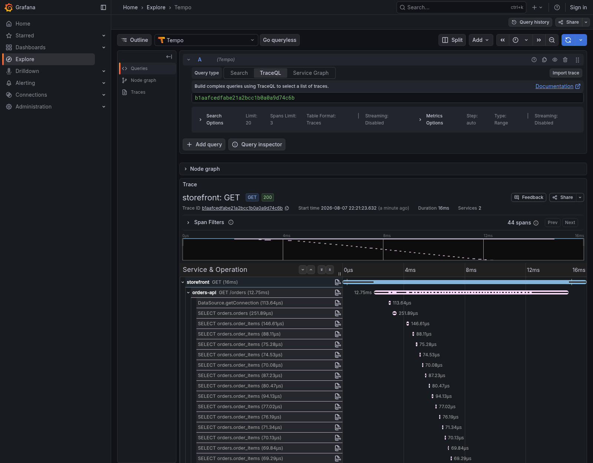
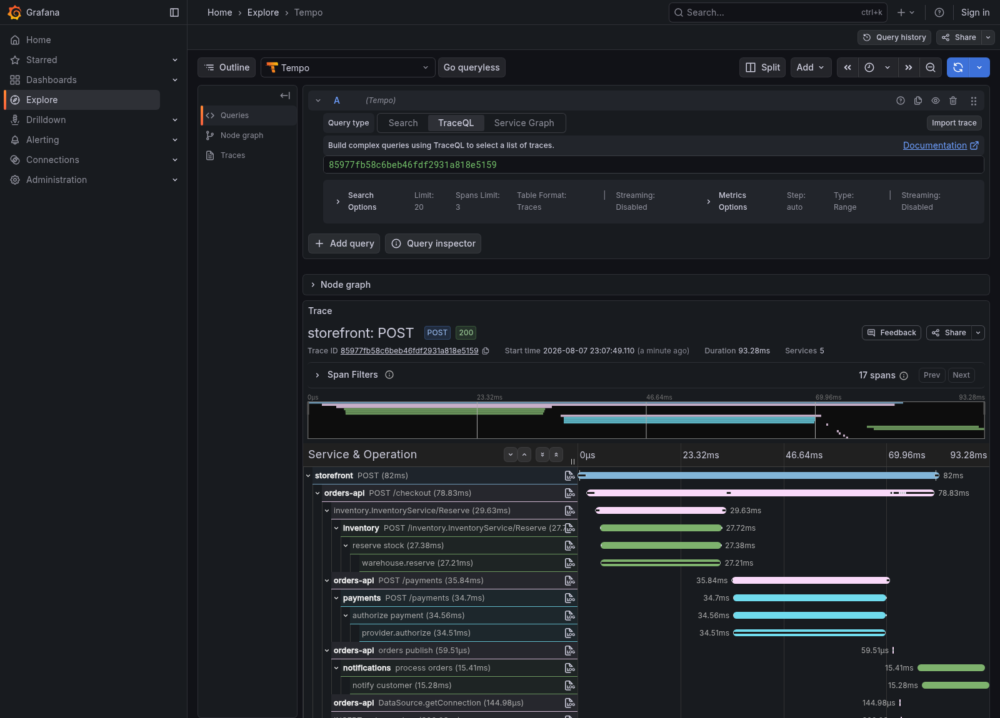
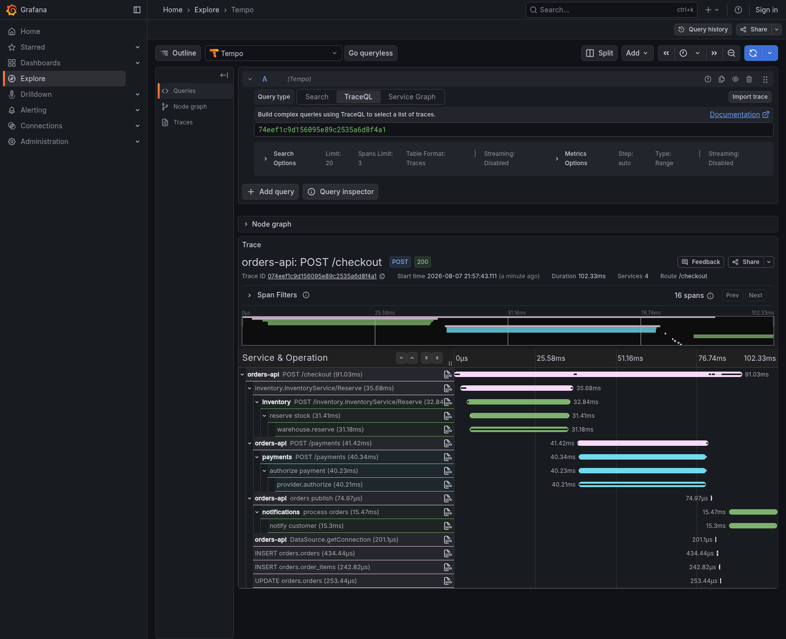
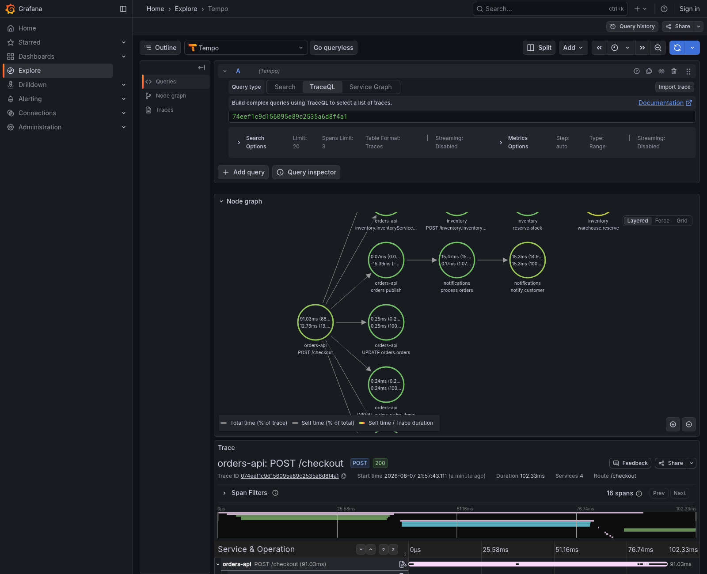
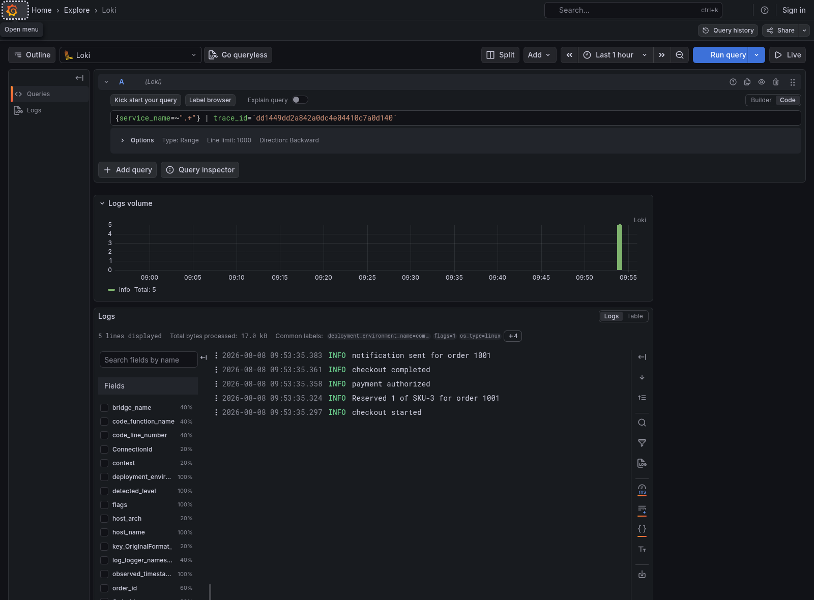
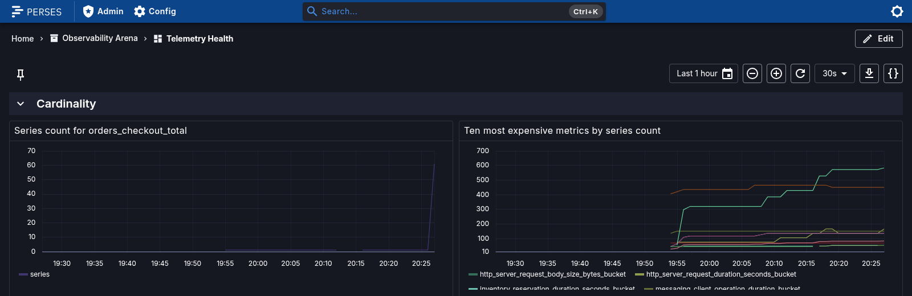
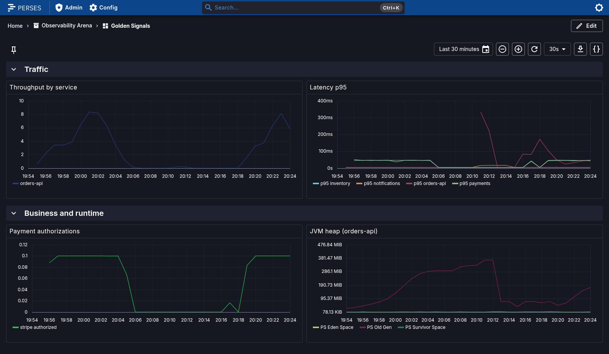
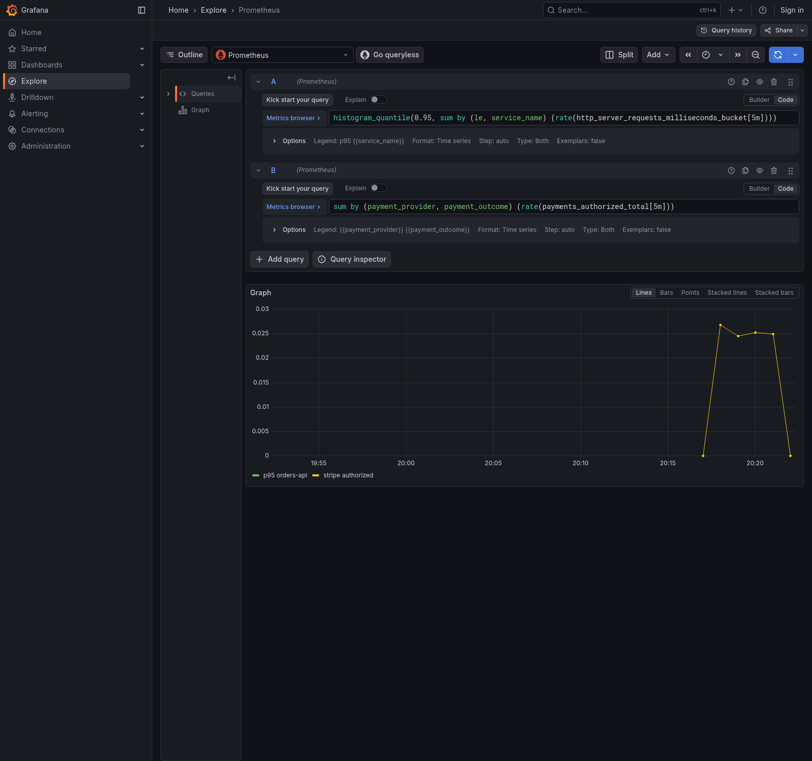
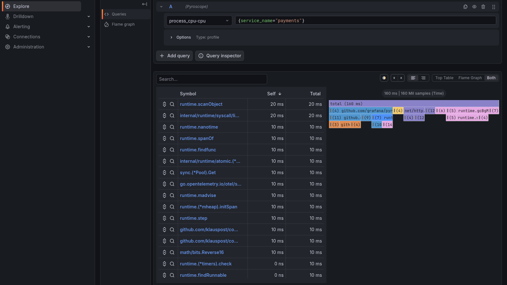

> **Part 2 of 2.** [Part 1](/en/posts/observability-quarkus-opentelemetry/) covered why
> to instrument and how to do it in a Quarkus service. Here the system becomes five
> services in four languages, and then we get into what changes in production.
>
> Every number came from measurements in the
> [observability-arena](https://github.com/omatheusmesmo/observability-arena) repo.

## The same concept in the other languages

The demo's trace crosses four runtimes. What changes in each one is not the concept, it
is how much of the mechanism stays visible.

### Go: where there is no magic

Go is the only stack here with no monkey patching, no agent and no build-time weaving.
You pass `context.Context` by hand, function to function, or the trace breaks.

```go
func authorize(ctx context.Context, req PaymentRequest, ...) (PaymentResult, error) {
    ctx, span := tracer.Start(ctx, "authorize payment")
    defer span.End()

    span.SetAttributes(attribute.Int64("payment.order_id", req.OrderID))

    auth, err := callProvider(ctx, req, chaos, m)  // ← the ctx travelling
    ...
}
```

That inverts the teaching value. In Quarkus you see the result and trust it. In Go you
see the mechanism: **the `ctx` crossing the stack IS context propagation**, spelled out.

And the failure mode teaches alongside it: drop the `ctx` anywhere and the child spans
detach from the trace. Nothing errors, nothing warns, they simply stop appearing under
the parent.

Two traps worth knowing:

- On the server, everything depends on `otelhttp.NewHandler`. It is what reads the
  incoming `traceparent` and opens the server span.
- The propagator has to be registered explicitly. Without `otel.SetTextMapPropagator`,
  the `traceparent` arriving from Java is ignored and the service starts a new trace. One
  request becomes two disconnected traces, and that is how distributed tracing fails in
  silence.

### NestJS: import order decides everything

```ts
// FIRST line of main.ts. Not style, a requirement.
import './instrumentation';
```

OpenTelemetry instruments Node by monkey patching exports. If Fastify or kafkajs load
before the SDK starts, the SDK patches a copy nobody uses. The application looks
instrumented, raises no error at all, and produces empty traces.

With CommonJS (Nest 11) that import is enough, because `require()` is synchronous and
ordered. With **ESM**, the default from Nest 12, that guarantee disappears: imports are
hoisted and evaluated before the module body. There you have to load from outside the
graph:

```bash
node --import ./dist/instrumentation.js dist/main.js
```

### .NET: the platform already had the abstraction

The inventory service is .NET 10 with gRPC, and it repeats a pattern worth noting:
**some platforms already have an instrumentation layer, and OpenTelemetry plugs into it
rather than replacing it.**

In Quarkus that layer is Micrometer. In .NET it is `ActivitySource` and `Meter`, from
`System.Diagnostics`, part of the standard library:

```csharp
public static readonly ActivitySource ActivitySource = new(ServiceName);

// An Activity in .NET is what the OpenTelemetry specification calls a Span.
using var activity = Telemetry.ActivitySource.StartActivity("reserve stock");
activity?.SetTag("order.id", request.OrderId);
```

A library can emit spans without depending on OpenTelemetry, and an application that
never configures OpenTelemetry pays nothing for them. The SDK simply subscribes.

The equivalent trap here: **with nobody subscribed to the `ActivitySource`,
`StartActivity` returns `null` and every span disappears in silence.** It is the number
one reason for "my custom spans do not show up" in .NET, and it is why that service's
test registers an `ActivityListener` explicitly.

And in logging, `ILogger` with structured placeholders, never interpolation:

```csharp
logger.LogInformation("Reserved {Quantity} of {Sku} for order {OrderId}",
    request.Quantity, request.Sku, request.OrderId);
```

The OpenTelemetry provider ships the placeholders as attributes. Interpolating the string
would produce a readable line that cannot be filtered.

### gRPC: when propagating too much breaks propagation

This service is in the repo because of the boundary, not the language. gRPC carries
context in **call metadata**, not in an HTTP header. Same 55 character string, different
envelope.

And it is the boundary with the most confusing symptom in the repository: two perfectly
instrumented services, clean telemetry on both, and **two disconnected traces**.

A four line middleware asking what actually arrives settles it in one restart:

```
traceparent=00-ba7ee5ef...-ce2e845b...-01,00-ba7ee5ef...-cf9e9638...-01,00-ba7ee5ef...-3b047e1f...-01
activityParent=(null)
```

**Three traceparent values, comma separated.** The W3C specification allows exactly one.
.NET saw a malformed header, discarded it and started a new trace, which is precisely
what the spec tells it to do.

Two sources injecting into the same call is enough to break it, and getting to three is
easy: the `quarkus-opentelemetry` instrumentation, the Vert.x based gRPC client (which
the documentation recommends in general, and which injects a second time here), and any
manual interceptor written to "fix" the problem.

Hence the configuration in the repository, which is a line **not** written:

```properties
# quarkus.grpc.clients.inventory.use-quarkus-grpc-client=true  <- do not do this here
```

The rule that sticks: **when propagation breaks, the instinct is to add more propagation,
and that makes it worse.** A duplicated `traceparent` is worse than a missing one,
because every component looks correct in isolation. Before touching code, look at what
actually arrives.

### Angular: closing the trace in the browser

The strongest moment in the demo is a single trace that **starts at the user's click and
ends at the Postgres query**.



Read it top to bottom: `storefront GET` in blue is the browser. Below it,
`orders-api GET /orders`. And below that, the ladder of `SELECT orders.order_items` from
part 1.

A bad LCP stops being "the frontend is slow" and becomes "the `GET /orders` spent its
time on an N+1 over the orders table". Same data, a completely different conversation
between teams.

#### Use the OpenTelemetry SDK, not a vendor SDK

The storefront uses `@opentelemetry/sdk-trace-web`, not a vendor SDK. Grafana Faro is the
natural candidate and it is a good product, with Core Web Vitals and error capture out of
the box. Two reasons weighed against it, and at bottom they are the same reason:

**Faro does not speak OTLP.** It posts a proprietary payload to a proprietary receiver.
Pointing it at the collector's OTLP port fails with a bare `TypeError: Failed to fetch`,
and making it work requires running an extra receiver on an extra port just to translate
back into OTLP.

**And it is not CNCF.** It is Grafana Labs, under AGPL. Everything else in the repository
travels over OTLP through neutral components, and the browser was the only place that did
not.

```ts
const provider = new WebTracerProvider({
  resource: resourceFromAttributes({
    [ATTR_SERVICE_NAME]: 'storefront',
    [ATTR_SERVICE_NAMESPACE]: 'observability-arena',   // the browser is part of the system
  }),
  spanProcessors: [new BatchSpanProcessor(
    new OTLPTraceExporter({ url: environment.otlpTracesUrl }),
  )],
});

provider.register();   // installs the provider AND the W3C propagator

registerInstrumentations({
  instrumentations: [new FetchInstrumentation({
    propagateTraceHeaderCorsUrls: [/localhost:8080/],   // who receives the traceparent
  })],
});
```

Two pieces, and both fail quietly if missing. `register()` installs the W3C propagator:
without it spans are created and **no traceparent is injected**. And
`FetchInstrumentation` is what actually injects the header into calls: without
`propagateTraceHeaderCorsUrls` listing the origin, the call is traced but leaves
**without context**, and you end up with one trace on the front and another on the back
that never meet.

The `service.namespace` there is not decoration. Without it the browser shows up in the
backend as a loose service, outside the system it belongs to.

#### Three traps, all silent

**1. `traceparent` is not a CORS-safelisted header.** If the API does not allow it, the
browser strips it without warning. No console error, no failing request.

```properties
quarkus.http.cors.headers=traceparent,tracestate,baggage,content-type
```

**2. The collector needs CORS too.** The browser talks directly to the collector, and
without CORS there the browser SDK fails with the same generic `Failed to fetch`. **They
are two distinct places**, and getting only one right still leaves you with no frontend
telemetry.

**3. Your own sampling hides the traces from you.** A fast, error-free `GET /orders` falls
into the gateway's 10% policy. With a handful of clicks, the odds of nothing surviving are
high, and the natural reading is that the browser is not exporting. It is.

That last one is the most treacherous of the three, because everything is working
**exactly as configured**.

---

## Real troubleshooting: the demo in action

> Every query used in this section is in
> [QUERIES.md](https://github.com/omatheusmesmo/observability-arena/blob/main/QUERIES.md),
> validated against this stack.

### The incident that opens part 1

Let us degrade the payments service on purpose and reproduce the 2:32 pm scene that opens
part 1:

```bash
docker compose --profile distributed up -d
CHAOS_LATENCY_MS=2000 docker compose --profile distributed up -d payments
k6 run load/scenario-03-cascading-failure.js
```

Result:

```
p95            2062ms
failure rate   0.00%
```

**Look at that zero.** No errors. Every availability dashboard is green. And every user is
waiting two seconds.

Degradation shows up as latency long before it shows up as errors. If your alerting only
knows about error rate, that is the window in which you are blind.

#### How this incident gets investigated without distributed tracing

This is where the effort becomes visible, because the difference stops being comfort and
starts being hours.

Without traces you have five independent sources and no seam between them. The
investigation becomes this:

1. **Open four dashboards** and compare by wall clock. Each team looks at their own, and
   each is technically right: `payments` has 0% errors, `inventory` is normal, the
   database is normal.
2. **Grep logs across four services** by time window, because there is no shared id. You
   filter "2:32 pm to 2:34 pm" in each one and try to match lines by proximity. At ten
   requests per second there are hundreds of candidates on each side.
3. **Trust that the clocks agree.** A few milliseconds of drift between machines and the
   event order you reconstructed is wrong, with nothing warning you.
4. **Blame the wrong component.** `orders-api` is the one screaming: connection pool
   drained, requests queueing, requests that never touch payments starting to fail too.
   Every signal points at it. It is the victim.

The typical outcome is a war room: four teams, three hours, and the answer coming from
somebody who **remembered** a deploy at the payment provider. Tribal knowledge, not data.

With the trace, the same question takes fifteen seconds and requires nobody to remember
anything: you open a slow request and read where the time went.



**That screenshot is the whole article in one image.** One click in the browser, five
systems, four languages, and a single trace id stitching everything together.

Read it top to bottom:

```
storefront    POST                    82.00ms   ← browser (Angular)
└── orders-api  POST /checkout        78.83ms   ← Java
    ├── InventoryService/Reserve      29.63ms   ← gRPC ────► .NET
    │   └── reserve stock             27.38ms
    │       └── warehouse.reserve     27.21ms
    ├── POST /payments                35.84ms   ← HTTP ────► Go
    │   └── authorize payment         34.56ms
    │       └── provider.authorize    34.51ms
    ├── orders publish                 0.06ms   ← Kafka ───► Node
    │   └── process orders            15.41ms
    │       └── notify customer       15.28ms
    └── INSERT / SELECT                         ← JDBC ────► Postgres
```

Each colour is a system, and **each colour change is a different transport carrying the
same context**. Green is `inventory`, reached over **gRPC**, where the context travels in
call metadata. Blue is `payments`, over **HTTP**. The light green at the bottom is
`notifications`, and what comes before it is **Kafka**: `orders publish` at 60
microseconds, followed by `process orders` at 15.41ms. The producer finished and
returned; the consumer ran afterwards, in another process and another language.

Nobody coordinated anything between those five services. There is no central registry, no
shared database, no agreement between teams. There is one 55 character string that each
one passes along, over three different transports.

The same flow without the browser, for comparison, and the system map derived from it:






Nobody drew that diagram. It was inferred from parent/child relationships between spans.

The trace answers immediately: the time is inside `provider.authorize`, in the Go
service, and everything above it is simply waiting.

And the detail that confuses all three teams: **the database was never the problem, but
`orders-api` really did run out of connections.** It holds the transaction while waiting
for payment, so a slow call becomes a retained connection, and requests that touch no
payment at all start failing too.

The component that screams loudest is rarely the one that broke.

### From trace to log, and back



Filtering by `trace_id` returns the whole checkout, and each line came from a different
service through a different mechanism:

| Service | Mechanism |
|---|---|
| `orders-api` | MDC populated by the Micrometer/OTel bridge |
| `inventory` | `ILogger` wired into .NET's OTel pipeline |
| `payments` | the `otelslog` bridge, reading context from `ctx` |
| `notifications` | `PinoInstrumentation` injecting into every Pino line |

None of them writes `trace_id` by hand. Correlation is not a one-stack trick, it is
configuration.

### "But what about structured JSON logging?"

This is the question almost everyone asks here, and it has an inversion inside it.

**Over OTLP the log is already structured, and better than JSON.** The OpenTelemetry data
model has typed attributes, `severity_number`, `trace_id` and the Resource as first-class
protocol fields. Those `order_id` and `code_function_name` entries in Loki's field panel
did not come from anybody parsing JSON: they came from the protocol. JSON on the console
is a way of squeezing structure into a byte stream, which is the problem OTLP does not
have.

So JSON on stdout does not serve the pipeline. It serves the **other channel**, and that
is where a trap lives which is nobody's fault: it comes from the documentation's minimal
example.

The `otelslog` docs show how to create the logger, and the natural next step is
installing it as the default:

```go
slog.SetDefault(slog.New(otelslog.NewHandler(serviceName)))
```

That is correct, and it does exactly what it promises. The detail is the word
**replaces**: from that line onward, `slog` has exactly one destination. Take the
collector down and send a request: it answers **200**, the payment is processed, and
`docker logs` comes back **completely empty**. Not even the startup line. A healthy
service, serving traffic, mute on the only channel left precisely when the thing that
broke was observability.

This is not a defect of Go or of the library. It is what happens when a minimal example
is treated as final configuration, and it generalises: **every single telemetry
destination is a single point of blindness.**

The log over OTLP is what you query. The log on stdout is what **survives**. Both, always,
and the stdout one in JSON because nobody aggregates prose.

And here Go charges the price of having no magic, consistent with the rest of this
section: `slog` has no fan-out handler in the standard library, so it takes about 65 lines
to deliver the same record to both destinations and copy the trace id to the side that
knows nothing about spans. In the other three it is configuration:
`quarkus-logging-json`, `AddJsonConsole()` in .NET, and Pino already writes JSON by
default.

---

## Production: where the bill arrives

Everything so far works on one machine. This section is about what changes when there are
forty services and an invoice at the end of the month.

### The structural mistake: every app talking to the backend

The most common mistake in a company is not technical, it is a design one. Every
application exports telemetry straight to the observability backend.

That works in a tutorial. With forty services it means changing the sampling policy is a
ticket for forty teams, switching vendors is a migration project, and one piece of
sensitive data leaked into a trace has to be fixed in forty repositories.

The design the industry settled on:

```
applications ──► agent ──► gateway ──► backend
                (enriches)  (samples, redacts)
```

Applications never talk to the backend. Policy lives in one place. This is not fussiness:
it is the difference between "let us change the sampling" being four lines of YAML or
being a quarter.

### What the collector actually is

Worth stopping here, because the collector tends to get treated as plumbing, and it is
the component where nearly every decision that matters lives once instrumentation is
done.

It is a process with four kinds of part, and a pipeline is how they connect:

| Part | What it does | Examples here |
|---|---|---|
| **receiver** | where data comes in | `otlp` over gRPC 4317 and HTTP 4318 |
| **processor** | transforms in transit | `memory_limiter`, `tail_sampling`, `attributes` |
| **exporter** | where data goes out | `otlp` to the next hop |
| **connector** | consumes one signal and emits **another** | `spanmetrics`, `servicegraph` |

The connector is the part almost nobody uses and the most interesting one: it wires the
output of one pipeline into the input of another, and that is how traces become metrics
without anybody instrumenting a single metric.

```yaml
traces:
  receivers: [otlp]
  processors: [memory_limiter, tail_sampling, attributes/redact, batch]
  exporters: [otlp, spanmetrics, servicegraph]

metrics:
  receivers: [otlp, spanmetrics, servicegraph]   # ← the same names, on the other side
  processors: [memory_limiter, batch]
  exporters: [otlp]
```

That is why the service map you saw above exists without anybody drawing anything, and
why the RED panel works even for a service that never configured a metrics SDK. If the
Service Graph tabs in your Grafana are empty, that is almost always what is missing: the
feature is there, the data is not.

#### Processor order is not style

The OpenTelemetry documentation is specific about this, and each position has a reason:

1. **`memory_limiter` first, always.** It refuses data when memory gets tight. Placed at
   the end, the earlier processors have already accumulated what will not be delivered,
   and then the collector dies of OOM taking with it the telemetry that would have
   explained the incident.
2. **Sampling and filtering before enrichment**, so you do not spend CPU on data that is
   about to be discarded.
3. **Enrichment before `batch`**, because batching **clears the request context**. A
   processor that depends on it (`k8sattributes`, for example) placed afterwards silently
   stops finding anything.
4. **`batch` last.**

#### Why two tiers, not one

The agent runs next to the workload: a DaemonSet in Kubernetes, a sidecar here. It stays
deliberately dumb, doing only what requires being close: discovering host and container,
and forwarding.

The gateway is where policy lives, and the split is not taste: **an agent never sees more
than its own fragment of a trace**. That is what pushes tail sampling upstream, as the
next section shows with numbers. Redacting sensitive data follows the same reasoning:
once, in one place, instead of in four codebases.

#### What keeps you from losing data

Two exporter settings are the difference between a backend restart being a scare or a
hole in the graph:

```yaml
exporters:
  otlp:
    retry_on_failure:
      enabled: true
    sending_queue:
      enabled: true
      queue_size: 5000
```

The queue absorbs short unavailability of the next hop, and the retry handles the rest.
Without them, a backend down for thirty seconds becomes thirty seconds of telemetry that
never existed, and the worst time to discover that is afterwards.

One honest caveat: the default queue is **in memory**. If the collector restarts, whatever
was in it dies. There is a persistent disk-backed queue, and it is the next step once the
loss starts costing something real.

### Sampling less is the wrong answer

At 100% sampling, a busy service spends more on telemetry than on serving traffic. The
naive fix is to sample less, and it throws away errors and slow requests in the same
proportion as the boring ones.

Tail sampling solves it, and **only works at the gateway**, because the decision needs the
complete trace and spans arrive from different agents:

```yaml
tail_sampling:
  decision_wait: 10s
  policies:
    - name: keep-errors      # never drop a failure
    - name: keep-slow        # never drop something slow
    - name: keep-checkout    # revenue path, always
    - name: sample-the-rest  # 10% of everything else
```

Measured on the demo, with part of the traffic degraded on purpose:

```
keep-slow        sampled=true      39    ← 100% of the slow ones
keep-checkout    sampled=true     110    ← 100% of the checkouts
sample-the-rest  sampled=true    1646    ← 10% of the rest
sample-the-rest  sampled=false  12828
```

About **12% stored, an 88% reduction**. But notice **which** 10%: all the slow ones, all
the checkouts, and a uniform sample of the boring traffic.

With head sampling at 10% you would have discarded nine out of every ten slow traces, and
the incident from the beginning would be undebuggable. That asymmetry is what pays for the
gateway's complexity.

#### So what about the service-level sampler?

It still exists, and the Quarkus configuration is trivial:

```properties
quarkus.otel.traces.sampler=traceidratio   # build time
quarkus.otel.traces.sampler.arg=0.5        # runtime: 1.0 everything, 0.0 nothing
```

Note the asymmetry, which is the same build time trap from part 1: **choosing the sampler
is build time, adjusting the rate is runtime**. Swapping `traceidratio` for another
sampler through an environment variable has no effect and no warning. But turning
`sampler.arg` during an incident works, and that is what lets you open the tap without a
redeploy.

The sensible production default is `parentbased_always_on`: every service respects the
caller's decision, so **a trace is never left half sampled**, and volume control lives
entirely at the gateway. Head sampling in each service, at different rates, is how you
produce traces that end in the middle with nobody understanding why.

The exception is serverless, where `quarkus.otel.simple=true` exists: it exports directly,
without batching, because a process that dies in seconds has no time to flush a batch.

### The mistake that takes down the metrics backend

```java
Counter.builder("orders.checkout")
    .tag("order.status", order.status)          // 3 possible values
    .tag("order.id", String.valueOf(order.id)); // one per order, forever
```

Both are strings. Both read the same. Both pass code review. Only one of them is a metric
label.

Measured:

```
without the tag,  10 checkouts  ->   1 series
with the tag,    +60 checkouts  ->  61 series
```

Ten orders share one series. Sixty orders create sixty. The relationship is linear and has
no ceiling, and every series occupies memory and disk for the whole retention window.

The rule: **if you cannot name every possible value of a label, it is not a label.**
`status`, `provider`, `region`: nameable, fine. `order.id`, `user.id`, a `url` with a
query string, an error message body: unbounded, and they belong on spans.

The perverse part is that nothing breaks when you add the label. The build passes, the
tests pass, the dashboard even gets **better**, because now you can filter by order. The
degradation is gradual and shows up weeks later, in another team's system.



It is literally a wall going up. On the left, `orders_checkout_total` going from one
series to sixty-one the instant the label landed. On the right, the ranking of the most
expensive metrics in the stack, which is the panel that answers "who is costing me".

Watching that after each deploy is cheap and almost nobody does it. A step there means
somebody added a label.

### Exemplars: the link that closes the loop between signals

Up to here the four signals have been presented as separate things you correlate by hand.
Exemplars break that.

An exemplar is a pointer travelling **inside** the metric: alongside the histogram value
goes the trace id of a request that produced it. On the chart it appears as a small dot on
the line. You click it and land in the trace.

In the collector, it is one line:

```yaml
connectors:
  spanmetrics:
    exemplars:
      enabled: true
```

Measured on the demo:

```
trace_id: e6110809ee54503136f18948524daa75   value: 1.820741
```

That number is the duration in milliseconds of a real request, and that id leads to its
trace.

Think about what that changes in an investigation. Without exemplars you see a spike in
p99, note the time, go to Tempo, filter by service and time window, and hunt for something
that looks slow. With exemplars, you **click the spike**.

It is the difference between "there are slow requests in this interval" and "this request
here, with this id". And it is surprisingly underused, considering it is one line of
configuration.

One caveat: exemplars only exist if the metric is derived from spans, or if the SDK
attaches the active context when recording the value. A business metric incremented
outside a span has nothing to point at.

### Dashboards as code

The panel above was not assembled by clicking. It is a YAML file in the repository, served
by **Perses**, the CNCF sandbox project for visualisation.

Worth explaining why there are **two** in the stack, because that confuses people for good
reason.

Grafana is what appears in every investigation screenshot in this article, and it is here
for a reason nothing replaces today: **it is the exploration tool**. Clicking from a metric
to an exemplar, from the exemplar to the trace, from the span to the log, all without
writing a query. That flow is the product.

Perses does something else: **versioned dashboards**. The panels you want identical in
every environment, reviewed in a pull request, restored by `git checkout`.

That also closes the last neutrality gap: collection and transport are CNCF
(OpenTelemetry), storage is CNCF (Prometheus), and visualisation was the hole, because
Grafana is Grafana Labs under AGPL. Perses is a CNCF sandbox project.

This is not "replace Grafana with Perses". It is explore in Grafana and version in Perses,
and in practice both read exactly the same datasources.



All four panels come from a file in the repository.

In practice the more immediate gain is different: provisioning overwrites the database on
every cycle, so **clicking in the UI cannot create drift**. The repository is the source of
truth by construction, and whoever clones gets working dashboards instead of an empty
screen.

### The blind spot: the pipeline itself

One last thing: **the collector itself needs to be observed**. It is the component most
likely to drop data silently under load, and a blind collector in the middle of the
pipeline cancels out everything before it.

```promql
rate(otelcol_exporter_send_failed_spans[5m])
```

And on the other side of the panel, the metrics that describe the business rather than the
infrastructure:



"p99 of the HTTP handler" is a proxy. "Authorization failure rate by provider" is what
somebody gets woken up at three in the morning to fix. Auto-instrumentation will never
invent the second one.

Spans the collector failed to export are spans that stopped existing. Silent telemetry
loss looks exactly like a healthy system.

---

## Testing observability

A question almost nobody asks: **how do you know your instrumentation still works?**

The honest answer on most projects is "when somebody needs it and finds out it is not
there". Instrumentation breaks silently, and this entire article is a list of examples.

The demo has 29 tests, and several of them do not check the HTTP response. They check the
span tree:

```go
// The child has to carry the parent's trace id. Drop the ctx anywhere in the chain and
// this assertion breaks, which is exactly the failure mode nobody notices.
if child.SpanContext().TraceID() != parent.SpanContext().TraceID() {
    t.Error("child span detached from the parent trace")
}
```

In .NET, the test registers an `ActivityListener` explicitly, which documents in code the
dependency described earlier: with no subscriber, there is no span.

In Angular, the test asserts the header follows the W3C format:

```ts
expect(traceparent).toMatch(/^00-[0-9a-f]{32}-[0-9a-f]{16}-[0-9a-f]{2}$/);
```

And in Java, one test exists **specifically to prevent an improvement**:

```java
@Test
void leavesTimersAloneBecauseTheUnitWouldSilentlyDisagree() {
    // renaming this to http.server.request.duration would claim seconds
    // while recording milliseconds
}
```

If somebody in the future "completes" the convention mapping, the test fails and explains
why that is a regression, not progress.

The principle: **if the span tree is the service's product, that is where the test should
speak**. A correct response with disconnected spans is a service that will be undebuggable
in production, and no API test catches that.

The clearest case came from the .NET service. The bug at that boundary was in the
transport, and the tests use a real in-process gRPC service rather than a mocked stub for
exactly that reason: a mock would have sailed straight past it.

---

## What to alert on: SLOs instead of symptoms

If CPU alerts are bad, what goes in their place? The substitute has a name, and in fact
there are four.

The acronym soup gets in the way more than it helps, so it is worth pinning all four down
at once. They form a ladder, and each rung has a different owner:

| Acronym | What it is | Who cares |
|---|---|---|
| **SLI** | the **measurement**: "% of requests under 300ms" | whoever instruments |
| **SLO** | the **internal target** for the SLI: "99.9% over 30 days" | the engineering team |
| **SLA** | the **contract** with the customer, with penalties | legal and sales |
| **Error budget** | what is left of the SLO: 0.1%, or 43 minutes a month | whoever prioritises |

The common confusion is thinking SLO and SLA are the same thing under different names.
They are not, and the difference is deliberate: **the SLO is always stricter than the
SLA.** If the contract promises 99.5%, the internal target is 99.9%, so the team gets woken
up before the customer is entitled to a refund. The slack between the two is the room to
fix things without commercial consequences.

The SLI is the only one of the four that is technical. The other three are business
decisions taken on top of it, which is why a badly chosen SLI contaminates everything
downstream: if you measure the average instead of a percentile, your SLO stays green while
the tail suffers.

And the **error budget** is the piece that changes team behaviour. It turns "did we have
errors?", which is a question about blame, into "how much of the budget have we spent?",
which is a question about planning. Budget to spare is permission to risk a deploy; budget
running out is a signal to stop and stabilise.

In numbers: a 99.9% SLO over 30 days gives a 0.1% budget. With a million requests, you can
fail a thousand times before blowing it.

With the metrics this repo already produces:

```promql
sum(rate(http_server_requests_milliseconds_count{http_response_status_code!~"5.."}[30d]))
/
sum(rate(http_server_requests_milliseconds_count[30d]))
```

And what actually deserves an alert is not the SLO itself, it is the **burn rate**. Alert
when the budget runs out and you warned too late. Alert on every isolated error and the
team stops reading.

Burn rate is how many times faster than acceptable you are spending:

```promql
(
  sum(rate(http_server_requests_milliseconds_count{http_response_status_code=~"5.."}[1h]))
  /
  sum(rate(http_server_requests_milliseconds_count[1h]))
) / 0.001
```

A result of 14.4 means that at this pace the 30 day budget is gone in two days. The
established practice is two windows: a long one for confidence, a short one to react
quickly, and alerting only when both agree. That cuts the false positive from a thirty
second spike.

Notice what that fixes: **the alert starts talking about users, not machines.** CPU at 95%
with every SLO green wakes nobody. And it should be that way, because high CPU is not a
problem, it is an observation.

The repository ships the metrics and the queries, and does not ship the alerting rules:
building a dual-window rule is a Grafana Alerting or Prometheus Alertmanager topic, and
would take another article.

---

## Four runtimes, two profiling models

Part 1 covered the fourth signal inside the JVM. Across runtimes it is the signal that
varies most. With the demo finished, the four backend services ended up like this, and the
split was not a matter of taste:

| Service | How | Model |
|---|---|---|
| `orders-api` (Java) | JFR, native to the JVM | records locally, collected on demand |
| `payments` (Go) | Pyroscope, library | continuous streaming |
| `notifications` (Node) | Pyroscope, library | continuous streaming |
| `inventory` (.NET) | **none** | see below |

**Where the platform already has the mechanism, use the mechanism.** The JVM has JFR, and
the `quarkus-jfr` extension adds the event that lets you go from a trace id to the
corresponding thread and time window inside the recording. Go and Node have no equivalent,
so there it is a library, and the model shifts: instead of recording locally and dumping on
demand, they sample and push continuously.

Notice what that difference means for cost. JFR sends nothing anywhere: it is a bounded
ring buffer on local disk that you read when you need it. It creates no time series, does
not weigh on the metrics backend, and has no cardinality. The streaming model has one more
service to operate and a storage bill proportional to how long it runs.

.NET ended up with nothing, and that is an honest gap. It **does** have EventPipe, the
runtime's own JFR equivalent, and a Pyroscope profiler for .NET exists. Neither fits here:
the profiler needs native libraries and a base image with full glibc, while this one is
*chiseled* on purpose. It stays documented as a gap rather than configured halfway,
because configuration that does nothing is worse than configuration that is absent: the
next person will assume it is covered.

And the difference between the two models is visible without reading any configuration.
Just ask Pyroscope who is reporting:

```json
{"names":["notifications", "payments", "pyroscope"]}
```

Two out of four. `orders-api` records locally and `inventory` records nothing, and the list
gives that away faster than any documentation.

The practical upside of streaming is this, and it is where it beats JFR: the profile
becomes a query in Grafana, alongside the other signals, with no terminal and no copying
files out of a container.



You pick a profile type and a label selector, like any other datasource:

```
process_cpu:cpu:nanoseconds:cpu:nanoseconds   {service_name="payments"}
```

And then the feature the local model does not have shows up: the **Diff** query type,
which takes two time ranges and colours the flame graph by the delta, red for what grew.
After a deploy, the question is rarely "where is the CPU", it is "what changed". It is the
exemplar's equivalent for profiles, and the reason to keep profiles for longer than a few
minutes.

---

## Following the official docs: the checklist

The OpenTelemetry documentation has explicit instrumentation recommendations. This is the
state of the repository against them, and it works as a checklist for yours:

| Recommendation | State | How |
|---|---|---|
| Low cardinality span names | ok | `authorize payment`, never `authorize order 1019` |
| `service.name` on every service | ok | all five |
| `service.version` and environment | ok | lets you ask "did this start with the last deploy?" |
| `service.namespace` | ok | groups the five as one system |
| `recordException` + `setStatus(ERROR)` | ok | on all four backends |
| A log channel that does not depend on the collector | ok | OTLP plus JSON on stdout |
| Do not create too many spans | ok | events instead of spans for internal operations |
| `schema_url` declared | **partial** | Go only |
| `isRecording()` before an expensive attribute | **absent** | deliberate, see below |

Two deserve an explanation, because the decision matters more than the item.

**`recordException` and `setStatus` travel together**, and the docs are explicit. A span
that fails while reporting `Ok` makes every error-rate dashboard lie and, worse, makes the
tail sampling policy that keeps errors keep nothing. It is the easiest item to forget,
because the `try/catch` is already there and looks complete.

**`isRecording()`** avoids computing expensive attributes on spans that will be discarded.
It is absent on purpose: no attribute here is expensive, they are ids and strings that
already exist. In an application that serialises a large object into an attribute, it would
be mandatory.

The partial `schema_url` is acknowledged debt. It documents which version of the convention
you wrote against, and without it a consumer cannot know whether that span's
`http.request.method` means what they think it means.

---

## Where to start on Monday

If you got this far convinced, the next obstacle is thinking you need all of it at once.
You do not. The order below is by return on effort, and each step works on its own.

**Step 1, one afternoon: one service, traces only.** Pick the service where the incidents
live. Add the extension, point it at a local Grafana LGTM, and turn on database
instrumentation. In Quarkus that is three lines and a `quarkus dev`. You will already see
things you did not know about.

**Step 2, a few hours: correlate the logs.** Do not write `trace_id` by hand anywhere: in
every stack that is configuration. When a clickable log leads to the trace and back, the
value becomes obvious to the whole team, and that is usually when adoption turns.

**Step 3, the second application.** This is where the magic shows up, because context
propagation crosses over without anybody coordinating. Pick the service the first one calls
most. If something goes wrong, reread the silent traps section: it is almost always CORS or
an unregistered propagator.

**Step 4, business attributes.** Auto-instrumentation gives you route and status. Only you
know that `order.id`, `tenant` and `payment.provider` exist. It is one line per span, and it
is what turns a trace into an answer instead of a pretty chart.

**Step 5, and only now: the collector.** Once there are three or four services, put an agent
and a gateway in the middle. That is when you gain sampling, redaction of sensitive data,
and freedom to change backends. Before that it is complexity with no return.

Notice what is **not** on the list: there is no "pick a vendor". That decision stopped being
the first one and became the last, and a reversible one. That is the gift standardisation
hands you.

---

## The repository

Everything in this article lives in
[observability-arena](https://github.com/omatheusmesmo/observability-arena): five services
(Quarkus 3.33 LTS on Java 25, Go 1.26, .NET 10 with gRPC, NestJS 11 and Angular 22), nine
planted failure scenarios, k6 scripts, versioned dashboards and the full collector
topology. Every number in this text was measured there.

The shortest path is still:

```bash
cd services/orders-api && quarkus dev
```

---

## What sticks

Observability is not about having data. Everyone already has data, by the terabyte. It is
about being able to answer questions you did not know you would ask.

The 2:32 pm incident that opens part 1 is not solved with more dashboards. It is solved
when somebody opens a trace and sees, in fifteen seconds, that the two seconds are inside
`provider.authorize`, and that `orders-api` was only waiting.

If you take one sentence away from this, make it this one: **almost every observability
failure is silent**. The `traceparent` blocked by CORS, the unregistered propagator, the
import out of order, the build time property in the wrong profile, the high cardinality
label. None of them raises an error. All of them produce a system that looks instrumented
and does not answer when you need it to.

The good news is that the list of traps is short and now it is written down. And the cost
of entry has never been lower: one command brings up the whole stack, and the
instrumentation you write today keeps working if you swap out everything underneath it.
