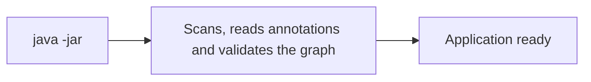
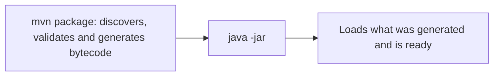
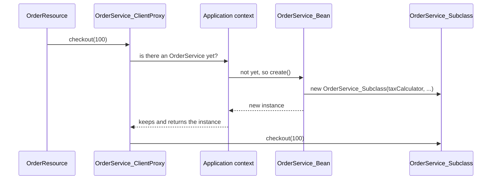

I created two implementations of the same interface, injected it without a qualifier and ran `./mvnw package`. Five seconds later, the build broke:

```text
[ERROR] Build step io.quarkus.arc.deployment.ArcProcessor#validate threw an exception:
jakarta.enterprise.inject.AmbiguousResolutionException: Ambiguous dependencies for type dev.omatheusmesmo.orders.Notifier and qualifiers [@Default]
	- injection target: dev.omatheusmesmo.orders.NotificationResource#notifier
	- available beans:
		- CLASS bean [types=[..., SmsNotifier, ...], target=dev.omatheusmesmo.orders.SmsNotifier]
		- CLASS bean [types=[..., EmailNotifier, ...], target=dev.omatheusmesmo.orders.EmailNotifier]
```

No server started. No runnable application was produced. The error died on the machine of the person who wrote the code.

In a traditional container, this same error only shows up when the application starts. On your laptop, if you're lucky. In the staging pod, if you're not.

That difference in **timing** is what this three-part series is about. In this first one, I show what ArC does at build time and what's left for runtime. In the second, what that changes in application code. In the third, the extension author's side.

Back in February I wrote the [dependency injection guide for Spring developers](/en/posts/mastering-dependency-injection-configuration-quarkus/), which covers *how to use it*. Here I open the hood. I built a small application, dumped the bytecode Quarkus generates and looked at what actually happens.

> **Tested with**
> Java 25 · Quarkus 3.39.5 · Maven 3.9

---

## The lab

A minimal order service with six pieces. Keep these names in mind; they come back in every section.

A tax calculator that logs a line when it's constructed:

```java
@ApplicationScoped
public class TaxCalculator {

    public TaxCalculator() {
        Log.info("TaxCalculator instantiated");
    }

    double rate() {
        return 0.1;
    }
}
```

The order service, which receives `TaxCalculator` through its constructor. `checkout()` calls `total()`, which is audited:

```java
@ApplicationScoped
public class OrderService {

    private final TaxCalculator taxCalculator;

    OrderService(TaxCalculator taxCalculator) {
        this.taxCalculator = taxCalculator;
    }

    public double checkout(double amount) {
        return total(amount);
    }

    @Audited
    double total(double amount) {
        return amount + amount * taxCalculator.rate();
    }
}
```

For auditing, CDI needs two pieces I wrote: a custom annotation, `@Audited`, which marks the audited methods (CDI calls it an *interceptor binding*), and the interceptor that runs before them:

```java
@InterceptorBinding
@Retention(RetentionPolicy.RUNTIME)
@Target({ ElementType.TYPE, ElementType.METHOD })
public @interface Audited {
}
```

```java
@Audited
@Interceptor
@Priority(Interceptor.Priority.APPLICATION)
public class AuditInterceptor {

    @AroundInvoke
    Object audit(InvocationContext ctx) throws Exception {
        Log.infof("AUDIT %s", ctx.getMethod().getName());
        return ctx.proceed();
    }
}
```

The REST endpoint `GET /orders`, which uses `OrderService`:

```java
@Path("/orders")
public class OrderResource {

    private final OrderService orderService;

    OrderResource(OrderService orderService) {
        this.orderService = orderService;
    }

    @GET
    public double checkout(@QueryParam("amount") double amount) {
        return orderService.checkout(amount);
    }
}
```

And a service nobody uses:

```java
@ApplicationScoped
public class LegacyReportService {

    public String report() {
        return "nobody calls me";
    }
}
```

Notice three details that will matter: `TaxCalculator` logs something in its constructor, `checkout()` calls `total()` **from inside** its own class, and no class injects `LegacyReportService`.

---

## 1. The problem ArC solves

CDI (Contexts and Dependency Injection) is the Jakarta EE specification for dependency injection: `@Inject`, scopes like `@ApplicationScoped`, `@Produces`, interceptors, events.

But annotations alone do nothing. Something has to read them and act: create the `TaxCalculator`, hand it to the `OrderService` constructor, keep the instance while the application is up and discard it at the end. That something is the **dependency injection container**, which I'll just call the *container* for the rest of the article. Think of it as the manager of your objects: you declare what each class needs, and it decides when to create things, who gets what and when to throw them away.

> **Don't mix them up:** this container has nothing to do with a Docker container. It's a part of the framework that runs inside the same JVM as your code.

In Spring, the container is the `ApplicationContext`. In CDI, the specification only defines the rules, and each framework brings its own container. The best known one is [Weld](https://weld.cdi-spec.org/), the CDI reference implementation, which runs inside servers like WildFly, GlassFish and Open Liberty. In Quarkus, the container is called **ArC**.

And the name isn't an acronym. When someone asked on the Quarkus mailing list in 2019, Martin Kouba, ArC's creator, [confirmed](https://groups.google.com/g/quarkus-dev/c/3hFuNgxSFq0) that it's a reference to *arc welding*. It's a nod to Weld: ArC started in 2018 as a prototype called ["Weld Arc"](https://github.com/quarkusio/quarkus/blob/026a17bc1fd/ext/arc/README.md), aiming to be a lighter CDI resolved at build time.

The CDI programming model is great. The problem has always been **when** the container does the heavy lifting. A traditional container like Weld does everything at startup: it scans the classpath, reads annotations via reflection, builds the dependency graph, validates it and only then starts serving beans. Every time the application starts, the same work is repeated with the same result. Spring, without AOT, does essentially the same with `@ComponentScan` and `BeanDefinition`.

ArC makes a different bet: if the result is always the same, compute it once, at build time, and write the result down as bytecode.

In a traditional container, everything happens at startup:



With ArC, the heavy lifting moves to the build:



When Martin Kouba introduced ArC in 2019, the comparison was brutal: the ArC runtime had about **72 classes and 140 KB**, against roughly **1,200 classes and 2 MB** for the Weld 3.1.1 core. About 7% of the size. Those numbers are from back then, but they show the order of magnitude of what you can throw away when the container doesn't need to think at runtime.

---

## 2. ArC thinks at build time

During `mvn package`, ArC goes through four phases, according to the [CDI Integration Guide](https://quarkus.io/guides/cdi-integration):

1. **Initialization**: registers custom contexts.
2. **Bean discovery**: analyzes classes through the [Jandex](https://github.com/smallrye/jandex) index, without loading anything via reflection, and wires the injection points.
3. **Registration of synthetic components**: extensions add beans that don't exist as classes (that's the topic of part 3).
4. **Validation**: ambiguity, missing dependencies, classes that can't be proxied.

After that, it **generates bytecode**. To see the result, just list a JAR Quarkus creates during packaging:

```bash
unzip -l target/quarkus-app/quarkus/generated-bytecode.jar | grep orders/
```

```text
AuditInterceptor_Bean.class
Audited_ArcAnnotationLiteral.class
OrderResource_Bean.class
OrderService_Bean.class
OrderService_ClientProxy.class
OrderService_Subclass.class
TaxCalculator_Bean.class
TaxCalculator_ClientProxy.class
```

Something is missing from that list: `LegacyReportService`. It's in the code, it's `@ApplicationScoped`, it compiles, and still it didn't get a single class. Keep that in mind; it's a topic for part 2.

Each suffix has a job:

| Generated class | What it does |
| --- | --- |
| `_Bean` | Bean metadata and the `create()` method that builds the instance |
| `_ClientProxy` | Proxy for normal scoped beans (part 2) |
| `_Subclass` | Applies interceptors (part 2) |
| `_ArcAnnotationLiteral` | Annotation instances without reflection |

### Where does this `create()` come from?

Every CDI container has to answer one question for each bean: "how do I create an instance of this?". The specification formalizes that question as a method, `create()`, in the `jakarta.enterprise.context.spi.Contextual` interface. Every bean implements that interface.

In a traditional container, `create()` is generic: a single piece of code that works for any class and figures out at runtime, via reflection, which constructor to call and what to inject into it. ArC does it differently. At build time, it reads the constructor of **your** `OrderService`, sees that it asks for a `TaxCalculator` and writes a `create()` specific to that class, inside `OrderService_Bean`.

The container itself calls that `create()` the first time someone needs the bean. In our case, the full chain is:

1. `OrderResource` calls `orderService.checkout(100)`.
2. The call lands on the client proxy (part 2), which asks the application context: "is there an `OrderService` yet?".
3. Since there isn't, the context calls `OrderService_Bean.create()`.
4. `create()` builds the instance, and the context keeps it for the next calls.



Now the part that made me smile. I disassembled that `create()` with `javap -c`. Translating the bytecode back into Java, it does basically this:

```java
Object taxCalculator = taxCalculatorProvider.get(creationalContext);
Object interceptor = auditInterceptorProvider.get();
OrderService_Subclass instance =
        new OrderService_Subclass((TaxCalculator) taxCalculator, creationalContext, interceptor);
return instance;
```

Line by line:

- **Line 1**: fetches the dependency your constructor asked for, the `TaxCalculator`.
- **Line 2**: fetches the `AuditInterceptor`, because `OrderService` has an `@Audited` method.
- **Line 3**: creates the instance. It's an `OrderService_Subclass` rather than a plain `OrderService` because the subclass is what applies the interceptors (part 2). Its constructor starts with `super(taxCalculator)`, which means it calls exactly **your** `OrderService(TaxCalculator)` constructor.

In the end, it's your constructor that runs. ArC just worked out at build time which one to call and what to pass in, and wrote that down in bytecode.

And notice what's missing: it's just a `new`. No `Class.forName`, no `Constructor.newInstance`, no `Field.set`. At execution time, the dependency injection container has become plain Java code that any JIT can optimize and that GraalVM compiles to native without any reflection configuration.

And how does the runtime find these classes? With a tool I've already covered on this blog. ArC generates a `_ComponentsProvider` class and registers it as a service provider. At startup, `ArcContainerImpl` does this:

```java
for (ComponentsProvider componentsProvider : ServiceLoader.load(ComponentsProvider.class)) {
    components.add(componentsProvider.getComponents(this.currentContextFactory));
}
```

It's good old [Java SPI with ServiceLoader](/en/posts/java-spi-serviceloader-power/). The difference is that `ServiceLoader` finds **one** class that already carries the complete list of beans, observers and interceptors. Nothing is discovered at runtime; everything is just loaded.

A fun fact: the bytecode is written by **Gizmo**, the Quarkus code generation library. Since Quarkus 3.30, ArC uses [Gizmo 2](https://quarkus.io/blog/arc-migrates-to-gizmo2/), built on top of the JDK's own ClassFile API.

> **Side note:** Spring Framework 6 also has an [AOT](https://docs.spring.io/spring-framework/reference/core/aot.html) mode that generates code at build time, but on the JVM it's optional. In Quarkus, build time is the only mode.

---

## 3. Fail fast: the error that never reaches production

Back to the opening error. It came from a simple test: a notification interface with two implementations, and an endpoint that injects the interface without saying which one it wants.

```java
public interface Notifier {
    void notify(String msg);
}

@ApplicationScoped
public class EmailNotifier implements Notifier {
    public void notify(String msg) {
    }
}

@ApplicationScoped
public class SmsNotifier implements Notifier {
    public void notify(String msg) {
    }
}

@Path("/notify")
public class NotificationResource {

    @Inject
    Notifier notifier;

    @POST
    public void send() {
        notifier.notify("order shipped");
    }
}
```

ArC has no way to guess whether `notifier` should be the email one or the SMS one. Validation happens in phase 4, inside the `ArcProcessor#validate` build step. If it finds a problem, the build stops, and the message already tells you what you need to fix it: the injection point (`NotificationResource#notifier`) and the list of candidates.

The fix is the usual CDI one, with a few ArC shortcuts:

- your own **qualifier** (`@Email`, `@Sms`);
- `@Identifier("email")`, the Quarkus string-based qualifier that avoids the ambiguities of `@Named`;
- `@Alternative` with `@Priority`, or the `quarkus.arc.selected-alternatives` property;
- `@DefaultBean` on the implementation that should back off if another one exists (part 2).

In the lab I used `@Identifier` (from the `io.smallrye.common.annotation` package). Each implementation gets a name, and the injection point says which one it wants:

```java
@ApplicationScoped
@Identifier("email")
public class EmailNotifier implements Notifier {
    public void notify(String msg) {
        Log.infof("EMAIL: %s", msg);
    }
}

@ApplicationScoped
@Identifier("sms")
public class SmsNotifier implements Notifier {
    public void notify(String msg) {
        Log.infof("SMS: %s", msg);
    }
}

@Path("/notify")
public class NotificationResource {

    @Inject
    @Identifier("email")
    Notifier notifier;

    @POST
    public void send() {
        notifier.notify("order shipped");
    }
}
```

With that, the build passes, and a `POST /notify` logs:

```text
INFO  [dev.omatheusmesmo.orders.EmailNotifier] (executor-thread-1) EMAIL: order shipped
```

It looks like a detail until you remember the last time a deploy failed because of a duplicate bean that only existed in the production profile.

---

## Conclusion

Quarkus CDI uses the same CDI annotations you already know. What changes is when the container thinks, and in this article we saw what happens when it thinks at build time:

- discovery, validation and the decision about how to create each bean happen during `mvn package`;
- injection errors break the build, not the deploy;
- at runtime, the container has become generated code: a `create()` that does `new` and a `ServiceLoader` that loads everything ready-made.

My suggestion: take your current Quarkus application, run `package` and list `generated-bytecode.jar`. Look for the beans you expected to see that aren't there.

In part 2, I go back to the same lab to explain three things that showed up in that listing: the `_ClientProxy`, the `_Subclass` and `LegacyReportService`, which got no class at all. That's where a constructor that runs twice and an interceptor that works even on internal calls show up.

If this deep dive helped you, **share it with someone who still thinks CDI is "old Java EE stuff"**.

---

## Resources

**Official Quarkus guides**
- [Introduction to CDI](https://quarkus.io/guides/cdi): the basics, with scopes, client proxies, interceptors and events.
- [CDI Reference](https://quarkus.io/guides/cdi-reference): the main ArC guide, with bean discovery and the differences from the specification.
- [CDI Integration Guide](https://quarkus.io/guides/cdi-integration): the container phases during the build.

**Quarkus blog**
- [Quarkus Dependency Injection](https://quarkus.io/blog/quarkus-dependency-injection/), by Martin Kouba (2019): the introduction of ArC and the comparison with Weld.
- [ArC migrates to Gizmo 2](https://quarkus.io/blog/arc-migrates-to-gizmo2/), by Ladislav Thon (2025): the new bytecode generation.

**Specification**
- [Jakarta CDI 4.1](https://jakarta.ee/specifications/cdi/4.1/jakarta-cdi-spec-4.1.html): the specification.
- [Weld](https://weld.cdi-spec.org/), the reference implementation.

**Source code**
- [ArC in the Quarkus repository](https://github.com/quarkusio/quarkus/tree/main/independent-projects/arc): start with `BeanProcessor`, `BeanGenerator` and `ComponentsProviderGenerator`.
