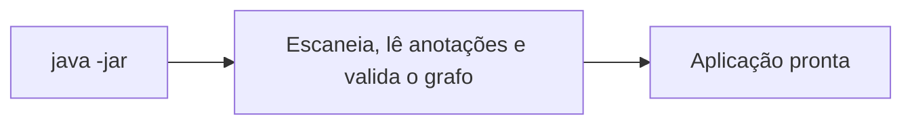
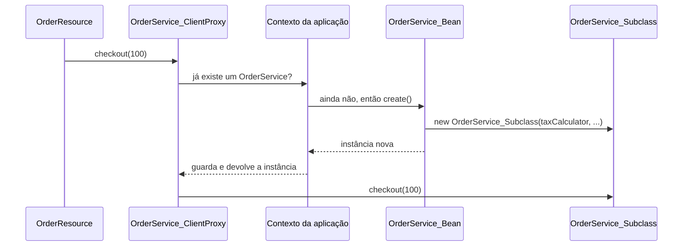

Eu criei duas implementações da mesma interface, injetei sem qualifier e rodei `./mvnw package`. Cinco segundos depois, o build quebrou:

```text
[ERROR] Build step io.quarkus.arc.deployment.ArcProcessor#validate threw an exception:
jakarta.enterprise.inject.AmbiguousResolutionException: Ambiguous dependencies for type dev.omatheusmesmo.orders.Notifier and qualifiers [@Default]
	- injection target: dev.omatheusmesmo.orders.NotificationResource#notifier
	- available beans:
		- CLASS bean [types=[..., SmsNotifier, ...], target=dev.omatheusmesmo.orders.SmsNotifier]
		- CLASS bean [types=[..., EmailNotifier, ...], target=dev.omatheusmesmo.orders.EmailNotifier]
```

Nenhum servidor subiu. Nenhuma aplicação executável foi gerada. O erro morreu na máquina de quem escreveu o código.

Num container tradicional, esse mesmo erro só aparece quando a aplicação sobe. Na sua máquina, se tiver sorte. No pod de staging, se não tiver.

Essa diferença de **momento** é o assunto desta série de três artigos. Neste primeiro, mostro o que o ArC faz durante o build e o que sobra para o runtime. No segundo, o que isso muda no código de quem escreve aplicação. No terceiro, o lado de quem escreve extensões.

Em fevereiro eu escrevi o [guia de injeção de dependência para quem vem do Spring](/posts/dominando-injecao-dependencia-configuracao-quarkus/), que mostra o *como usar*. Aqui eu abro o capô. Montei uma aplicação pequena, despejei o bytecode que o Quarkus gera e fui olhar o que acontece de verdade.

> **Testado com**
> Java 25 · Quarkus 3.39.5 · Maven 3.9

---

## O laboratório

Um serviço de pedidos mínimo, com seis peças. Guarde esses nomes, eles voltam em todas as seções.

Um calculador de impostos, que loga uma linha quando é construído:

```java
@ApplicationScoped
public class TaxCalculator {

    public TaxCalculator() {
        Log.info("TaxCalculator instantiated");
    }

    double rate() {
        return 0.1;
    }
}
```

O serviço de pedidos, que recebe o `TaxCalculator` pelo construtor. O `checkout()` chama o `total()`, que é auditado:

```java
@ApplicationScoped
public class OrderService {

    private final TaxCalculator taxCalculator;

    OrderService(TaxCalculator taxCalculator) {
        this.taxCalculator = taxCalculator;
    }

    public double checkout(double amount) {
        return total(amount);
    }

    @Audited
    double total(double amount) {
        return amount + amount * taxCalculator.rate();
    }
}
```

Para auditar, o CDI pede duas peças que eu criei: uma anotação própria, o `@Audited`, que marca os métodos auditados (o CDI chama isso de *interceptor binding*), e o interceptor que roda antes deles:

```java
@InterceptorBinding
@Retention(RetentionPolicy.RUNTIME)
@Target({ ElementType.TYPE, ElementType.METHOD })
public @interface Audited {
}
```

```java
@Audited
@Interceptor
@Priority(Interceptor.Priority.APPLICATION)
public class AuditInterceptor {

    @AroundInvoke
    Object audit(InvocationContext ctx) throws Exception {
        Log.infof("AUDIT %s", ctx.getMethod().getName());
        return ctx.proceed();
    }
}
```

O endpoint REST `GET /orders`, que usa o `OrderService`:

```java
@Path("/orders")
public class OrderResource {

    private final OrderService orderService;

    OrderResource(OrderService orderService) {
        this.orderService = orderService;
    }

    @GET
    public double checkout(@QueryParam("amount") double amount) {
        return orderService.checkout(amount);
    }
}
```

E um serviço que ninguém usa:

```java
@ApplicationScoped
public class LegacyReportService {

    public String report() {
        return "nobody calls me";
    }
}
```

Repare em três detalhes que vão importar: o `TaxCalculator` loga algo no construtor, o `checkout()` chama `total()` **por dentro** da própria classe, e nenhuma classe injeta o `LegacyReportService`.

---

## 1. O problema que o ArC resolve

CDI (Contexts and Dependency Injection) é a especificação do Jakarta EE para injeção de dependência: `@Inject`, escopos como `@ApplicationScoped`, `@Produces`, interceptors, eventos.

Só que anotação sozinha não faz nada. Alguém precisa ler essas anotações e agir: criar o `TaxCalculator`, entregá-lo ao construtor do `OrderService`, guardar a instância enquanto a aplicação estiver no ar e descartá-la no fim. Esse alguém é o **container de injeção de dependência**, que no resto do artigo eu chamo só de *container*. Pense nele como o gerente dos seus objetos: você declara do que cada classe precisa, e ele decide quando criar, quem recebe o quê e quando jogar fora.

> **Não confunda:** esse container não tem nada a ver com container Docker. É uma parte do framework que roda dentro da mesma JVM que o seu código.

No Spring, o container é o `ApplicationContext`. No CDI, a especificação só define as regras, e cada framework traz o seu próprio container. O mais conhecido é o [Weld](https://weld.cdi-spec.org/), a implementação de referência do CDI, que roda dentro de servidores como WildFly, GlassFish e Open Liberty. No Quarkus, o container se chama **ArC**.

E o nome não é sigla. Quando perguntaram na lista de discussão do Quarkus, em 2019, o Martin Kouba, criador do ArC, [confirmou](https://groups.google.com/g/quarkus-dev/c/3hFuNgxSFq0) que é uma referência a *arc welding*, a soldagem a arco. É uma piada com o Weld (*weld* é "soldar" em inglês): o ArC começou em 2018 como um protótipo chamado ["Weld Arc"](https://github.com/quarkusio/quarkus/blob/026a17bc1fd/ext/arc/README.md), com a proposta de ser um CDI mais leve, resolvido no build.

O modelo de programação do CDI é ótimo. O problema sempre foi **quando** o container faz o trabalho pesado. Um container tradicional como o Weld faz tudo no startup: escaneia o classpath, lê anotações via reflection, monta o grafo de dependências, valida e só então começa a servir beans. Cada vez que a aplicação sobe, o mesmo trabalho é refeito, com o mesmo resultado. O Spring, sem AOT, faz essencialmente a mesma coisa com `@ComponentScan` e `BeanDefinition`.

A aposta do ArC é outra: se o resultado é sempre o mesmo, calcule uma vez, no build, e grave o resultado como bytecode.

Num container tradicional, tudo acontece no startup:



Com o ArC, o trabalho pesado vai para o build:


Quando o Martin Kouba apresentou o ArC em 2019, a comparação foi brutal: o runtime do ArC tinha cerca de **72 classes e 140 KB**, contra aproximadamente **1.200 classes e 2 MB** do core do Weld 3.1.1. Uns 7% do tamanho. São números daquela época, mas mostram a ordem de grandeza do que dá para jogar fora quando o container não precisa pensar em runtime.

---

## 2. O ArC pensa no build

Durante o `mvn package`, o ArC passa por quatro fases, segundo o [CDI Integration Guide](https://quarkus.io/guides/cdi-integration):

1. **Inicialização**: registra contextos customizados.
2. **Descoberta de beans**: analisa as classes pelo índice [Jandex](https://github.com/smallrye/jandex), sem carregar nada com reflection, e liga os injection points.
3. **Registro de componentes sintéticos**: extensões adicionam beans que não existem como classe (é o assunto da parte 3).
4. **Validação**: ambiguidade, dependência faltando, classe impossível de fazer proxy.

Depois disso ele **gera bytecode**. Para ver o resultado, basta listar um JAR que o Quarkus cria no empacotamento:

```bash
unzip -l target/quarkus-app/quarkus/generated-bytecode.jar | grep orders/
```

```text
AuditInterceptor_Bean.class
Audited_ArcAnnotationLiteral.class
OrderResource_Bean.class
OrderService_Bean.class
OrderService_ClientProxy.class
OrderService_Subclass.class
TaxCalculator_Bean.class
TaxCalculator_ClientProxy.class
```

Tem uma ausência nessa lista: o `LegacyReportService`. Ele está no código, é `@ApplicationScoped`, compila, e mesmo assim não ganhou nenhuma classe. Guarde isso, ele é assunto da parte 2.

Cada sufixo tem um papel:

| Classe gerada | Para que serve |
| --- | --- |
| `_Bean` | Metadados do bean e o método `create()`, que monta a instância |
| `_ClientProxy` | Proxy para beans de escopo normal (parte 2) |
| `_Subclass` | Aplica interceptors (parte 2) |
| `_ArcAnnotationLiteral` | Instâncias de anotação sem reflection |

### De onde vem esse `create()`?

Todo container CDI precisa saber responder uma pergunta para cada bean: "como eu crio uma instância disto?". A especificação formaliza essa pergunta num método, `create()`, da interface `jakarta.enterprise.context.spi.Contextual`. Todo bean implementa essa interface.

Num container tradicional, o `create()` é genérico: um código só, que serve para qualquer classe e descobre em runtime, via reflection, qual construtor chamar e o que injetar nele. O ArC faz diferente. No build, ele lê o construtor do **seu** `OrderService`, vê que ele pede um `TaxCalculator` e escreve um `create()` específico para essa classe, dentro do `OrderService_Bean`.

Quem chama esse `create()` é o próprio container, na primeira vez que alguém precisa do bean. No nosso caso, a cadeia completa é:

1. O `OrderResource` chama `orderService.checkout(100)`.
2. Quem recebe a chamada é o client proxy (parte 2), que pergunta ao contexto da aplicação: "já existe um `OrderService`?".
3. Como ainda não existe, o contexto chama `OrderService_Bean.create()`.
4. O `create()` monta a instância, e o contexto guarda o resultado para as próximas chamadas.



Agora a parte que me fez sorrir. Desmontei esse `create()` com `javap -c`. Traduzindo o bytecode de volta para Java, ele faz basicamente isto:

```java
Object taxCalculator = taxCalculatorProvider.get(creationalContext);
Object interceptor = auditInterceptorProvider.get();
OrderService_Subclass instance =
        new OrderService_Subclass((TaxCalculator) taxCalculator, creationalContext, interceptor);
return instance;
```

Linha por linha:

- **Linha 1**: busca a dependência que o seu construtor pediu, o `TaxCalculator`.
- **Linha 2**: busca o `AuditInterceptor`, porque o `OrderService` tem um método `@Audited`.
- **Linha 3**: cria a instância. É um `OrderService_Subclass` e não um `OrderService` puro porque a subclasse é quem aplica os interceptors (parte 2). O construtor dela começa com `super(taxCalculator)`, ou seja, chama exatamente o **seu** construtor `OrderService(TaxCalculator)`.

No fim, quem roda é o seu construtor mesmo. O ArC só resolveu no build qual construtor chamar e o que passar para ele, e deixou isso escrito no bytecode.

E repare no que não aparece: é só um `new`. Sem `Class.forName`, sem `Constructor.newInstance`, sem `Field.set`. O container de injeção de dependência, no momento da execução, virou código Java comum que qualquer JIT otimiza e que o GraalVM compila para native sem precisar de configuração de reflection.

E como o runtime encontra essas classes? Com uma ferramenta que eu já mostrei aqui no blog. O ArC gera uma classe `_ComponentsProvider` e a registra como service provider. Na inicialização, o `ArcContainerImpl` faz isto:

```java
for (ComponentsProvider componentsProvider : ServiceLoader.load(ComponentsProvider.class)) {
    components.add(componentsProvider.getComponents(this.currentContextFactory));
}
```

É o bom e velho [Java SPI com ServiceLoader](/posts/java-spi-serviceloader-poder/). A diferença é que o `ServiceLoader` encontra **uma** classe que já traz a lista pronta de beans, observers e interceptors. Nada é descoberto em runtime: tudo é só carregado.

Uma curiosidade: quem escreve esse bytecode é o **Gizmo**, a biblioteca de geração de código do Quarkus. Desde o Quarkus 3.30, o ArC usa o [Gizmo 2](https://quarkus.io/blog/arc-migrates-to-gizmo2/), construído sobre a ClassFile API do próprio JDK.

> **Curiosidade:** o Spring Framework 6 também tem um modo [AOT](https://docs.spring.io/spring-framework/reference/core/aot.html) que gera código no build, mas na JVM ele é opcional. No Quarkus, build time é o único modo.

---

## 3. Fail fast: o erro que nunca chega em produção

Voltando ao erro do começo. Ele veio de um teste simples: uma interface de notificação com duas implementações, e um endpoint que injeta a interface sem dizer qual das duas quer.

```java
public interface Notifier {
    void notify(String msg);
}

@ApplicationScoped
public class EmailNotifier implements Notifier {
    public void notify(String msg) {
    }
}

@ApplicationScoped
public class SmsNotifier implements Notifier {
    public void notify(String msg) {
    }
}

@Path("/notify")
public class NotificationResource {

    @Inject
    Notifier notifier;

    @POST
    public void send() {
        notifier.notify("order shipped");
    }
}
```

O ArC não tem como adivinhar se o `notifier` deve ser o de e-mail ou o de SMS. A validação acontece na fase 4, dentro do build step `ArcProcessor#validate`. Se ela encontra um problema, o build para, e a mensagem já traz o que você precisa para corrigir: o injection point (`NotificationResource#notifier`) e a lista de candidatos.

A correção é a mesma de sempre em CDI, com alguns atalhos do ArC:

- um **qualifier** próprio (`@Email`, `@Sms`);
- `@Identifier("email")`, o qualifier baseado em string do Quarkus, que evita as ambiguidades do `@Named`;
- `@Alternative` com `@Priority`, ou a propriedade `quarkus.arc.selected-alternatives`;
- `@DefaultBean` na implementação que deve "recuar" se existir outra (parte 2).

No laboratório eu usei o `@Identifier` (do pacote `io.smallrye.common.annotation`). Cada implementação ganha um nome, e o ponto de injeção diz qual das duas quer:

```java
@ApplicationScoped
@Identifier("email")
public class EmailNotifier implements Notifier {
    public void notify(String msg) {
        Log.infof("EMAIL: %s", msg);
    }
}

@ApplicationScoped
@Identifier("sms")
public class SmsNotifier implements Notifier {
    public void notify(String msg) {
        Log.infof("SMS: %s", msg);
    }
}

@Path("/notify")
public class NotificationResource {

    @Inject
    @Identifier("email")
    Notifier notifier;

    @POST
    public void send() {
        notifier.notify("order shipped");
    }
}
```

Com isso o build passa, e um `POST /notify` loga:

```text
INFO  [dev.omatheusmesmo.orders.EmailNotifier] (executor-thread-1) EMAIL: order shipped
```

Parece detalhe até você lembrar da última vez que um deploy caiu por um bean duplicado que só existia no profile de produção.

---

## Conclusão

O CDI do Quarkus usa as mesmas anotações do CDI que você conhece. O que muda é o momento em que o container pensa, e neste artigo vimos o que acontece quando ele pensa no build:

- descoberta, validação e a decisão de como criar cada bean acontecem no `mvn package`;
- erros de injeção quebram o build, não o deploy;
- em runtime, o container virou código gerado: um `create()` que faz `new` e um `ServiceLoader` que carrega tudo pronto.

Minha sugestão: pegue a sua aplicação Quarkus de hoje, rode um `package` e liste o `generated-bytecode.jar`. Procure os beans que você esperava ver e não estão lá.

Na parte 2, volto ao mesmo laboratório para explicar três coisas que apareceram nessa listagem: o `_ClientProxy`, o `_Subclass` e o `LegacyReportService`, que não ganhou classe nenhuma. É ali que aparecem um construtor que roda duas vezes e um interceptor que funciona até em chamadas internas.

Se este mergulho te ajudou, **compartilhe com quem ainda acha que CDI é "coisa de Java EE antigo"**.

---

## Recursos

**Guias oficiais do Quarkus**
- [Introduction to CDI](https://quarkus.io/guides/cdi): a base, com escopos, client proxies, interceptors e eventos.
- [CDI Reference](https://quarkus.io/guides/cdi-reference): o guia central do ArC, com descoberta de beans e as diferenças para a especificação.
- [CDI Integration Guide](https://quarkus.io/guides/cdi-integration): as fases do container durante o build.

**Blog do Quarkus**
- [Quarkus Dependency Injection](https://quarkus.io/blog/quarkus-dependency-injection/), de Martin Kouba (2019): a apresentação do ArC e a comparação com o Weld.
- [ArC migrates to Gizmo 2](https://quarkus.io/blog/arc-migrates-to-gizmo2/), de Ladislav Thon (2025): a nova geração de bytecode.

**Especificação**
- [Jakarta CDI 4.1](https://jakarta.ee/specifications/cdi/4.1/jakarta-cdi-spec-4.1.html): a especificação.
- [Weld](https://weld.cdi-spec.org/), a implementação de referência.

**Código-fonte**
- [ArC no repositório do Quarkus](https://github.com/quarkusio/quarkus/tree/main/independent-projects/arc): comece por `BeanProcessor`, `BeanGenerator` e `ComponentsProviderGenerator`.
