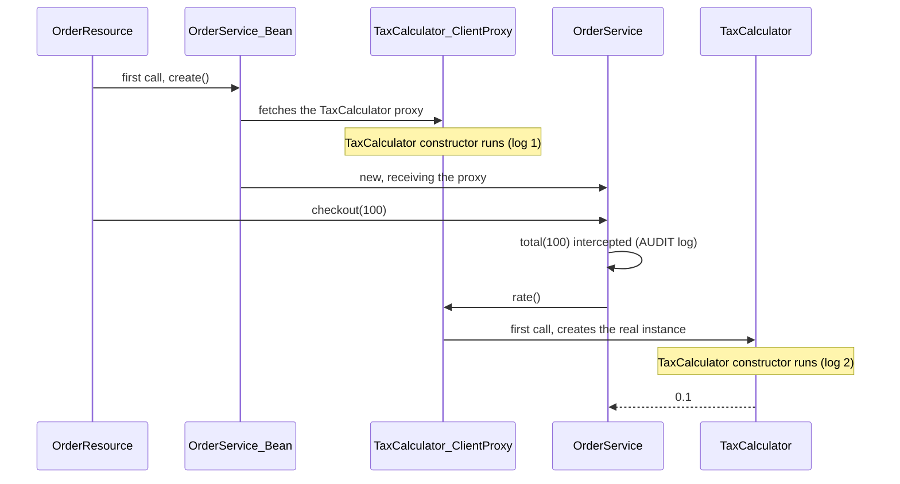
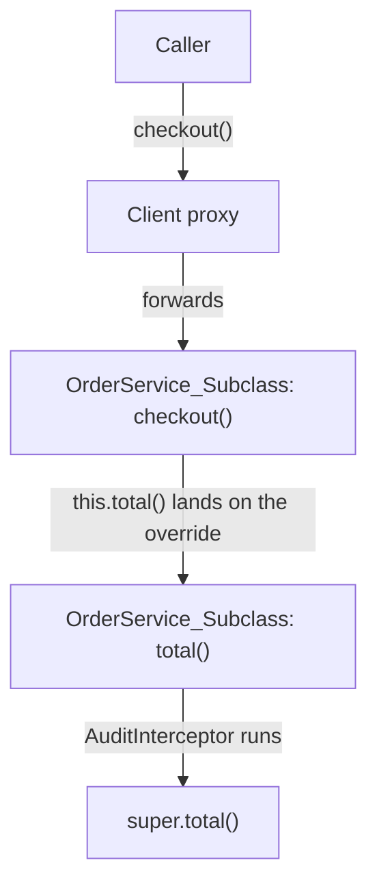
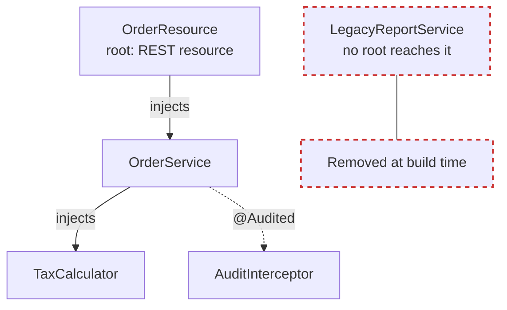

In [part 1](/en/posts/quarkus-arc-cdi-at-build-time/), I showed that ArC, the Quarkus CDI container, does almost all its work at build time and leaves only generated code for runtime. I ended with a listing of `generated-bytecode.jar` that left three questions: why `OrderService` got a `_ClientProxy` and a `_Subclass`, and why `LegacyReportService` got nothing.

In this article I answer all three. Along the way, a constructor that runs twice and an interceptor that works even on internal calls show up.

> **Tested with**
> Java 25 · Quarkus 3.39.5 · Maven 3.9

---

## The lab, in short

It's the same order service from part 1. These are the two classes that matter most here:

```java
@ApplicationScoped
public class TaxCalculator {

    public TaxCalculator() {
        Log.info("TaxCalculator instantiated");
    }

    double rate() {
        return 0.1;
    }
}
```

```java
@ApplicationScoped
public class OrderService {

    private final TaxCalculator taxCalculator;

    OrderService(TaxCalculator taxCalculator) {
        this.taxCalculator = taxCalculator;
    }

    public double checkout(double amount) {
        return total(amount);
    }

    @Audited
    double total(double amount) {
        return amount + amount * taxCalculator.rate();
    }
}
```

Besides those, `@Audited` is an interceptor binding I wrote, `AuditInterceptor` logs `AUDIT` before each audited method, `OrderResource` exposes `GET /orders` using `OrderService`, and `LegacyReportService` is an `@ApplicationScoped` bean no class injects. The full code is in [part 1](/en/posts/quarkus-arc-cdi-at-build-time/).

---

## 1. Truly lazy: the client proxy and the constructor that runs twice

I started the packaged application and looked at the log:

```text
arc-demo 1.0.0-SNAPSHOT on JVM (powered by Quarkus 3.39.5) started in 0.493s.
```

Not a single `TaxCalculator instantiated` line. **Zero** application beans were created at startup. Then I sent a request:

```bash
curl "localhost:8080/orders?amount=100"
```

```text
INFO  [dev.omatheusmesmo.orders.TaxCalculator] (executor-thread-1) TaxCalculator instantiated
INFO  [dev.omatheusmesmo.orders.AuditInterceptor] (executor-thread-1) AUDIT total
INFO  [dev.omatheusmesmo.orders.TaxCalculator] (executor-thread-1) TaxCalculator instantiated
```

Two facts here.

**The first one is laziness.** An `@ApplicationScoped` bean is only born when someone calls a method on it. What makes this possible is the **client proxy**: what ArC injects into `OrderService` isn't `TaxCalculator`, it's a `TaxCalculator_ClientProxy`. That proxy holds a reference to the bean and its context, and on every call it asks the context "what's the current instance?", creating it the first time. It's the same mechanism that lets you inject a `@RequestScoped` bean into an `@ApplicationScoped` one and always get the instance for the right request.

**The second one is the constructor running twice.** That puzzled me, so I disassembled the proxy:

```text
public TaxCalculator_ClientProxy(java.lang.String);
  0: aload_0
  1: invokespecial TaxCalculator."<init>":()V
  4: invokestatic  Arc.requireContainer()
  ...
```

The proxy **extends** your class. And, like every subclass in Java, its constructor calls `super()`. In other words: `TaxCalculator`'s no-args constructor runs once for the proxy and once more for the real instance.

Putting the first request in order, you can see where each log line comes from:



> **Side note:** this doesn't happen in Spring. There, the proxy is created with the Objenesis library, which [skips the constructor](https://docs.spring.io/spring-framework/reference/core/aop/proxying.html).

Notice that `OrderService` didn't print anything twice. It only has a constructor with an argument, and in that case Quarkus **generates** a no-args constructor just for the proxy. As a bonus, you don't need the fake empty constructor that plain CDI requires, nor `@Inject` when there's only one constructor.

### `@ApplicationScoped` or `@Singleton`?

| | `@ApplicationScoped` | `@Singleton` |
| --- | --- | --- |
| Client proxy | Yes | No |
| When it's created | On the first method call | When it's injected |
| Mocking with `@InjectMock` | Works | Doesn't work (no proxy to swap) |
| Reading a public field directly | Never (you read the proxy's field) | Safe |
| Cost per call | One indirection | None |

My default is `@ApplicationScoped`. `@Singleton` is for the rare case where the proxy indirection really matters.

If you need a bean to be created at startup, use `@Startup` or a `StartupEvent` observer.

---

## 2. The interceptor that runs even on internal calls

Look at the output again: `AUDIT total`. `total()` is the method annotated with `@Audited`, but nobody outside called `total()`. `OrderResource` called `checkout()`, and `checkout()` called `total()` from the inside, through `this`.

This works because of how ArC intercepts. In part 1, we saw that `OrderService_Bean.create()` does `new OrderService_Subclass(...)`. The instance living in the context **is** the generated subclass, which overrides `total()` to go through the interceptor chain before calling `super.total()`. So `this.total()` lands on the overridden method, and the interceptor runs.



The same logic explains what ArC can intercept:

| Method | Intercepted? |
| --- | --- |
| Called from inside the class, via `this` | Yes |
| `private` | No |
| `final` | Yes, Quarkus removes `final` in the bytecode |
| `static` | Yes, if the binding is declared on the method itself |

The [Quarkus documentation](https://quarkus.io/guides/cdi-reference#intercepted-self-invocation) calls this *intercepted self-invocation* and makes it clear it's a **non-standard** feature: the CDI specification doesn't define whether it should work. In practice, it means one less workaround in your code.

> **Side note:** this is exactly where Spring's `@Transactional` usually fails. Spring's proxy wraps the object, and a call through `this` [doesn't go through it](https://docs.spring.io/spring-framework/reference/core/aop/proxying.html).

---

## 3. The bean that vanished from the build

In the `generated-bytecode.jar` listing from part 1, every application bean had its own `_Bean` class, except `LegacyReportService`. Its class is still in the application JAR, because the code is yours, but ArC generated nothing for it. At runtime, it doesn't exist as a bean: you can't inject it or look it up.

That's **bean pruning**: by default, ArC removes every bean, interceptor and decorator nobody uses. The criterion is a tree:

- **Roots** are beans that can't be removed: REST resources, beans with observers, beans with `@Named`, beans marked `@Unremovable`, and whatever each extension declares (`@Scheduled` methods, for example).
- A bean is **removed** if it's not a root and isn't eligible for any injection point in the roots' tree, including `Instance<>`, `Provider<>` and `@All List<>`.

In the lab, the tree looks like this:



Why bother? Martin Kouba [does the math](https://quarkus.io/blog/unused-beans/): 50 unused beans with a normal scope and a `@Transactional` method generate **more than 150 classes**. Each would get a `_Bean`, a `_ClientProxy` and a `_Subclass`. Removing them at build time is framework-level dead code elimination, and it matters even more when extensions register beans your application never touches.

### The only way to get hurt

ArC sees injection points. What it **can't** see is programmatic lookup through the static `CDI.current()` method. I tested it with a startup observer:

```java
@ApplicationScoped
public class ReportJob {

    void onStart(@Observes StartupEvent event) {
        LegacyReportService service = CDI.current().select(LegacyReportService.class).get();
        Log.info(service.report());
    }
}
```

Result at startup:

```text
WARN  [io.quarkus.arc.impl] (main)
CDI: programmatic lookup problem detected
-----------------------------------------
At least one bean matched the required type and qualifiers but was marked as unused and removed during build

Stack frame: dev.omatheusmesmo.orders.ReportJob.onStart(ReportJob.java:13)
Required type: class dev.omatheusmesmo.orders.LegacyReportService
Removed beans:
	- CLASS bean  [types=[class dev.omatheusmesmo.orders.LegacyReportService], qualifiers=null]
Solutions:
	- Application developers can eliminate false positives via the @Unremovable annotation
	...
Caused by: jakarta.enterprise.inject.UnsatisfiedResolutionException: No bean found for required type [class dev.omatheusmesmo.orders.LegacyReportService]
```

I like this message. The container keeps metadata about the beans it removed just so it can tell you exactly what happened, where, and how to fix it.

The fixes, in the order I recommend them:

1. **Inject `Instance<LegacyReportService>`** instead of using `CDI.current()`. It's an injection point, so the bean is no longer "unused", and the code becomes testable.
2. Annotate the class with `@io.quarkus.arc.Unremovable`.
3. Use `quarkus.arc.unremovable-types=org.acme.Foo,org.acme.**` when you can't touch the class.
4. Last resort: `quarkus.arc.remove-unused-beans=fwk` keeps all your application beans and only removes framework ones.

> **Side note:** Spring doesn't remove unused beans, not even with AOT. That's why `applicationContext.getBean()` never fails for this reason, and developers coming from Spring tend to bring exactly the habit that `CDI.current()` punishes.

---

## 4. Powers the specification doesn't have

ArC implements CDI and then goes further. These are the non-standard features I use the most:

| ArC | What it does | Decided at |
| --- | --- | --- |
| `@DefaultBean` | Bean that backs off if another of the same type exists | Build |
| `@IfBuildProfile("prod")` | Bean only exists in that build profile | **Build** |
| `@IfBuildProperty` | Bean only exists if the build property matches | **Build** |
| `@LookupIfProperty` | Bean is only returned by `Instance<>` if the runtime property matches | Runtime |
| `@All List<T>` | All implementations, sorted by priority | Build |
| `@Lock` | Read/write concurrency control via an interceptor | Runtime |
| `@WithCaching Instance<T>` | Caches the result of `get()` | Runtime |

One column in that table deserves bold, and it's "Decided at". The documentation is blunt: "The runtime profile has absolutely no effect on the bean resolution using `@IfBuildProfile`". If you built the JAR with the `prod` profile and start it with `-Dquarkus.profile=staging`, the beans are still the `prod` ones. To decide at runtime, use `@LookupIfProperty` together with `Instance<T>`.

---

## 5. Checklist: CDI in Quarkus without surprises

- **Avoid `private`** on injected fields, constructors, observers and producers. Generated code lives in another class; to access a private member, ArC needs reflection, and the native executable grows. Package-private solves it.
- **Replace `CDI.current()` with `Instance<T>`.** It's the only case where bean pruning breaks your application.
- **Initialization goes in `@PostConstruct`**, never in the no-args constructor of a normal scoped bean.
- **Don't read or write fields** of an injected `@ApplicationScoped` bean. The proxy only delegates methods.
- **Build profile is not runtime profile.** `@IfBuildProfile` is decided during `mvn package`.
- **Watch out for `Instance.get()` on `@Dependent` beans in a loop.** Each call creates an instance that's only destroyed along with the `Instance`. Use `@WithCaching` or destroy it explicitly.
- **An external library without `beans.xml` or a Jandex index isn't discovered.** Use `quarkus.index-dependency` or a producer. And remember: `beans.xml` is just a marker; its content is ignored.
- **An interceptor on a `private` method doesn't run.** Neither from outside nor from inside.

---

## Conclusion

The three mysteries from the listing have the same origin: ArC decides everything at build time and generates code for each decision.

- `_ClientProxy` exists so normal scoped beans are only born when someone actually needs them. The price is that the no-args constructor also runs for the proxy, so initialization belongs in `@PostConstruct`.
- `_Subclass` is the bean instance itself, which is why interceptors work even on internal calls.
- `LegacyReportService` got no class because no root reaches it. The only way to get hurt by that is `CDI.current()`.

In part 3, I switch sides. The same JAR has classes with names like `EventLoopGroup_..._Synthetic_Bean`, which nobody in my project wrote. They're the starting point to talk about synthetic beans, why Quarkus doesn't support CDI Portable Extensions and how to extend the container.

If you found some curious ArC behavior in your project, tell me about it: I want to know what your application's bytecode revealed.

---

## Resources

**Official Quarkus guides**
- [Introduction to CDI: client proxies](https://quarkus.io/guides/cdi#client_proxies): what the proxy does and why you shouldn't read fields of `@ApplicationScoped` beans.
- [CDI Reference](https://quarkus.io/guides/cdi-reference): lazy by default, self-invocation, bean removal and non-standard features.
- [Application Initialization and Termination](https://quarkus.io/guides/lifecycle): `@Startup` and `StartupEvent`.

**Quarkus blog**
- [Unused Beans and Why We Remove Them](https://quarkus.io/blog/unused-beans/), by Martin Kouba (2021): the reasoning behind bean pruning.

**Specification**
- [Client proxies in Jakarta CDI 4.1](https://jakarta.ee/specifications/cdi/4.1/jakarta-cdi-spec-4.1.html#client_proxies).

**Source code**
- [ClientProxyGenerator](https://github.com/quarkusio/quarkus/blob/main/independent-projects/arc/processor/src/main/java/io/quarkus/arc/processor/ClientProxyGenerator.java), [SubclassGenerator](https://github.com/quarkusio/quarkus/blob/main/independent-projects/arc/processor/src/main/java/io/quarkus/arc/processor/SubclassGenerator.java) and [UnusedBeans](https://github.com/quarkusio/quarkus/blob/main/independent-projects/arc/processor/src/main/java/io/quarkus/arc/processor/UnusedBeans.java).
