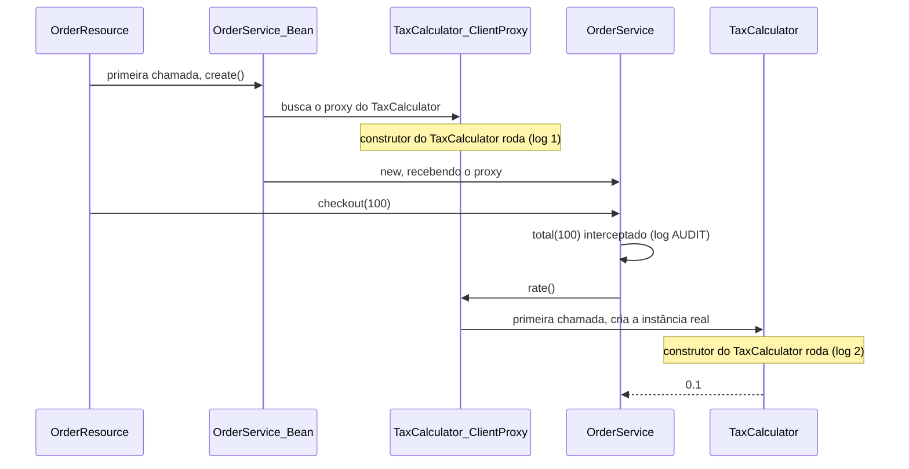
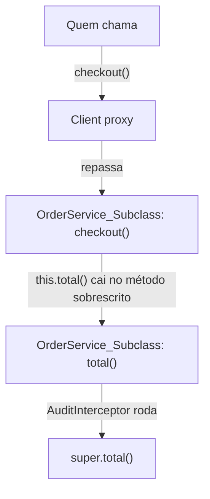
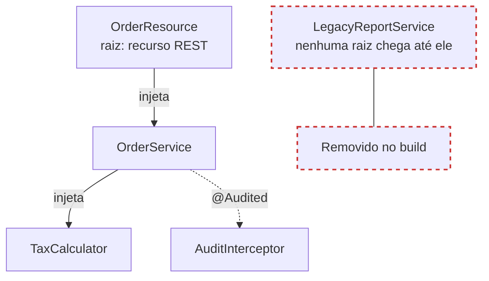

Na [parte 1](/posts/quarkus-arc-cdi-em-tempo-de-build/), eu mostrei que o ArC, o container de CDI do Quarkus, faz quase todo o trabalho no build e deixa para o runtime só código gerado. Terminei com uma listagem do `generated-bytecode.jar` que deixou três perguntas: por que o `OrderService` ganhou um `_ClientProxy` e um `_Subclass`, e por que o `LegacyReportService` não ganhou nada.

Neste artigo eu respondo às três. No caminho aparecem um construtor que roda duas vezes e um interceptor que funciona até em chamadas internas.

> **Testado com**
> Java 25 · Quarkus 3.39.5 · Maven 3.9

---

## O laboratório, em resumo

É o mesmo serviço de pedidos da parte 1. As duas classes que mais importam aqui são estas:

```java
@ApplicationScoped
public class TaxCalculator {

    public TaxCalculator() {
        Log.info("TaxCalculator instantiated");
    }

    double rate() {
        return 0.1;
    }
}
```

```java
@ApplicationScoped
public class OrderService {

    private final TaxCalculator taxCalculator;

    OrderService(TaxCalculator taxCalculator) {
        this.taxCalculator = taxCalculator;
    }

    public double checkout(double amount) {
        return total(amount);
    }

    @Audited
    double total(double amount) {
        return amount + amount * taxCalculator.rate();
    }
}
```

Além delas, o `@Audited` é um interceptor binding que eu criei, o `AuditInterceptor` loga `AUDIT` antes de cada método auditado, o `OrderResource` expõe `GET /orders` usando o `OrderService`, e o `LegacyReportService` é um `@ApplicationScoped` que nenhuma classe injeta. O código completo está na [parte 1](/posts/quarkus-arc-cdi-em-tempo-de-build/).

---

## 1. Lazy de verdade: o client proxy e o construtor que roda duas vezes

Subi a aplicação empacotada e olhei o log:

```text
arc-demo 1.0.0-SNAPSHOT on JVM (powered by Quarkus 3.39.5) started in 0.493s.
```

Nenhuma linha `TaxCalculator instantiated`. **Zero** beans da aplicação foram criados no startup. Aí fiz uma requisição:

```bash
curl "localhost:8080/orders?amount=100"
```

```text
INFO  [dev.omatheusmesmo.orders.TaxCalculator] (executor-thread-1) TaxCalculator instantiated
INFO  [dev.omatheusmesmo.orders.AuditInterceptor] (executor-thread-1) AUDIT total
INFO  [dev.omatheusmesmo.orders.TaxCalculator] (executor-thread-1) TaxCalculator instantiated
```

Dois fatos aqui.

**O primeiro é o lazy.** Um bean `@ApplicationScoped` só nasce quando alguém chama um método nele. Quem torna isso possível é o **client proxy**: o que o ArC injeta no `OrderService` não é o `TaxCalculator`, é um `TaxCalculator_ClientProxy`. Esse proxy guarda uma referência ao bean e ao contexto, e em cada chamada pergunta ao contexto "qual é a instância atual?", criando-a na primeira vez. É o mesmo mecanismo que permite injetar um bean `@RequestScoped` dentro de um `@ApplicationScoped` e sempre receber a instância da requisição certa.

**O segundo é o construtor rodando duas vezes.** Isso me intrigou, então desmontei o proxy:

```text
public TaxCalculator_ClientProxy(java.lang.String);
  0: aload_0
  1: invokespecial TaxCalculator."<init>":()V
  4: invokestatic  Arc.requireContainer()
  ...
```

O proxy **estende** a sua classe. E, como toda subclasse em Java, o construtor dele chama `super()`. Ou seja: o construtor sem argumentos do `TaxCalculator` roda uma vez para o proxy e outra para a instância real.

Colocando a primeira requisição em ordem, dá para ver de onde sai cada linha do log:



> **Curiosidade:** no Spring isso não acontece. Lá o proxy é criado com a biblioteca Objenesis, que [pula o construtor](https://docs.spring.io/spring-framework/reference/core/aop/proxying.html).

Repare que o `OrderService` não imprimiu nada duas vezes. Ele só tem um construtor com argumento, e nesse caso o Quarkus **gera** um construtor sem argumentos exclusivo para o proxy. De quebra, você não precisa daquele construtor vazio "de mentira" que o CDI puro exige, nem do `@Inject` quando só há um construtor.

### `@ApplicationScoped` ou `@Singleton`?

| | `@ApplicationScoped` | `@Singleton` |
| --- | --- | --- |
| Client proxy | Sim | Não |
| Quando nasce | Na primeira chamada de método | Quando é injetado |
| Mock com `@InjectMock` | Funciona | Não funciona (não há proxy para trocar) |
| Ler campo público direto | Nunca (você lê o campo do proxy) | Seguro |
| Custo por chamada | Uma indireção | Nenhum |

Minha escolha padrão é `@ApplicationScoped`. O `@Singleton` fica para o caso raro em que a indireção do proxy pesa de verdade.

Se você precisa que um bean nasça no startup, use `@Startup` ou um observer de `StartupEvent`.

---

## 2. O interceptor que roda até em chamada interna

Olhe de novo a saída: `AUDIT total`. O `total()` é o método anotado com `@Audited`, mas ninguém de fora chamou `total()`. O `OrderResource` chamou `checkout()`, e o `checkout()` chamou `total()` por dentro, via `this`.

Isso funciona por causa do jeito que o ArC intercepta. Na parte 1, vimos que o `create()` do `OrderService_Bean` faz `new OrderService_Subclass(...)`. A instância que vive no contexto **é** a subclasse gerada, que sobrescreve `total()` para passar pela cadeia de interceptors antes de chamar `super.total()`. Então `this.total()` cai no método sobrescrito, e o interceptor roda.



A mesma lógica explica o que o ArC consegue interceptar:

| Método | Interceptado? |
| --- | --- |
| Chamado de dentro da classe, via `this` | Sim |
| `private` | Não |
| `final` | Sim, o Quarkus remove o `final` no bytecode |
| `static` | Sim, se o binding estiver declarado no próprio método |

A [documentação do Quarkus](https://quarkus.io/guides/cdi-reference#intercepted-self-invocation) chama isso de *intercepted self-invocation* e deixa claro que é um recurso **não-padrão**: a especificação CDI não define se deve funcionar. Na prática, significa um workaround a menos no seu código.

> **Curiosidade:** é exatamente aqui que o `@Transactional` do Spring costuma falhar. O proxy do Spring envolve o objeto, e uma chamada via `this` [não passa por ele](https://docs.spring.io/spring-framework/reference/core/aop/proxying.html).

---

## 3. O bean que sumiu do build

Na listagem do `generated-bytecode.jar` da parte 1, todo bean da aplicação tinha a sua classe `_Bean`, menos o `LegacyReportService`. A classe dele continua no JAR da aplicação, porque o código é seu, mas o ArC não gerou nada para ela. Em runtime, ele não existe como bean: não dá para injetar nem buscar.

Isso é o **bean pruning**: por padrão, o ArC remove do build todo bean, interceptor e decorator que ninguém usa. O critério é uma árvore:

- **Raízes** são beans que não podem ser removidos: recursos REST, beans com observers, beans com `@Named`, beans marcados com `@Unremovable`, e o que cada extensão declarar (métodos `@Scheduled`, por exemplo).
- Um bean é **removido** se não é raiz e não é elegível para nenhum injection point na árvore das raízes, incluindo `Instance<>`, `Provider<>` e `@All List<>`.

No laboratório, a árvore fica assim:



Por que se dar ao trabalho? O Martin Kouba [dá a conta](https://quarkus.io/blog/unused-beans/): 50 beans não usados, com escopo normal e um método `@Transactional`, geram **mais de 150 classes**. Cada um ganharia `_Bean`, `_ClientProxy` e `_Subclass`. Remover no build é *dead code elimination* no nível do framework, e pesa ainda mais quando extensões registram beans que a sua aplicação nunca toca.

### O único jeito de se machucar

O ArC enxerga injection points. O que ele **não** enxerga é lookup programático pelo método estático `CDI.current()`. Fiz o teste com um observer de startup:

```java
@ApplicationScoped
public class ReportJob {

    void onStart(@Observes StartupEvent event) {
        LegacyReportService service = CDI.current().select(LegacyReportService.class).get();
        Log.info(service.report());
    }
}
```

Resultado no startup:

```text
WARN  [io.quarkus.arc.impl] (main)
CDI: programmatic lookup problem detected
-----------------------------------------
At least one bean matched the required type and qualifiers but was marked as unused and removed during build

Stack frame: dev.omatheusmesmo.orders.ReportJob.onStart(ReportJob.java:13)
Required type: class dev.omatheusmesmo.orders.LegacyReportService
Removed beans:
	- CLASS bean  [types=[class dev.omatheusmesmo.orders.LegacyReportService], qualifiers=null]
Solutions:
	- Application developers can eliminate false positives via the @Unremovable annotation
	...
Caused by: jakarta.enterprise.inject.UnsatisfiedResolutionException: No bean found for required type [class dev.omatheusmesmo.orders.LegacyReportService]
```

Eu gosto dessa mensagem. O container guarda os metadados dos beans que ele removeu só para conseguir dizer exatamente o que aconteceu, onde, e como resolver.

As correções, na ordem em que eu recomendo:

1. **Injete `Instance<LegacyReportService>`** em vez de usar `CDI.current()`. É um injection point, então o bean deixa de ser "não usado", e o código fica testável.
2. Anote a classe com `@io.quarkus.arc.Unremovable`.
3. Use `quarkus.arc.unremovable-types=org.acme.Foo,org.acme.**` quando não puder mexer na classe.
4. Último recurso: `quarkus.arc.remove-unused-beans=fwk` mantém todos os beans da sua aplicação e só remove os de frameworks.

> **Curiosidade:** o Spring não remove beans não usados, nem com AOT. Por isso o `applicationContext.getBean()` nunca falha por esse motivo, e quem vem de lá costuma trazer justamente o hábito que o `CDI.current()` pune.

---

## 4. Poderes que a especificação não tem

O ArC implementa o CDI e depois vai além. Estes são os recursos não-padrão que eu mais uso:

| ArC | O que faz | Decidido em |
| --- | --- | --- |
| `@DefaultBean` | Bean que recua se outro do mesmo tipo existir | Build |
| `@IfBuildProfile("prod")` | Bean só existe naquele build profile | **Build** |
| `@IfBuildProperty` | Bean só existe se a propriedade de build bater | **Build** |
| `@LookupIfProperty` | Bean só é retornado por `Instance<>` se a propriedade de runtime bater | Runtime |
| `@All List<T>` | Todas as implementações, ordenadas por prioridade | Build |
| `@Lock` | Controle de concorrência (leitura e escrita) por interceptor | Runtime |
| `@WithCaching Instance<T>` | Cacheia o resultado do `get()` | Runtime |

Uma linha dessa tabela merece destaque em negrito, e é a coluna "Decidido em". A documentação é taxativa: "The runtime profile has absolutely no effect on the bean resolution using `@IfBuildProfile`". Se você gerou o JAR com o profile `prod` e sobe com `-Dquarkus.profile=staging`, os beans continuam sendo os de `prod`. Para decidir em runtime, use `@LookupIfProperty` combinado com `Instance<T>`.

---

## 5. Checklist: CDI no Quarkus sem sustos

- **Evite `private`** em campos injetados, construtores, observers e producers. O código gerado vive em outra classe; para acessar um membro privado, o ArC precisa de reflection, e o executável nativo cresce. Package-private resolve.
- **Troque `CDI.current()` por `Instance<T>`.** É o único caso em que o bean pruning quebra a sua aplicação.
- **Inicialização vai no `@PostConstruct`**, nunca no construtor sem argumentos de um bean de escopo normal.
- **Não leia nem escreva campos** de um bean `@ApplicationScoped` injetado. O proxy só delega métodos.
- **Build profile não é runtime profile.** `@IfBuildProfile` é decidido no `mvn package`.
- **Cuidado com `Instance.get()` de beans `@Dependent` em loop.** Cada chamada cria uma instância que só é destruída junto com o `Instance`. Use `@WithCaching` ou destrua explicitamente.
- **Biblioteca externa sem `beans.xml` nem índice Jandex não é descoberta.** Use `quarkus.index-dependency` ou um producer. E lembre: o `beans.xml` serve só como marcador, o conteúdo dele é ignorado.
- **Interceptor em método `private` não roda.** Nem por fora, nem por dentro.

---

## Conclusão

Os três mistérios da listagem têm a mesma origem: o ArC decide tudo no build e gera código para cada decisão.

- O `_ClientProxy` existe para que beans de escopo normal só nasçam quando alguém realmente precisa deles. O preço é que o construtor sem argumentos roda também para o proxy, então inicialização vai no `@PostConstruct`.
- O `_Subclass` é a própria instância do bean, e é por isso que interceptors funcionam até em chamadas internas.
- O `LegacyReportService` não ganhou classe porque nenhuma raiz chega até ele. O único jeito de se machucar com isso é o `CDI.current()`.

Na parte 3, troco de lado. Nesse mesmo JAR existem classes com nomes como `EventLoopGroup_..._Synthetic_Bean`, que ninguém do meu projeto escreveu. Elas são o ponto de partida para falar de beans sintéticos, de por que o Quarkus não suporta as Portable Extensions do CDI e de como estender o container.

Se você encontrou algum comportamento curioso do ArC no seu projeto, me conta: quero saber o que o bytecode da sua aplicação revelou.

---

## Recursos

**Guias oficiais do Quarkus**
- [Introduction to CDI: client proxies](https://quarkus.io/guides/cdi#client_proxies): o que o proxy faz e por que não ler campos de beans `@ApplicationScoped`.
- [CDI Reference](https://quarkus.io/guides/cdi-reference): lazy por padrão, self-invocation, remoção de beans e recursos não-padrão.
- [Application Initialization and Termination](https://quarkus.io/guides/lifecycle): `@Startup` e `StartupEvent`.

**Blog do Quarkus**
- [Unused Beans and Why We Remove Them](https://quarkus.io/blog/unused-beans/), de Martin Kouba (2021): o raciocínio por trás do bean pruning.

**Especificação**
- [Client proxies no Jakarta CDI 4.1](https://jakarta.ee/specifications/cdi/4.1/jakarta-cdi-spec-4.1.html#client_proxies).

**Código-fonte**
- [ClientProxyGenerator](https://github.com/quarkusio/quarkus/blob/main/independent-projects/arc/processor/src/main/java/io/quarkus/arc/processor/ClientProxyGenerator.java), [SubclassGenerator](https://github.com/quarkusio/quarkus/blob/main/independent-projects/arc/processor/src/main/java/io/quarkus/arc/processor/SubclassGenerator.java) e [UnusedBeans](https://github.com/quarkusio/quarkus/blob/main/independent-projects/arc/processor/src/main/java/io/quarkus/arc/processor/UnusedBeans.java).
