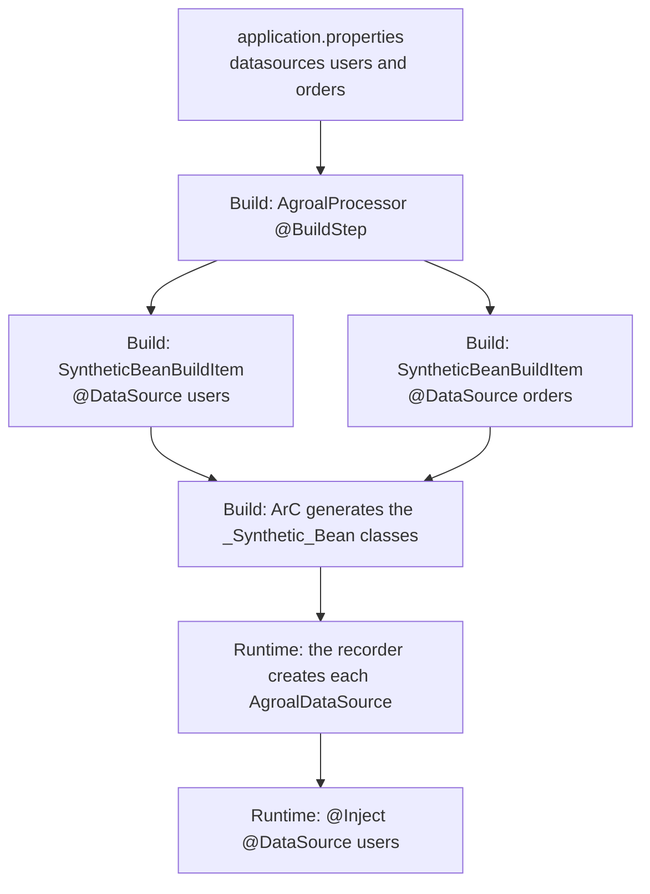
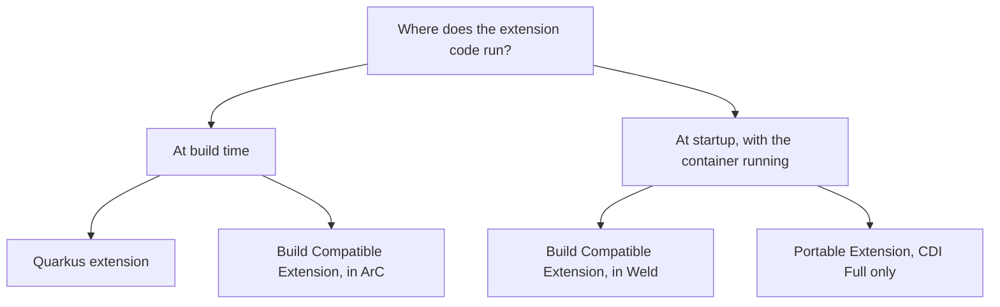
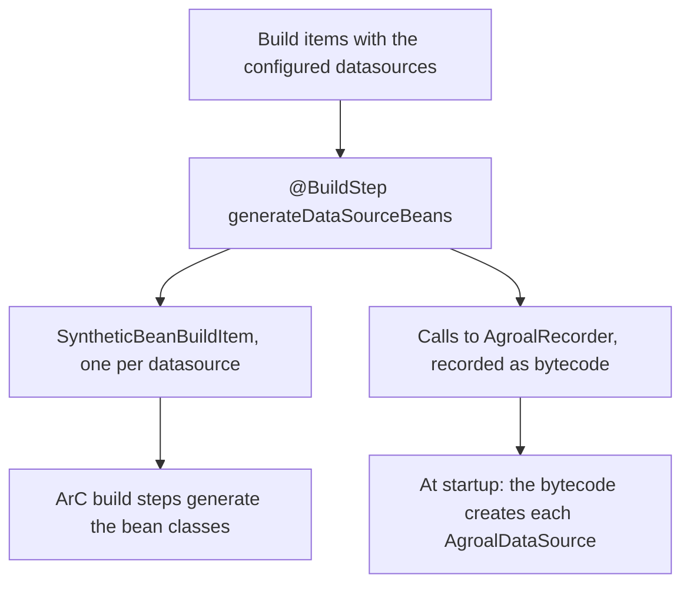

In [parts 1](/en/posts/quarkus-arc-cdi-at-build-time/) and [2](/en/posts/quarkus-arc-client-proxy-interceptors-unused-beans/), I listed the `generated-bytecode.jar` of a small application and went after the classes ArC generated for my beans. This time I looked at the rest of the JAR and found classes I didn't write:

```text
io/netty/channel/EventLoopGroup_a3b9G5N0ykJYNK_I4Ykk8EyknTI_Synthetic_Bean.class
io/quarkus/tls/TlsConfigurationRegistry_45amFsmjYOWmkiZNzau51qXx5aw_Synthetic_Bean.class
```

No class in my project, or in Netty, declares an `EventLoopGroup` bean. Still, the container (the part of the framework that creates and injects your objects, as I explained in part 1) knows how to create one. These are **synthetic beans**, the main tool of anyone writing Quarkus extensions.

In this article I switch sides: I leave application code and move to the code of those who extend the container. Three questions guide the text: how an extension creates beans from configuration, why Quarkus doesn't run the Portable Extensions of traditional CDI, and what to use instead.

> **Tested with**
> Java 25 · Quarkus 3.39.5 · Maven 3.9

---

## 1. Synthetic beans: beans that don't exist as classes

Have you ever written this in a Quarkus application?

```java
@Inject
@DataSource("users")
AgroalDataSource usersDataSource;
```

There's no `UsersDataSource` class in your project. There's no `@Produces` method you wrote. And still the bean exists, with a qualifier, a scope and a lifecycle. It's a **synthetic bean**: a bean whose attributes come from extension code, not from an annotated class.

That's how an extension creates **N beans from configuration**. The Agroal extension reads the datasources defined in `application.properties` and, in [`AgroalProcessor`](https://github.com/quarkusio/quarkus/blob/main/extensions/agroal/deployment/src/main/java/io/quarkus/agroal/deployment/AgroalProcessor.java), registers one bean for each:

```java
SyntheticBeanBuildItem.configure(AgroalDataSource.class)
        .addType(DATA_SOURCE)
        .addType(AGROAL_DATA_SOURCE)
        .scope(ApplicationScoped.class)
        .qualifiers(qualifiers(dataSourceName))
        .setRuntimeInit()
        .unremovable()
        .addInjectionPoint(ClassType.create(DotName.createSimple(DataSources.class)))
        .startup()
        .checkActive(recorder.agroalDataSourceCheckActiveSupplier(dataSourceName))
        .createWith(recorder.agroalDataSourceSupplier(dataSourceName, ...))
        .destroyer(BeanDestroyer.AutoCloseableDestroyer.class);
```

Almost all the power of `SyntheticBeanBuildItem` is in that snippet:

- **`qualifiers(...)`**: that's where `@DataSource("users")` comes from.
- **`setRuntimeInit()`**: the instance is created at real startup, not during *static init*. That matters because the database URL and password are runtime configuration. In a native image, *static init* happens while the image is being built.
- **`createWith(recorder...)`**: creation is done by a **recorder**, code written at build time and recorded as bytecode to run at runtime.
- **`addInjectionPoint(...)`**: a synthetic injection point. It's validated at build time and counts for bean pruning, so the dependency isn't removed by mistake.
- **`checkActive(...)`** and **`startup()`**: the bean can be inactive (datasource disabled by config) and, if it's active and broken, it fails right at startup.
- **`destroyer(...)`**: closes the pool when the application stops.

From above, the path from a configuration line to `@Inject` looks like this:



The same pattern shows up in [quarkus-langchain4j](https://github.com/quarkiverse/quarkus-langchain4j), a project I contribute to. `AnthropicProcessor` registers a synthetic `ChatModel` per named configuration and adds `.defaultBean()`: if you declare your own `ChatModel`, the extension's one backs off.

> **Side note:** in Spring, the closest thing is a `BeanDefinitionRegistryPostProcessor`, which also registers beans in code, but at startup.

---

## 2. CDI Lite: why Quarkus doesn't run Portable Extensions

ArC implements **CDI Lite**, not CDI Full. CDI Lite was born in CDI 4.0 (Jakarta EE 10) precisely as the subset of the specification that can be implemented at build time. Since [Quarkus 3.2](https://quarkus.io/blog/on-the-road-to-cdi-compatibility/), ArC passes the official CDI Lite TCK, and it still supports a few items from Full, such as decorators.

What's really left out are **Portable Extensions**, CDI's classic extension mechanism. Ladislav Thon sums up why: to execute a portable extension, "you need to have a running CDI container", reflection over application classes, and extension instances holding state across phases. Three things that don't exist during a build.

If you have a library that relies on a portable extension, there are two paths, and the difference between them is **where** the code runs:




- **Build Compatible Extensions**: the standard CDI Lite API, with `@Discovery`, `@Enhancement`, `@Registration`, `@Synthesis` and `@Validation` phases and a reflection-free language model. ArC runs these extensions at build time; Weld runs them at runtime. This is the portable path.
- **A Quarkus extension**: `@BuildStep` with ArC build items. This is the idiomatic and more powerful path, and I explain its pieces in the next section.

If you need strict specification behavior, there's `quarkus.arc.strict-compatibility=true`. The official recommendation is to stay in the default mode, which is more convenient.

---

## 3. How a Quarkus extension works, in a nutshell

So far I've treated extensions as black boxes. It's worth opening them a bit, because there are only a few pieces.

**Two modules.** Every extension is split into two JARs:

| Module | When it exists | What it holds |
| --- | --- | --- |
| `deployment` | Only during the build | The *processors*, with the logic that analyzes the application |
| `runtime` | Ships with your application | Only what needs to run: configuration, recorders, beans |

That's why code that reads annotations or parses configuration at build time doesn't need to reach your final JAR.

**Build steps and build items.** A processor is a plain class with methods annotated with `@BuildStep`. Each build step receives and produces *build items*: immutable objects that carry information from one step to another, even across different extensions. Quarkus works out the execution order on its own, by looking at who produces and who consumes each item. A build step whose result nobody uses doesn't even run.

**Recorders.** A build step can't open a database connection: that only makes sense with the application up. That's what *recorders* are for. During the build, calls to a recorder don't actually execute: they're recorded and turned into bytecode, which runs when the application starts. With `@Record(STATIC_INIT)`, that code runs during static initialization (in a native executable, still while the image is being generated). With `@Record(RUNTIME_INIT)`, it runs at real startup, when runtime configuration is already available.

With these three pieces, the Agroal snippet from section 1 becomes easy to read. `generateDataSourceBeans` is a `@BuildStep` annotated with `@Record(RUNTIME_INIT)`. It receives the datasources defined in the configuration as build items, produces a `SyntheticBeanBuildItem` for each one, and `createWith(recorder...)` records the datasource creation to happen at startup:



This is just the skeleton. How to write an extension from scratch, the difference between build time and runtime configuration, and when you don't even need an extension deserve an article of their own.

---

## 4. How to see all of this on your machine

Nothing I showed requires special tooling:

- **Generated classes:** `target/quarkus-app/quarkus/generated-bytecode.jar` after `package`. In dev mode and tests, use `-Dquarkus.debug.generated-classes-dir=dump-classes` and open the `.class` files in your IDE.
- **Dev mode endpoints:** `/q/arc/beans`, `/q/arc/removed-beans` and `/q/arc/observers`, with filters like `?scope=ApplicationScoped`. To see only synthetic beans, use `/q/arc/beans?kind=SYNTHETIC`.
- **Dev UI:** the ArC page shows beans, observers, interceptors, removed beans and the dependency graph. With `quarkus.arc.dev-mode.monitoring-enabled=true`, it also shows invocations and events.
- **Logging:** `quarkus.log.category."io.quarkus.arc.processor".level=DEBUG` lists the beans removed during the build.

---

## Conclusion

Synthetic beans explain a good part of Quarkus "magic". Every time a configuration line turns into something you receive with `@Inject`, chances are an extension registered a synthetic bean at build time. And the lack of Portable Extensions isn't an oversight: it's the direct consequence of moving the container's work out of startup.

If you want to extend the container, here's the summary:

- **Deep, configuration-driven integration:** a Quarkus extension with `SyntheticBeanBuildItem`.
- **Something small, or something that must run in other containers:** a Build Compatible Extension, right in the project.
- **An old library with a Portable Extension:** it'll need to be rewritten in one of those two formats.

My suggestion: start your application in dev mode and open `/q/arc/beans?kind=SYNTHETIC`. Count how many beans you use without having written any of them. If the number surprises you, tell me.

---

## Resources

**Official Quarkus guides**
- [CDI Integration Guide](https://quarkus.io/guides/cdi-integration): the extension author's view, with synthetic beans, synthetic injection points and inactive beans.
- [Writing Your Own Extension](https://quarkus.io/guides/writing-extensions): bootstrap phases, recorders and how to dump the generated classes.
- [All Build Items](https://quarkus.io/guides/all-builditems): the BuildItem catalog, including ArC's.
- [Building my first extension](https://quarkus.io/guides/building-my-first-extension): the official step-by-step guide to creating an extension.
- [CDI Reference](https://quarkus.io/guides/cdi-reference#supported_features_and_limitations): what ArC supports and what it doesn't.

**Community**
- [Developing a Quarkus Extension](https://matheuscruz.dev/2024/01/12/developing-a-quarkus-extension/), by Matheus Cruz: recorders, Gizmo and Jandex in practice.
- [Quarkus extensions resources](https://hollycummins.com/quarkus-extensions-resources/), by Holly Cummins: a curated list of guides, videos and posts about extensions.

**Quarkus blog**
- [On the Road to CDI Compatibility](https://quarkus.io/blog/on-the-road-to-cdi-compatibility/), by Ladislav Thon (2023): CDI Lite and why there are no Portable Extensions.
- [ArC migrates to Gizmo 2](https://quarkus.io/blog/arc-migrates-to-gizmo2/), by Ladislav Thon (2025): what changed for extension authors.

**Specification**
- [Build Compatible Extensions in Jakarta CDI 4.1](https://jakarta.ee/specifications/cdi/4.1/jakarta-cdi-spec-4.1.html#spi_lite): the official API.
- [You already know Build Compatible Extensions](https://jakartaee.github.io/cdi/2021/12/03/you-know-build-compatible-extensions.html): the introduction by the CDI team itself.
- [Quarkus Insights #122: CDI Lite and Build Compatible Extensions](https://www.youtube.com/watch?v=ODA31hrHFvU), with Martin Kouba, Ladislav Thon and Matej Novotny.

**Source code**
- [AgroalProcessor](https://github.com/quarkusio/quarkus/blob/main/extensions/agroal/deployment/src/main/java/io/quarkus/agroal/deployment/AgroalProcessor.java): one synthetic bean per datasource.
- [AnthropicProcessor](https://github.com/quarkiverse/quarkus-langchain4j/blob/main/model-providers/anthropic/deployment/src/main/java/io/quarkiverse/langchain4j/anthropic/deployment/AnthropicProcessor.java): one synthetic `ChatModel` per configuration.
