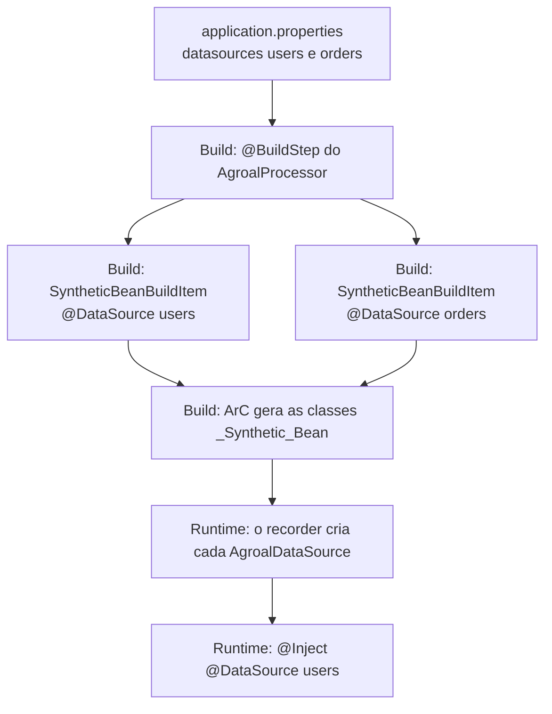
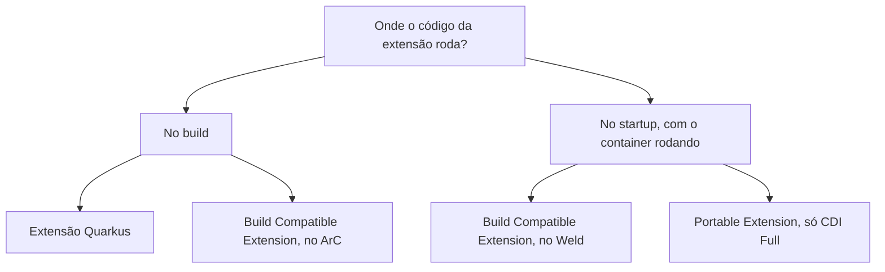
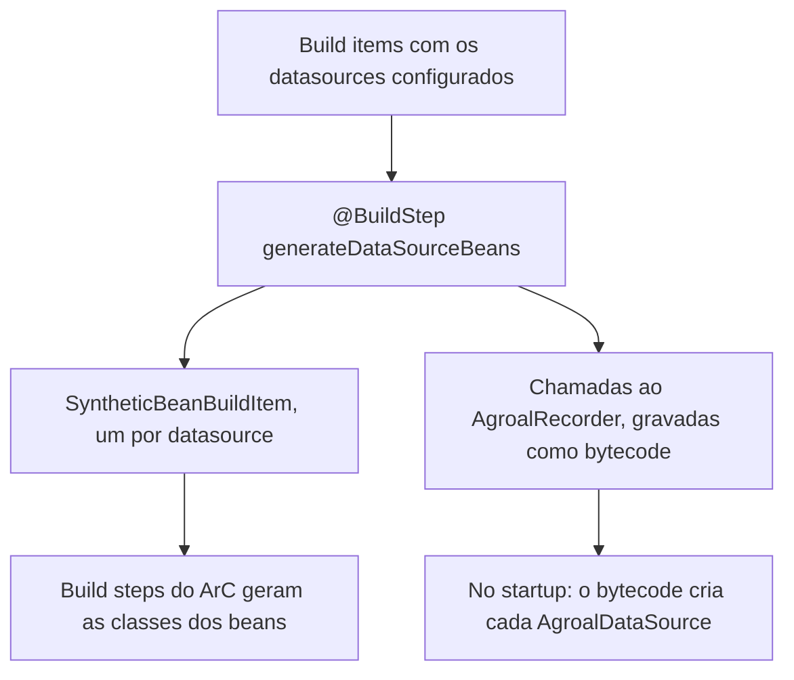

Nas [partes 1](/posts/quarkus-arc-cdi-em-tempo-de-build/) e [2](/posts/quarkus-arc-client-proxy-interceptors-beans-removidos/), eu listei o `generated-bytecode.jar` de uma aplicação pequena e fui atrás das classes que o ArC gerou para os meus beans. Desta vez olhei o resto do JAR e encontrei classes que eu não escrevi:

```text
io/netty/channel/EventLoopGroup_a3b9G5N0ykJYNK_I4Ykk8EyknTI_Synthetic_Bean.class
io/quarkus/tls/TlsConfigurationRegistry_45amFsmjYOWmkiZNzau51qXx5aw_Synthetic_Bean.class
```

Nenhuma classe do meu projeto, nem do Netty, declara um bean de `EventLoopGroup`. Mesmo assim, o container (a parte do framework que cria e injeta os seus objetos, como expliquei na parte 1) sabe criar um. Esses são **beans sintéticos**, a ferramenta principal de quem escreve extensões Quarkus.

Neste artigo eu troco de lado: saio do código de aplicação e vou para o de quem estende o container. Três perguntas guiam o texto: como uma extensão cria beans a partir de configuração, por que o Quarkus não roda as Portable Extensions do CDI tradicional, e o que usar no lugar delas.

> **Testado com**
> Java 25 · Quarkus 3.39.5 · Maven 3.9

---

## 1. Beans sintéticos: beans que não existem como classe

Você já escreveu isto numa aplicação Quarkus?

```java
@Inject
@DataSource("users")
AgroalDataSource usersDataSource;
```

Não existe nenhuma classe `UsersDataSource` no seu projeto. Não existe um `@Produces` que você escreveu. E mesmo assim o bean existe, com qualifier, escopo e ciclo de vida. Ele é um **bean sintético**: um bean cujos atributos vêm de código de extensão, não de uma classe anotada.

É assim que uma extensão cria **N beans a partir da configuração**. A extensão do Agroal lê os datasources definidos em `application.properties` e, no [`AgroalProcessor`](https://github.com/quarkusio/quarkus/blob/main/extensions/agroal/deployment/src/main/java/io/quarkus/agroal/deployment/AgroalProcessor.java), registra um bean para cada um:

```java
SyntheticBeanBuildItem.configure(AgroalDataSource.class)
        .addType(DATA_SOURCE)
        .addType(AGROAL_DATA_SOURCE)
        .scope(ApplicationScoped.class)
        .qualifiers(qualifiers(dataSourceName))
        .setRuntimeInit()
        .unremovable()
        .addInjectionPoint(ClassType.create(DotName.createSimple(DataSources.class)))
        .startup()
        .checkActive(recorder.agroalDataSourceCheckActiveSupplier(dataSourceName))
        .createWith(recorder.agroalDataSourceSupplier(dataSourceName, ...))
        .destroyer(BeanDestroyer.AutoCloseableDestroyer.class);
```

Quase todo o poder do `SyntheticBeanBuildItem` está nesse trecho:

- **`qualifiers(...)`**: é daí que vem o `@DataSource("users")`.
- **`setRuntimeInit()`**: a instância é criada no startup real, não no *static init*. Isso importa porque URL e senha do banco são configuração de runtime. Em native image, o *static init* acontece durante o build da imagem.
- **`createWith(recorder...)`**: a criação é feita por um **recorder**, código escrito no build e gravado como bytecode para rodar em runtime.
- **`addInjectionPoint(...)`**: um injection point sintético. Ele é validado no build e conta para o bean pruning, então a dependência não é removida por engano.
- **`checkActive(...)`** e **`startup()`**: o bean pode estar inativo (datasource desligado por config) e, se estiver ativo e quebrado, falha logo no startup.
- **`destroyer(...)`**: fecha o pool quando a aplicação para.

Visto de cima, o caminho de uma linha de configuração até o `@Inject` é este:



O mesmo padrão aparece no [quarkus-langchain4j](https://github.com/quarkiverse/quarkus-langchain4j), projeto em que eu contribuo. O `AnthropicProcessor` registra um `ChatModel` sintético por configuração nomeada, e adiciona `.defaultBean()`: se você declarar o seu próprio `ChatModel`, o da extensão recua.

> **Curiosidade:** no Spring, o mais parecido é um `BeanDefinitionRegistryPostProcessor`, que também registra beans por código, só que no startup.

---

## 2. CDI Lite: por que o Quarkus não roda Portable Extensions

O ArC implementa o **CDI Lite**, não o CDI Full. O CDI Lite nasceu no CDI 4.0 (Jakarta EE 10) justamente como o subconjunto da especificação que dá para implementar em build time. Desde o [Quarkus 3.2](https://quarkus.io/blog/on-the-road-to-cdi-compatibility/), o ArC passa no TCK oficial do CDI Lite, e ainda suporta alguns itens do Full, como decorators.

O que fica de fora de verdade são as **Portable Extensions**, o mecanismo clássico de extensão do CDI. O Ladislav Thon resume por quê: para executar uma portable extension, "you need to have a running CDI container", reflection sobre as classes da aplicação e instâncias de extensão guardando estado entre as fases. Três coisas que não existem durante um build.

Se você tem uma biblioteca que depende de portable extension, existem dois caminhos, e a diferença entre eles é **onde** o código roda:




- **Build Compatible Extensions**: a API padrão do CDI Lite, com fases `@Discovery`, `@Enhancement`, `@Registration`, `@Synthesis` e `@Validation`, e um modelo de linguagem sem reflection. O ArC executa essas extensões no build; o Weld executa em runtime. É o caminho portável.
- **Uma extensão Quarkus**: `@BuildStep` com os build items do ArC. É o caminho idiomático e mais poderoso, e explico as peças na próxima seção.

Se você precisa do comportamento estrito da especificação, existe `quarkus.arc.strict-compatibility=true`. A recomendação oficial é ficar no modo padrão, que é mais conveniente.

---

## 3. Como uma extensão Quarkus funciona, em poucas palavras

Até aqui eu tratei extensões como caixas-pretas. Vale abrir um pouco, porque as peças são poucas.

**Dois módulos.** Toda extensão é dividida em dois JARs:

| Módulo | Quando existe | O que tem |
| --- | --- | --- |
| `deployment` | Só durante o build | Os *processors*, com a lógica que analisa a aplicação |
| `runtime` | Vai junto com a sua aplicação | Só o que precisa rodar: configuração, recorders, beans |

É por isso que o código que lê anotações ou faz parsing de configuração no build não precisa chegar ao seu JAR final.

**Build steps e build items.** Um processor é uma classe comum com métodos anotados com `@BuildStep`. Cada build step recebe e produz *build items*: objetos imutáveis que carregam informação de um passo para outro, inclusive entre extensões diferentes. O Quarkus descobre a ordem de execução sozinho, olhando quem produz e quem consome cada item. Um build step cujo resultado ninguém usa nem chega a rodar.

**Recorders.** Um build step não pode abrir uma conexão com o banco: isso só faz sentido com a aplicação no ar. Para isso existem os *recorders*. Durante o build, as chamadas a um recorder não executam de verdade: elas são gravadas e viram bytecode, que roda quando a aplicação sobe. Com `@Record(STATIC_INIT)`, esse código roda na inicialização estática (num executável nativo, ainda durante a geração da imagem). Com `@Record(RUNTIME_INIT)`, roda no startup real, quando a configuração de runtime já está disponível.

Com essas três peças, o trecho do Agroal da seção 1 fica fácil de ler. `generateDataSourceBeans` é um `@BuildStep` anotado com `@Record(RUNTIME_INIT)`. Ele recebe como build items os datasources definidos na configuração, produz um `SyntheticBeanBuildItem` para cada um, e o `createWith(recorder...)` grava a criação do datasource para acontecer no startup:



Isso é só o esqueleto. Como criar uma extensão do zero, a diferença entre configuração de build e de runtime e quando uma extensão nem é necessária merecem um artigo próprio.

---

## 4. Como ver tudo isso na sua máquina

Nada do que eu mostrei exige ferramenta especial:

- **Classes geradas:** `target/quarkus-app/quarkus/generated-bytecode.jar` depois do `package`. Em dev mode e testes, use `-Dquarkus.debug.generated-classes-dir=dump-classes` e abra os `.class` no IDE.
- **Endpoints de dev mode:** `/q/arc/beans`, `/q/arc/removed-beans` e `/q/arc/observers`, com filtros como `?scope=ApplicationScoped`. Para ver só os beans sintéticos, use `/q/arc/beans?kind=SYNTHETIC`.
- **Dev UI:** a página do ArC mostra beans, observers, interceptors, beans removidos e o grafo de dependências. Com `quarkus.arc.dev-mode.monitoring-enabled=true`, mostra também as invocações e os eventos.
- **Log:** `quarkus.log.category."io.quarkus.arc.processor".level=DEBUG` lista os beans removidos durante o build.

---

## Conclusão

Beans sintéticos explicam boa parte da "mágica" do Quarkus. Toda vez que uma linha de configuração vira algo que você recebe com `@Inject`, é bem provável que uma extensão tenha registrado um bean sintético no build. E a falta de Portable Extensions não é descuido: é a consequência direta de tirar o trabalho do container do startup.

Se você quer estender o container, o resumo é este:

- **Integração profunda, guiada por configuração:** extensão Quarkus com `SyntheticBeanBuildItem`.
- **Algo pequeno ou que precisa rodar em outros containers:** Build Compatible Extension, direto no projeto.
- **Biblioteca antiga com Portable Extension:** vai precisar ser reescrita num desses dois formatos.

Minha sugestão: suba a sua aplicação em dev mode e abra `/q/arc/beans?kind=SYNTHETIC`. Conte quantos beans você usa sem ter escrito nenhum deles. Se o número te surpreender, me conta.

---

## Recursos

**Guias oficiais do Quarkus**
- [CDI Integration Guide](https://quarkus.io/guides/cdi-integration): a visão de quem escreve extensões, com beans sintéticos, injection points sintéticos e beans inativos.
- [Writing Your Own Extension](https://quarkus.io/guides/writing-extensions): fases de bootstrap, recorders e como despejar as classes geradas.
- [All Build Items](https://quarkus.io/guides/all-builditems): o catálogo de BuildItems, incluindo os do ArC.
- [Building my first extension](https://quarkus.io/guides/building-my-first-extension): o passo a passo oficial para criar uma extensão.
- [CDI Reference](https://quarkus.io/guides/cdi-reference#supported_features_and_limitations): o que o ArC suporta e o que não suporta.

**Comunidade**
- [Developing a Quarkus Extension](https://matheuscruz.dev/2024/01/12/developing-a-quarkus-extension/), de Matheus Cruz: recorders, Gizmo e Jandex na prática.
- [Quarkus extensions resources](https://hollycummins.com/quarkus-extensions-resources/), de Holly Cummins: uma curadoria de guias, vídeos e posts sobre extensões.

**Blog do Quarkus**
- [On the Road to CDI Compatibility](https://quarkus.io/blog/on-the-road-to-cdi-compatibility/), de Ladislav Thon (2023): CDI Lite e por que não existem Portable Extensions.
- [ArC migrates to Gizmo 2](https://quarkus.io/blog/arc-migrates-to-gizmo2/), de Ladislav Thon (2025): o que mudou para autores de extensão.

**Especificação**
- [Build Compatible Extensions no Jakarta CDI 4.1](https://jakarta.ee/specifications/cdi/4.1/jakarta-cdi-spec-4.1.html#spi_lite): a API oficial.
- [You already know Build Compatible Extensions](https://jakartaee.github.io/cdi/2021/12/03/you-know-build-compatible-extensions.html): a introdução da própria equipe do CDI.
- [Quarkus Insights #122: CDI Lite and Build Compatible Extensions](https://www.youtube.com/watch?v=ODA31hrHFvU), com Martin Kouba, Ladislav Thon e Matej Novotny.

**Código-fonte**
- [AgroalProcessor](https://github.com/quarkusio/quarkus/blob/main/extensions/agroal/deployment/src/main/java/io/quarkus/agroal/deployment/AgroalProcessor.java): um bean sintético por datasource.
- [AnthropicProcessor](https://github.com/quarkiverse/quarkus-langchain4j/blob/main/model-providers/anthropic/deployment/src/main/java/io/quarkiverse/langchain4j/anthropic/deployment/AnthropicProcessor.java): um `ChatModel` sintético por configuração.
